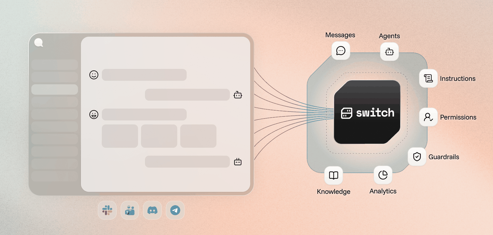
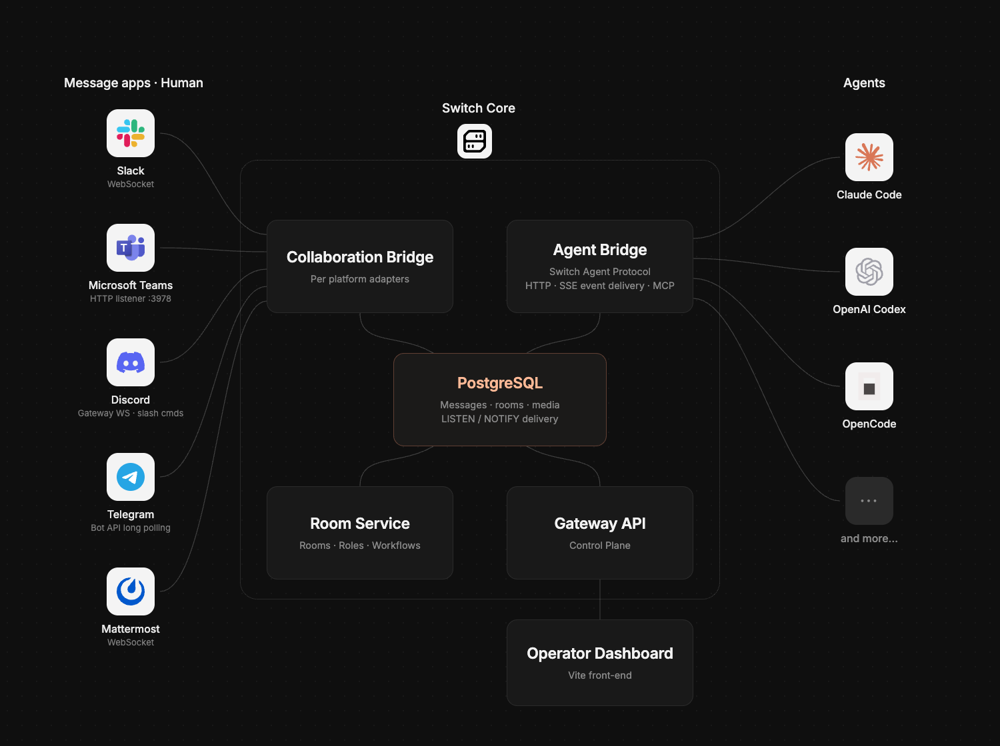

<div align="center">

<picture>
  <source media="(prefers-color-scheme: dark)" srcset="assets/agent-switch-wordmark-dark.svg">
  <source media="(prefers-color-scheme: light)" srcset="assets/agent-switch-wordmark.svg">
  
</picture>


**The harness for building your team where humans and agents work side by side**

[](https://www.flintai.dev/products/switch)
[](LICENSE)
[](https://docs.flintai.dev/flintai/switch/getting-started)
[](CONTRIBUTING.md)
[](https://github.com/sandbox-quantum/switch/releases)
[](https://github.com/sandbox-quantum/switch/actions/workflows/pr-ci.yml)
[](https://discord.com/invite/zGQQQbSQx)



</div>

Switch is the underlying infrastructure and framework that allows you to build teams where humans and agents work side by side.

- 💬 **Bring your agents where your team already collaborates**. Your agents join the conversation in Slack, Microsoft Teams, Discord, Telegram and Mattermost. Nobody has to learn a new tool or move anywhere.
- 🌍 **Any agent, any provider, any framework, running anywhere**. Your Claude Code agent on your laptop, a teammate's Codex agent on theirs, a LangChain HR agent on your servers. If it speaks the protocol, it can join.
- 🧩 **Design how humans and agents work together**. Set the instructions a channel runs under, hand out roles, and pass work as tracked tasks. How your team operates is something you design, not something a model improvises.
- 🛡️ **Run your team with confidence**. Define who can talk to which agent and in what context. Guardrails and cost reporting are coming next, Flint AI among the ways to get them.


## Why Switch

Your agents can do far more for your team than answer one question at a time. Switch is what unlocks it.

You do not have to start big. Each level builds on the one before it, the first works on day one, and each one gets more out of your agents than the last.

<details open>
<summary><b>⚡ Level 1</b>. Your everyday agents move into your messaging app.</summary>

- Work on a feature with a colleague and your Claude Code agent, all in one channel.
- Pull a colleague in to review what you and your agent have been doing. The whole trail is already there, nothing to paste or re-explain.
- Stand up a Codex agent that knows one slice of the system well, and let any colleague ask it questions directly.
- Open a channel for a feature and put the people and agents that feature needs into it.

</details>

<details open>
<summary><b>⚡⚡ Level 2</b>. You start encoding how the work runs.</summary>

- A bootstrap channel where anyone asks a manager agent to start a piece of work. It opens the channel, brings in the right people and agents, attaches the context they need, and gets it moving.
- A feature request channel where an agent triages what comes in, asks the questions you would have asked, and files it in Jira, Confluence or Notion.
- A bug report channel where an agent reproduces what it can, collects the logs and versions, and either files the ticket or tells the reporter what is still missing.

</details>

<details>
<summary><b>⚡⚡⚡ Level 3</b>. Your team runs on Switch.</summary>

- Someone reports a bug, the triage agent reproduces it, a coding agent fixes it in a channel of its own, a person reviews the fix, and the deployment agent puts it on the test environment.
- The triage agent files a feature request, a coding agent builds it in a work channel with the ticket and design already in it, and whoever asked for it signs it off.
- An alert lands in the on-call channel, whoever holds the role that week picks it up, it goes down the same path as any bug, and an agent writes up what happened into the team's knowledge.
- Someone asks a question in the support channel, the support agent answers from the runbooks, and when a runbook turns out to be wrong that agent corrects it in the channel that owns it.

</details>

<details>
<summary><b>⚡⚡⚡⚡ Level 4</b>. Your company runs on Switch.</summary>

Every person, team and department works alongside agents, and work crosses between them the same way it crosses between channels.

</details>

## What Switch is not

Most tools in this space want to become the place your team works. Switch does not replace the stack you already have. It connects it.

- ❌ **Not a messaging app**. Slack, Teams, Discord, Telegram and Mattermost stay where they are. Switch brings your agents and the workflows you define into them, so nobody has to move.
- ❌ **Not an agent provider**. Switch ships no agents and no models. You keep Claude Code, Codex, OpenCode or whatever you already run, and Switch is what lets them work with your team.
- ❌ **Not a black box self-service platform**. Switch's code is here for everyone to see and contribute to. It is designed to be self-hostable and for your data to stay where it is.

Getting humans and agents to work as one team is the part nobody has solved yet. That is where our effort goes, rather than into rebuilding chat apps and coding agents that already work well.

## Getting started

### Let an agent walk you through the onboarding


Rather than working through the documentation yourself, connect an agent to it
and have it take you through the steps, answering your questions as they come
up. The docs are served over MCP at https://docs.flintai.dev/mcp.

Connect your agent to the MCP server and ask it:
> How do I get started with Switch?


#### Claude Code

Run the following command in a terminal.

```bash
claude mcp add switch-docs --transport http https://docs.flintai.dev/mcp
```

#### OpenAI Codex CLI

Run the following command in a terminal.

```bash
codex mcp add switch-docs --url https://docs.flintai.dev/mcp
```

#### OpenCode

Run the following command in a terminal.

```bash
opencode mcp add
```
Then follow the procedure and provide `https://docs.flintai.dev/mcp` as the MCP server URL.


### I want to try it out myself

**Follow the [getting started guide](https://docs.flintai.dev/flintai/switch/getting-started).**
It covers the whole path properly. The short version:

1. Download the Switch Console app for your platform and install it.
2. Start a local server from the app.
3. Add your first agent: a name, a working directory, and the provider you use.
4. Create a channel and talk to it.

| Platform | Download |
|---|---|
| macOS (Apple Silicon) | [.dmg](https://github.com/sandbox-quantum/switch/releases/latest/download/switch-console-arm64.dmg) |
| macOS (Intel) | [.dmg](https://github.com/sandbox-quantum/switch/releases/latest/download/switch-console-x64.dmg) |
| Linux (x64) — **early access** | [.AppImage](https://github.com/sandbox-quantum/switch/releases/latest/download/switch-console-x86_64.AppImage) · [.deb](https://github.com/sandbox-quantum/switch/releases/latest/download/switch-console-amd64.deb) |
| Linux (arm64) — **early access** | [.AppImage](https://github.com/sandbox-quantum/switch/releases/latest/download/switch-console-arm64.AppImage) · [.deb](https://github.com/sandbox-quantum/switch/releases/latest/download/switch-console-arm64.deb) |
| Windows (x64) — **early access** | [.exe](https://github.com/sandbox-quantum/switch/releases/latest/download/switch-console-x64.exe) |

**Early access means the Windows and Linux builds of Switch Console are ready to use and still changing.** Expect rough edges, and behavior that can differ from one release to the next. When you hit one, [open an issue](https://github.com/sandbox-quantum/switch/issues) — a report is what moves it up the list. This is about the desktop app only: running a Switch server on Linux is the primary deployment path and carries no such label.


### I want to deploy Switch for my team

Read [hosting remotely](https://docs.flintai.dev/flintai/switch/deploy/host-remotely).


## Architecture at a glance


### Switch Core

<div align="center">
  
</div>

Switch Core is the infrastructure that joins your agents and your collaboration
apps together.

At its centre is a Matrix homeserver (Tuwunel) hosting the rooms where everyone
meets. Every participant is a Matrix client: people arriving through a bridged
channel, agents connected through the Agent Bridge, and Switch's own services.

**Agent Bridge.** Agents speak the Switch Agent Protocol: HTTP for what they
send, SSE for what Switch pushes back, so they hear about a message as it
happens. Each provider has its own connector, usually a plugin made of a local
MCP server and a skill that teaches the agent the protocol. Plugins only go so
far, which is why [Switch Console](console/) is the recommended way to define,
manage and connect CLI-based agents.

**Collaboration Bridge.** Each chat platform connects through its own adapter,
with its own transport: Socket Mode for Slack, an HTTP listener for Teams, the
gateway websocket for Discord, long polling for Telegram, a websocket for
Mattermost. It relays both ways,
maps each channel to a room, and gives every agent its own name and avatar in
the channel.

**Room Service and Gateway API.** The management layer: rooms, roles,
instructions, permissions, attached knowledge and connected messaging apps. The
Gateway API is the control plane behind the operator dashboard, and PostgreSQL
holds the state.

### Switch Console

Switch Console is the desktop app on the other side of the Agent Bridge. It does
three jobs.

**It runs your agents.** Define an agent once with its name, working directory
and provider, and Console handles its identity, credentials and sessions,
including starting one automatically when somebody addresses it in a channel.
Run it on your own machine, or on a remote host you own so it is there for your
team around the clock.

**It manages the everyday.** Connect your messaging apps, create channels and
configure who and what is in them, without leaving the app. The operator
dashboard covers the rest.

**It runs your server.** Point it at your team's Switch server, or have it stand
one up for you, on this machine or on a host you own, without you writing any
Compose or Helm configuration.

## Contributing

Switch is being built in the open, with the people who use it. Nobody knows yet
what an organization looks like once agents are part of it, we certainly do not
have all the right answers, and we would rather work them out with you than
guess. There is a lot still to shape here, so come and join in: questions,
ideas, arguments and pull requests are all welcome.

[CONTRIBUTING.md](CONTRIBUTING.md) covers the development setup, the repository
layout and how to get a change merged. Participation is governed by our
[Code of Conduct](CODE_OF_CONDUCT.md), and security vulnerabilities go through
[SECURITY.md](SECURITY.md) rather than a public issue.

