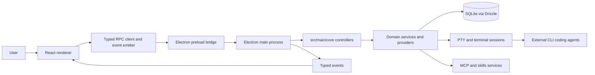

# Project Overview

**This repository is public.** Everything written here is world-readable and
permanent, git history included. See "This repository is public" in the root
`CLAUDE.md` for what that rules out — credentials, internal hostnames and
infrastructure names, personal addresses. It applies to test fixtures too.

Switch Console is a cross-platform, local-first Electron app for orchestrating multiple AI
coding agents in parallel. Each agent runs in its own session in its location's directory
(there are no Git worktrees). An agent runs either locally or — when configured remote — on an
SSH host, where it runs inside tmux next to an app-deployed sidecar so it keeps
working and listening to its Switch rooms while the app is closed (CHOO-1059). It
combines provider-agnostic CLI agent execution, session management,
terminal sessions, MCP and skills, and packaging for desktop releases.

## The name: display vs identity (CHOO-2008)

Switch Console is a fork; upstream attribution is recorded in `NOTICE`. The app was
previously called **switchdash**, and before that `emdash`.

The rename covered the display name, the source tree and the release artifacts. What
did **not** move is anything already written to a user's disk or already spoken to
something deployed — those names are frozen, and the split is load-bearing.

Renamed: `PRODUCT_NAME`, the workspace packages (`@switch-console/*`), the app
directory (`apps/switch-console-desktop/`), the binary and package names
(`APP_NAME_LOWER`), the release artifacts (`ARTIFACT_PREFIX`) and tags
(`switch-console-v*`), the Windows signing profile, and every name that lives
only inside this repo — log filenames, the renderer-log IPC channel, temp-file
prefixes, `TERM_PROGRAM`, the oxlint plugin namespace, the icon asset folder,
the Nix package, the updater cache directories and the BYOI tooling names.

Still `switchdash`, deliberately — **do not "fix" these**:

- the user-data directory (`USER_DATA_DIR_NAME`) and the SQLite file `switchdash.db` —
  it holds the database, and the compose project names derive from it, so renaming
  starts an existing install empty and orphans its Postgres volume
- the macOS app id (`com.switchdash.*`) — it carries registration and update
  continuity for copies installed before the rename, and nobody reads it
- the name the app announces to the OS (`OS_APP_NAME`, passed to `app.setName`) —
  `safeStorage` encrypts against a key the OS files under it, bound the first time
  the app touches the keychain and never re-read, so a renamed build gets an empty
  key and cannot read the saved sign-ins or the local server's credentials sitting
  in the shared database. Measured on macOS: the bundle names are not consulted,
  only this call. Nothing a user reads comes from it — display strings take
  `PRODUCT_NAME`
- the `switchdash://` deeplink scheme — links already posted into Slack and Mattermost
  are permanent, and deployed Mattermost stacks whitelist the scheme in their config
- the per-project config file (`.switchdash.json`) and per-repo state dir
  (`.switchdash/`)
- `SWITCHDASH_*` environment variables and the `X-Switchdash-*` hook headers — baked
  into hook commands already written into users' own agent config files, and into
  sidecars already deployed on remote hosts

The artifact-registry key was on this list and should not have been. The name is
a lookup key inside each build, not something that crosses a wire: a sidecar is
handed the resulting `speaks`/`accepts` numbers and never sees the name. It is
now `switch-console` in `artifacts.yaml`, in `SIDECAR_CLIENT_ARTIFACT`, and as
the `CHANGELOG.md` section that tracks it.

One cost was accepted rather than avoided: because `APP_NAME_LOWER` moved, `apt` and
`dnf` treat `switch-console` as a new package rather than an upgrade of `switchdash`,
so a Linux user upgrading across the rename has to remove the old package by hand.

The **update feed** points at GitHub Releases on the public
`sandbox-quantum/switch` repo (see `electron-builder.config.ts` `publish`): the feed is
read unauthenticated, so the updater needs no token. The SQLite database file is `switchdash.db`;
installs upgrading from a pre-rebrand build are migrated forward from their legacy database
on first launch — see `LEGACY_DB_FILENAMES` in `src/main/db/default-path.ts` and the
copy-migration in `database-file.ts` (those legacy filenames are the only place the
pre-rebrand name is retained).

## Repository Structure

This is a pnpm workspace monorepo. The Electron app lives in `apps/switch-console-desktop/`
(package `@switch-console/desktop`). Unless prefixed otherwise, `src/...`, `drizzle/`,
`scripts/`, `build/`, and config-file paths in this document and in `agents/` docs are
relative to `apps/switch-console-desktop/`.

Repo root:

- `.claude/` - Local Claude agent settings for this checkout.
- `agents/` - Agent-facing architecture, workflow, convention, integration, and risk docs.
- `apps/switch-console-desktop/` - The Electron desktop app (everything below).
- `packages/` - Shared workspace packages.
  - `packages/core/` - Transport-agnostic core runtime primitives.
  - `packages/shared/` - Shared workspace primitives, including the `Result<T, E>` type
    (`@switch-console/shared`).
  - `packages/plugins/` - Plugin interfaces and helpers, and the agent provider plugins
    under `src/agents/impl/<id>/`.
  - `packages/switch-agent-runtime/` - The published agent runtime; sessions run a pinned
    version of it (see "Versioned Artifacts").
- Root config files - `pnpm-workspace.yaml`, root `package.json` with aggregate scripts,
  `.nvmrc`, `.oxfmtrc.json`, `.oxlintrc.json`.

Inside `apps/switch-console-desktop/`:

- `build/` - Electron packaging assets; avoid edits unless working on packaging or signing.
- `drizzle/` - Generated Drizzle SQL migrations and metadata.
- `scripts/` - Build and verification support scripts (sidecar bundle, postinstall,
  deeplink reset, compose sync). Releasing is a GitHub Actions workflow at the repo
  root, not a script here.
- `src/main/` - Electron main process, RPC controllers, services, database, PTY.
- `src/preload/` - Typed Electron preload bridge exposed to the renderer.
- `src/renderer/` - React app organized around `app/`, `features/`, `lib/`, and tests.
- `src/shared/` - Shared IPC primitives, provider metadata, events, MCP, skills, and types.
- `src/types/` - Ambient and cross-cutting TypeScript declarations.
- `tooling/` - App-level dev and test infrastructure that is not bundled into production.
- App config files - Electron Vite, Vitest, TypeScript, Drizzle, Nix, and packaging config.

## Build & Development Commands

The repo root has aggregate scripts (`dev`, `build`, `test`, `lint`, `format`,
`format:check`, `typecheck`) that fan out through the pnpm workspace. App-specific
commands run from `apps/switch-console-desktop/`.

Install dependencies (repo root):

```bash
pnpm install
```

Start the full workspace dev setup from the repo root. This builds `packages/**`
once, then runs package watch builds and the Electron app in parallel:

```bash
pnpm run dev
```

Start only the Electron app from `apps/switch-console-desktop/`:

```bash
cd apps/switch-console-desktop
pnpm run dev
pnpm run d
```

Run main-process or renderer-only dev watches:

```bash
pnpm run dev:main
pnpm run dev:renderer
```

Run with debug logging:

```bash
pnpm run dev:debug
```

Use an isolated development database for schema or migration work by pointing
`SWITCHDASH_DB_FILE` at a scratch path. From the repo root this starts the full workspace
dev setup:

```bash
SWITCHDASH_DB_FILE=/tmp/switchdash-scratch.db pnpm run dev
```

From `apps/switch-console-desktop/`, this starts only the Electron app:

```bash
cd apps/switch-console-desktop
SWITCHDASH_DB_FILE=/tmp/switchdash-scratch.db pnpm run dev
```

Reset the dev databases from `apps/switch-console-desktop/`:

```bash
pnpm run db:reset
```

Build the app:

```bash
pnpm run build
pnpm run build:main
pnpm run build:renderer
```

Package desktop artifacts locally:

```bash
pnpm run package
pnpm run package:mac           # arm64
pnpm run package:mac:x64
pnpm run package:linux         # x64
pnpm run package:linux:arm64
pnpm run package:win
```

Two things these scripts do NOT do for you:

- **Build the workspace packages.** They package the app only, so on a fresh
  clone the renderer build fails with `Failed to resolve entry for package
  "@switch-console/shared"` — its `exports` point at a `dist/` that no one has
  written yet. Run `pnpm run build` from the repo root (or
  `pnpm -r --filter './packages/**' run build`) first.
- **Rebuild the native modules.** `npmRebuild` is off, so whatever
  `pnpm --filter @switch-console/desktop run rebuild` last produced is what
  gets copied into the package.

The macOS and Linux scripts name an arch for that second reason: the natives are
built for the host, so packaging the other arch yields a package that installs,
launches, and dies on the first wrong-arch `.node`. Build each arch on that arch
— which is also why the release workflow runs macOS twice, on an Apple silicon
runner and an Intel one, rather than passing both flags to one job.

The two macOS builds share one auto-update channel file. electron-builder writes
`latest-mac.yml` for every macOS arch (the per-arch suffix it gives Linux is
Linux-only), so neither release job publishes its own — `merge-mac-manifest`
combines them into one manifest listing both, which is what electron-updater
reads and how it routes each Mac to its own build. Anything that changes macOS
artifact names has to keep `arm64` in the Apple silicon file names: that
substring is the whole of the updater's routing rule.

Run formatting, linting, type checks, and tests:

```bash
pnpm run format
pnpm run lint
pnpm run typecheck
pnpm run test
```

Run focused database validation:

```bash
pnpm run db:setup
pnpm run db:fixtures
pnpm run test:migrations
```

Rebuild native Electron dependencies after native dependency changes:

```bash
pnpm run rebuild
```

Clean and reset dependencies:

```bash
pnpm run clean
pnpm run reset
```

## Code Style & Conventions

- Use Node `24.14.0` from `.nvmrc` and `pnpm@10.28.2`.
- Use `pnpm` for root project work; do not introduce npm or yarn lockfile churn.
- Format with `oxfmt`; config is `.oxfmtrc.json`.
- Keep formatted lines near the configured `printWidth` of 100 characters.
- Use 2 spaces, semicolons, single quotes in TS, double quotes in JSX, LF endings,
  trailing commas where valid in ES5, and sorted imports.
- Lint with `oxlint`; config is `.oxlintrc.json` with correctness errors,
  TypeScript, React hooks, and local repo rules enabled.
- TypeScript strict mode is enabled in `apps/switch-console-desktop/tsconfig.json`, the single
  tsconfig for all app targets.
- Avoid `any`; if a registry or boundary needs it, keep the escape local and documented.
- Use top-level `import` statements; do not use `require()`.
- Never re-export as a shortcut; import from the original source.
- Components use `PascalCase`; hooks use `useX` camelCase or an existing local pattern.
- Tests use `*.test.ts` or `*.test.tsx`.
- Main-process RPC handlers live in `src/main/core/*/controller.ts` and delegate to
  imported operation or service functions.
- Renderer RPC calls go through `rpc` from `src/renderer/lib/ipc.ts`.
- Feature UI lives under `src/renderer/features/<feature>/`; shared renderer
  primitives, stores, hooks, modal infrastructure, PTY, hotkeys, and UI live under
  `src/renderer/lib/`.
- New modals must be registered in `src/renderer/app/modal-registry.ts`.
- New views must be registered in `src/renderer/app/view-registry.ts`.
- New commands should use `src/renderer/lib/commands/registry.ts` and view-level
  `commandProvider` hooks where possible.
- Commit messages should follow Conventional Commits:

```text
<type>(<scope>): <short imperative summary>

Examples:
fix(opencode): change initialPromptFlag from -p to --prompt for TUI
feat(docs): add changelog tab with GitHub releases integration
```

## Architecture Notes



The app boots from `src/main/index.ts`, loads environment and database state,
registers RPC controllers through `src/main/rpc.ts`, creates the Electron window,
and exposes a typed preload API from `src/preload/index.ts`. The renderer is a
React app that calls typed RPC methods, subscribes to typed events, and coordinates
views, modals, command providers, project state, terminals, and session workflows.
Shared IPC primitives, provider metadata, events, MCP types, skills types, and
domain types live under `src/shared/`.

Main-process work is split into domain modules under `src/main/core/`: agent hooks,
agent runtime, agents (Switch agents), app, dependencies, execution context, fs,
locations (an agent's working dir on a host — formerly the project/workspace split),
managed Switch server, prompt library, providers (the CLI-provider registry), PTY,
remote hosts, resource monitor, search, secrets, sessions, settings, sidecar, SSH,
switch rooms, switch servers, switch setup, terminal shell, terminals, updates, and
view state. `agents` and `providers` are different things — see
`agents/architecture/main-process.md`. Stateful main-process concerns use singleton
services; expected failures should use the `Result<T, E>` pattern from the
`@switch-console/shared` workspace package.

### Logging

`createLogger()` in `src/shared/logger.ts` backs all three processes. The console and
the file sink are levelled independently: the console follows `LOG_LEVEL` (default
`warn`), the file follows `LOG_FILE_LEVEL` (default `info`), so a shipped build records
the run that led to a failure without a noisy terminal.

Entries carry structured context. Do not add a parameter to a function only so a log
line can mention it — the identity is ambient:

- **Main:** an `AsyncLocalStorage` scope (`src/main/lib/log-context.ts`) is opened at the
  RPC chokepoint, so anything beneath a call inherits its `sessionId`. Use
  `runWithLogContext()` when adding a new entry point, and `bindLogContext()` for
  callbacks that outlive the operation that created them (streams, intervals) — ALS
  follows promises and timers but such emitters otherwise keep a stale scope forever.
- **Renderer:** no ALS in the browser; attach ids with `log.child({ … })`.
- **Enrichment:** `registerLogContextResolver()` derives the remaining fields from the
  ids present (session → room, id → name). Resolvers must stay synchronous and
  best-effort; never query the database from the logging path, which runs during
  shutdown and inside error handlers.

Names come from a cache **pushed to** by the row mappers (`mapSessionRowToSession`,
`mapAgentRowToAgent`) — never fetched on demand.

At the boundaries that fail (sidecar launch, migrations, updater, PTY, RPC), log an
`event` plus an enumerated `stage`/`errorCode` rather than prose, so failures can be
grepped and counted.

## Testing Strategy

- Local merge gate:

```bash
pnpm run format
pnpm run lint
pnpm run typecheck
pnpm run test
```

- Unit tests run with Vitest in the `node` project for `src/**/*.test.ts`.
- Main database integration tests run in the `main-db` Vitest project.
- Migration tests run in the `migrations` project via `pnpm run test:migrations`.
- Fixture generation runs in the `fixtures` project via `pnpm run db:fixtures`.
- Renderer browser tests run in the `browser` project using Playwright-backed
  `@vitest/browser-playwright`. **Agents: skip these — do not run or try to fix
  them.** They need a real Chromium and its system libraries (e.g. `libnspr4`),
  which dev VMs generally lack, so they fail for environment reasons unrelated
  to your change. CI is the gate for them. Run the node projects instead:

```bash
pnpm vitest run --project node --project main-db
```

  If `pnpm run test` reports failures only from the `browser` project (a
  Playwright launch error rather than an assertion), treat the run as green and
  say so — do not install browsers or chase the failure.
- Main-process tests are colocated in `src/main/core/**/*.test.ts`.
- Renderer unit tests live under `src/renderer/tests/`.
- Renderer browser tests live under `src/renderer/tests/browser/`.
- Integration-style tests create temporary projects in `os.tmpdir()`.
- Run the consistency checks locally before merging:

```bash
pnpm run format:check
pnpm run typecheck
pnpm run lint
```

- Run the tests locally before merging as well.

## Security & Compliance

- The project is licensed under Apache-2.0; see `LICENSE` at the repo root.
- Do not commit secrets, tokens, private keys, app databases, logs, build artifacts,
  or generated dependency folders.
- Application secrets are stored through encrypted app secret services and Electron
  safe storage.
- The app sends a small, fixed set of product events to the company's public OTLP relay,
  which forwards them to Amplitude and Datadog, and nothing else. The relay holds both
  vendor keys, so **no credential ships in the app** — do not reintroduce one, and do not
  call a vendor directly. It also means the vendors see the relay's network address rather
  than the user's, which is what makes the "never your location" promise in the consent
  copy true rather than merely requested.
  Logs are local-only and no code path transmits them off the machine. Do not add one.
  `getDiagnosticLogAttachment()` builds a redacted export and is the only function
  intended to ever feed such a path; anything that ships log content must go through it
  rather than reading the log itself, and no log content may enter a telemetry payload.
- **Telemetry consent is a gate, not a preference.** Anything that would send usage data
  must `await isTelemetryAllowed()` (`src/main/core/telemetry/consent.ts`) at the point of
  emission and send nothing when it returns false. Do not read `telemetry.enabled` from
  settings directly — it does not distinguish "said yes" from "not asked yet" — and do not
  cache the answer across a send, since the user can revoke it at any time. Consent off
  means **no request is made at all**, not a request whose result is discarded.
- **The toggle defaults to off.** The payload carries a random per-install id, which makes
  it pseudonymous personal data under GDPR/nFADP; an opt-out default does not cover that.
  Flipping the default back to on is a product decision that requires the id to go first,
  not a code change.
- **What a telemetry payload may contain.** Add an event only by adding it to the closed
  catalogue in `src/main/core/telemetry/events.ts`: its property types are literal unions
  and numbers, and `TELEMETRY_EVENT_PROPERTIES` names the same fields as data, which the
  emitter uses to drop anything else before it builds a payload. The types alone are not
  enough — excess-property checking does not apply through a spread — so the runtime
  filter is what makes "nothing free-text can reach a payload" true rather than intended.
  Permitted: which of the catalogued things happened, agent type, local-vs-remote,
  success-vs-failure, app version, operating system, and the random install id. Never:
  prompts, code, file paths, working directories, error messages or stack traces (use an
  enumerated code), machine or user names, IP or MAC addresses, email or sign-in, and no
  agent, room, project, location or server names or ids. Widening this is a consent
  decision — the user-facing wording lives in
  `src/renderer/features/telemetry/telemetry-copy.ts` and must be kept in step with it.
- **Telemetry never affects the user.** It is fire-and-forget with a short timeout and no
  retry: a send that fails is logged with an `errorCode` and dropped. It must never block,
  delay or fail an operation, and must never surface in the UI. It is off in a dev build
  and inert without a build-time API key, both of which are logged once so a build that
  is not reporting says why.
- **The sidecar sends nothing.** It runs headless on a user's VM with no consent prompt
  and no access to this setting, so sessions it starts are not counted. Do not "fix" that
  by having it report; the gate is not reachable from there.
- **Redaction is split by destination, and both halves must be preserved:**
  - **Secrets** (tokens, keys, JWTs, PEM blocks, URL credentials) are redacted on the
    write path by `redactSecrets()` and must never reach disk.
  - **Personal data** (home directories, IP and MAC addresses, emails) is deliberately
    *retained* in the local log file — it is what makes a user's own log debuggable —
    and is redacted by `redactDiagnosticLog()` in `getDiagnosticLogAttachment()`, the
    single point at which content is prepared to leave the machine. Do not "fix" the
    local file by scrubbing it on write; that reinstates the problem this split exists
    to solve.
  - Anything contributed via `registerDiagnosticSection()` passes through the same
    export scrub. Never read the raw log file from outside `file-logger.ts`.
- **An agent's Switch API token lives in exactly one file:**
  `<working dir>/.switch/agents/<slug>.json`, beside a generated `.gitignore`
  containing `*`. For the agents **Switch Console** manages it also writes
  `.claude/settings.local.json` carrying the endpoint and agent id only — Claude
  Code's own file, read by every session in the directory, which does not need
  the credential. Do not add a token back to it: two copies is how one goes stale
  and authenticates as the wrong agent.
  - **That write is Switch Console's alone.** The connector's `configure` skill
    deliberately writes no `SWITCH_*` into any settings file — a directory it
    sets up carries the store and nothing else, which is the resolution path that
    works on every runtime. Do not "restore" the env block there to match this
    layout; the skill strips it on sight.
  - **Where Switch Console does write it, Claude Code makes it live.** Its `env`
    block becomes real process environment for everything a session spawns, the
    Switch runtime and the connector's hooks included — so the agent id in it
    decides who a hand-started session is, and an id naming no entry under
    `.switch/agents/` fails every session in that directory rather than falling
    back. Keep the two in step; changing one means changing the other.
  - Four consumers read this layout: switchdash, the sidecar,
    `@sandboxaq/switch-agent-runtime`, and the Claude connector's
    `hooks/switch_hook.py`. The runtime and the hook read it whenever the
    environment does not already carry a complete identity — including when it
    carries a *partial* one, which is the ordinary case above. Changing the
    shape means changing all four.
  - The runtime and the hook are the same resolution written twice, in two
    languages, over the same directory. They must agree: where they don't, a
    session acts as one agent and is mediated as another, and nothing fails to
    say so. The hook keys on the agent id the session recorded when it joined a
    room — not on the settings file — so a directory holding several agents
    still resolves exactly. Change one and change the other, and keep the paired
    cases in `bin.handshake.test.ts` and `test_claude_connector_hook.py`
    matching.
  - The token being in a working tree at all is a known exposure — a
    `.gitignore` stops `git add` and not an archive, a sync or `git add -f`.
    Moving it out is tracked separately; it is deliberately not solved by
    writing it to a second location as well.
- PTY environment passthrough must use the allowlist in `src/main/core/pty/pty-env.ts`.
- Treat shell escaping and PTY spawning as security-sensitive.
- Do not bypass path-safety, shell escaping, or validation helpers.
- Use `pnpm-lock.yaml` for dependency integrity and review dependency changes.

## The Sidecar Mirrors Switch Console — Check Both

`src/sidecar/` is a second, headless implementation of what the desktop app does
for a session: it starts sessions, keeps them connected to their room, and
injects messages into their pane. It runs on the agent's VM with no Electron, no
database and no renderer.

**So whenever you add or change logic in the desktop app, ask whether the sidecar
needs the same thing — and answer it in the same change.** Not "later": the
sidecar has no UI, so when it lacks something the symptom is a remote session
that quietly does less than a local one, and nobody notices until someone is
debugging a VM.

The pairs that must stay in step:

| Desktop | Sidecar | Shared by |
|---|---|---|
| `agent-runtime/impl/local-agent-runtime.ts` (spawn env) | `sidecar/session-spawner.ts` + `sidecar/index.ts` | nothing — **the usual place to forget** |
| `agent-hooks/hook-config-service.ts` + `ssh-agent-runtime.installRemoteHooks` | `sidecar/session-spawner.installHooks` | nothing — same failure mode: one side quietly installs fewer hooks |
| `switch-rooms/auto-session-watcher.ts` | `sidecar/notification-watcher.ts` | nothing — two implementations of one watcher |
| `switch-rooms/room-connection.ts` | — | shared: the sidecar constructs the same class |
| protocol client (stream, heartbeat, cursor) | — | shared: `@sandboxaq/switch-agent-runtime` |

Where a row says *shared*, a change lands in both for free — prefer putting
logic there. Where it says *nothing*, you are editing one of two copies and the
other will not follow you.

Things that reach a session through its **environment** are the sharpest edge,
because both sides build that separately. If you add a variable in
`local-agent-runtime`, it almost certainly belongs in the sidecar's `switchEnv`
too.

## Versioned Artifacts — Bump Them

Four things here ship independently of the app and carry their own version.
**If you make a non-trivial change to one, bump its version in the same commit.**
Not at release time, not "later" — in the commit that changes it, or it will be
forgotten and someone will debug a build they think is newer than it is.

| Artifact | Version lives in | Bump when |
|---|---|---|
| Remote sidecar | `src/sidecar/sidecar-version.ts` | any behaviour change; **major only** on a client↔sidecar wire break (ready line, endpoint shapes, shared on-disk layout) |
| Claude Code plugin | `connectors/claude-code-plugin/.claude-plugin/plugin.json` | any change to the plugin — installs will not pick it up otherwise |
| Codex plugin | `connectors/codex-plugin/.codex-plugin/plugin.json` | any change to the plugin (the room-workflow and `configure` skills, and its own `.mcp.json`) — installs will not pick it up otherwise |
| OpenCode connector | `connectors/opencode-plugin/package.json` | any change to the connector. Nothing fetches it — Switch Console writes it — so the number is for humans reading a diff rather than for an installer, and `just artifacts-check` fails if it disagrees with `artifacts.yaml` |
| Agent runtime package | `packages/switch-agent-runtime/package.json` | any change; it is published, and the marketplace connectors' `.mcp.json` pin the version sessions actually run. An agent type whose connector the app writes rather than installs is pinned by `SWITCH_AGENT_RUNTIME_PIN` in `packages/plugins/src/distribution.ts`, which `connectors/opencode-plugin/opencode.json` must match. `runtime-pin.test.ts` and `connector-assets.test.ts` fail if any of them disagree |

"Non-trivial" means anything a user could observe: behaviour, protocol, wiring,
dependencies. A comment or a rename that changes nothing does not need one.

**The runtime's version and the connector pins move at different times, in
this order.** Bump `package.json` with the change; the pins must keep naming a
version that is *published*, so they stay behind until the tag exists
(`git tag switch-agent-runtime-v<version> && git push origin <tag>`), and only
then move to it. Pinning ahead points every session at something the registry
does not have. Nothing checks this for you — the pins and `package.json` are
free to sit apart, and how far apart is a release decision rather than an
invariant. The cost of the lag is real and worth stating in the PR — a change
to `bin.ts` reaches no session until the tag is pushed and the pins follow.

Two traps worth knowing rather than rediscovering:

- **A sidecar major replaces every sidecar on sight, live sessions included.**
  It is judged on the contract *Switch Console* speaks to, not on how much changed
  inside. Changing how the sidecar talks to Switch is not a major.
- **A *new* sidecar endpoint is a minor, not a major.** A major only achieves
  anything if `MIN_SUPPORTED_SIDECAR_MAJOR` moves with it, and that kills every
  older sidecar on sight — including one an older Switch Console on the same host
  then kills right back, each replacing the other forever. The client owns the
  detection instead: call the endpoint, and when an older sidecar 404s it, fail
  the operation with a message naming the upgrade rather than continuing
  without whatever the endpoint was for.
- **Redeploy is decided by the bundle's content hash, not by the version.** So a
  forgotten bump does not strand a VM on old code — but it does make the version
  a lie, which is worse in its own way, because it is the number people reason
  from when something misbehaves.

## Agent Guardrails

- Load only the relevant `agents/` docs for the area being changed.
- Do not hand-edit numbered Drizzle migrations or `drizzle/meta/`.
- Use `pnpm run db:generate` for new migrations, then update fixtures and migration tests.
- Avoid editing `dist/`, `release/`, `out/`, `build/`, and generated package artifacts
  unless the task is explicitly about packaging, signing, or release behavior.
- Do not dispatch release workflows, publish packages, or upload artifacts unless the
  user explicitly asks for release work.
- Treat `src/main/core/pty/`, `src/main/db/`, and updater code as high risk and read
  the matching `agents/risky-areas/` page first.
- Do not weaken shell quoting, spawn behavior, env allowlists, or secret redaction casually.
- Prefer existing service, provider, RPC, modal, view, and store patterns over new abstractions.
- New RPC methods belong in the appropriate `src/main/core/*/controller.ts` and are
  registered through `src/main/rpc.ts`.
- Keep renderer-main calls on typed RPC and typed events. The preload bridge in
  `src/preload/index.ts` should stay small; add direct `window.electronAPI` surface
  only when a browser/Electron primitive cannot fit the RPC/event path.
- Access session and location MobX stores through selectors and session view hooks:
  `getSessionStore`, `asProvisioned`, `sessionViewKind`, `getSessionManagerStore`,
  `getLocationStore`, `asMounted`, `useSessionViewKind`, `useSessionRuntime`,
  `useSessionLocationId`, `useSessionViewModel`, and `useSessionAgent`.
- Never use `asProvisioned(...)!` or `asMounted(...)!`; use explicit null checks.
- State guards must check `kind !== 'ready'` rather than enumerating non-ready states.
- Access session managers through `getSessionManagerStore(locationId)`, not `location.sessionManager`.
- Access mounted locations through `asMounted(getLocationStore(id))`, not inline guards.
- Session selectors live in `src/renderer/features/sessions/stores/session-selectors.ts`.
- Location selectors live in `src/renderer/features/locations/stores/location-selectors.ts`.
- For provider changes, update shared provider metadata, PTY env passthrough if needed,
  hook/plugin integrations, renderer assumptions, and tests for non-standard behavior.
- For MCP changes, keep canonical data in shared types and adapt provider formats at edges.
- Run the local merge gate before merging:

```bash
pnpm run format
pnpm run lint
pnpm run typecheck
pnpm run test
```

## Extensibility Hooks

- Agent providers are defined in `packages/plugins/src/agents/impl/<id>/index.ts`.
  `src/shared/core/providers/agent-provider-registry.ts` holds the id list, per-provider
  display metadata, and a mirror of each provider's argv shape. The mirror is
  descriptive: nothing reads it at spawn time, so change the plugin first and update the
  mirror to match. `provider-argv-parity.test.ts` pins Codex's.
- **How an agent type gets its Switch connector** is the `switchSetup` capability
  in `packages/core/src/agents/plugins/capabilities/switch-setup.ts`, and it has
  two working shapes. `kind: 'cli'` drives the host's plugin-marketplace CLI, with
  the per-host verbs and JSON shapes in
  `src/main/core/switch-setup/switch-setup-cli-dialect.ts` (Claude Code, Codex).
  `kind: 'files'` is for a host with no marketplace: the plugin supplies a
  behavior that writes the connector itself, through a home-rooted `PluginFs` so
  one implementation serves a local machine and an SSH host alike (OpenCode).
  Both reach the same status / install / update / uninstall surface in
  `switch-setup-service.ts` and `remote-switch-setup.ts`. A `files` connector has
  no version of its own — it ships inside the app, so the app version stamps the
  install and "update available" means an install written by an older build.
- Provider detection lives in `src/main/core/dependencies/` (`dependency-managers.ts`,
  `registry.ts`), with remote detection in `remote-dependency-manager.ts`.
- Provider PTY behavior and env passthrough live under `src/main/core/pty/`.
- Provider event hooks and plugins live under `src/main/core/agent-hooks/`.
- Modal definitions are centralized in `src/renderer/app/modal-registry.ts`.
- View definitions and navigation guards are centralized in `src/renderer/app/view-registry.ts`.
- MCP types live under `src/shared/core/mcp/`.
- Skills types and validation live under `src/shared/core/skills/`.
- Per-location runtime settings can be supplied through `.switchdash.json`:
  `preservePatterns`, `scripts.setup`, `scripts.run`, `scripts.teardown`, and
  `shellSetup`.
- Location settings such as `tmux` and `locationProvider` are DB-backed, not
  `.switchdash.json`.
- Optional environment variables:
  `SWITCHDASH_DB_FILE`, `SWITCHDASH_DISABLE_NATIVE_DB`,
  `SWITCHDASH_DISABLE_PTY`, `SWITCHDASH_REGISTER_DEEPLINK`,
  `SWITCHDASH_FAKE_UPDATE`, `SWITCHDASH_TELEMETRY_DEV`, and
  `SWITCHDASH_TELEMETRY_ENDPOINT`.
- Telemetry in dev: a dev build sends nothing, so the emitter cannot be exercised by
  `pnpm run dev` alone. `SWITCHDASH_TELEMETRY_DEV=1` opts a dev run in, and
  `SWITCHDASH_TELEMETRY_ENDPOINT` redirects it at a local listener so what is actually
  sent can be read off the wire rather than off the code. Both are dev-only and cannot
  activate in a packaged build. There is no key to configure: events go to the public
  OTLP relay, which holds the vendor credentials server-side, so every build can report
  and none carries a secret. Example:
  `SWITCHDASH_TELEMETRY_DEV=1 SWITCHDASH_TELEMETRY_ENDPOINT=http://127.0.0.1:9009 pnpm run dev`.
- **A hook command is built for the machine the session runs on, not for the one
  building it.** `writeHooks(fs, hooks, { platform })` takes the target
  platform: `process.platform` locally and in the sidecar, the VM's `uname -s`
  in `SshAgentRuntime.installRemoteHooks`. A `makeStdinHookCommand(...)` returns
  a builder, not a string, so nothing can freeze the wrong shell at import time.
  Getting this wrong is silent — the POSIX form ends in `|| true` and agents
  ignore hook exit codes, so the only symptom is a remote session whose provider
  session id is never captured and whose room never stops saying "working on it".
- **A Windows hook command carries no quotes of its own.** It is a bare
  `powershell.exe -NoProfile -ExecutionPolicy Bypass -EncodedCommand <base64>`,
  never a `cmd.exe /d /c "…"` wrapper. Hosts wrap a `command` hook in a shell
  before running it, and Claude Code's wrapping did not reliably survive the
  inner double quotes: when they were lost, cmd.exe ignored its `/c` argument,
  opened an interactive prompt and exited 0 — a hook that reported success
  having never run. Because the marker then exists only inside the base64,
  `isManagedHookEntry` decodes it; matching on the raw string would stop
  recognising managed entries and append a duplicate on every launch.
- The Codex Windows install list leads with the ChatGPT `install.ps1`, and npm's
  option is stripped of the `recommended` flag `npmDependency` adds for every
  platform — both `pickInstallOption` and the settings UI take the *first*
  recommended option, so leaving it on npm steers Windows users there whatever
  the order. The script ships no uninstaller, so the descriptor removes exactly
  the two directories it creates (`%LOCALAPPDATA%\Programs\OpenAI\Codex` and
  `%USERPROFILE%\.codex\packages\standalone`) and leaves the rest of
  `~/.codex` — config, auth, sessions — alone. It is written without `$` or `%`
  because the install runner's shell may be either PowerShell or cmd.exe, and
  each would expand one of them before `powershell -c` ran.
- An auto-approving Codex session launches with `-c approval_policy="never"` and
  nothing else. The sandbox is deliberately **not** overridden: "Bypass
  permissions" promises unattended approvals, not unattended filesystem and
  network access, so the user's own `sandbox_mode` from `~/.codex/config.toml`
  stands. Measured against codex-cli 0.146.0, Codex runs hooks **outside** the
  sandbox, so Switch Console's `curl http://127.0.0.1:$SWITCHDASH_HOOK_PORT/hook`
  hooks return 200 under `workspace-write` — the loopback block applies to
  model-generated commands only. See
  `packages/plugins/src/agents/impl/codex/index.ts`.
- Every Codex session launched by Switch Console — not only auto-approving ones — carries
  `--dangerously-bypass-hook-trust`. Codex skips any hook it has no persisted
  `trusted_hash` for, which would take Switch Console's own hooks with it; the flag is
  per-invocation and also un-gates hooks the user added to `~/.codex/hooks.json`
  themselves. Rationale and the rejected alternative are on `CODEX_HOOK_TRUST_FLAG` in
  `packages/plugins/src/agents/impl/codex/hooks.ts`.
- App updates in dev: the update service is inert outside packaged builds, so the
  "update available" UI cannot be exercised by `pnpm run dev` alone. Set
  `SWITCHDASH_FAKE_UPDATE` to replay the lifecycle against a simulated release —
  `available`, `download-error`, `check-error`, `auth-required`, or `up-to-date`.
  An unrecognised value fails at startup rather than silently doing nothing.
  `SWITCHDASH_FAKE_UPDATE_VERSION` overrides the offered version (default: the
  current minor, bumped) and `SWITCHDASH_FAKE_UPDATE_MS` the simulated download
  duration. Nothing is downloaded or installed, and the harness cannot activate in
  a packaged build. Example:
  `SWITCHDASH_FAKE_UPDATE=available pnpm run dev`.
- The managed local Switch server in dev: a dev build launched from a Switch
  checkout shows a **"Build switch-core from this checkout"** toggle on the local
  server's page. With it on, every start layers a generated build override on the
  bundled compose file and runs `up -d --build`, so `switch`, `gateway` and
  `setup` are built from the working tree and tagged `dev-checkout` instead of
  pulling the pinned GHCR images. The choice persists in
  `local-switch-server/checkout-build.json` under user-data and applies from the
  next start. The compose file stays the bundled pinned one — re-sync it
  (`pnpm run sync:compose`) if the checkout's own standalone compose has moved
  on. Because the tag is not a semver, the downgrade guard cannot run against a
  checkout build; it is skipped with a warning rather than silently.
  See `src/main/core/managed-switch-server/checkout-build.ts`.
- Deeplinks in dev: `pnpm run dev` does **not** claim the `switchdash://` OS URL
  scheme by default — doing so hijacks the handler from the installed app and the
  registration outlives the dev process (on macOS it sticks in Launch Services),
  so later deeplinks open the bare dev Electron's welcome window instead of the
  installed app. To test deeplinks against the dev build, run with
  `SWITCHDASH_REGISTER_DEEPLINK=1 pnpm run dev`; afterwards run
  `pnpm run deeplink:reset` (macOS) to hand the scheme back to the installed app.
- Path aliases are defined in `tsconfig.json` and mirrored in `electron.vite.config.ts`:
  `@/*`, `@renderer/*`, `@main/*`, `@shared/*`, and `@root/*`.
- Versioned JSON column schemas are defined in `src/shared/` using
  `defineVersionedSchema()` from `src/shared/lib/versioned-schema/versioned-schema.ts` and wired to
  Drizzle via `versionedJsonColumn()` from `src/main/db/versioned-column.ts`.
  See `agents/conventions/versioned-schemas.md` for the full guide.

## Further Reading

- [Agent docs map](agents/README.md)
- [Quickstart](agents/quickstart.md)
- [Architecture overview](agents/architecture/overview.md)
- [Main process architecture](agents/architecture/main-process.md)
- [Renderer architecture](agents/architecture/renderer.md)
- [Shared modules](agents/architecture/shared.md)
- [Remote execution: hosts, reachability, sidecar](agents/architecture/remote-execution.md)
- [Switch rooms and sessions](agents/architecture/switch-rooms.md)
- [Data model (Switch Console vs. its upstream origin)](agents/architecture/data-model.md)
- [Testing workflow](agents/workflows/testing.md)
- [Provider integration](agents/integrations/providers.md)
- [MCP integration](agents/integrations/mcp.md)
- [IPC conventions](agents/conventions/ipc.md)
- [Main-process patterns](agents/conventions/main-patterns.md)
- [Renderer patterns](agents/conventions/renderer-patterns.md)
- [TypeScript and React conventions](agents/conventions/typescript.md)
- [Config file rules](agents/conventions/config-files.md)
- [Versioned schema conventions](agents/conventions/versioned-schemas.md)
- [Database risk notes](agents/risky-areas/database.md)
- [PTY risk notes](agents/risky-areas/pty.md)
- [Updater risk notes](agents/risky-areas/updater.md)
- [Contributing guide](../CONTRIBUTING.md) (repo root)
- [Project README](README.md)
