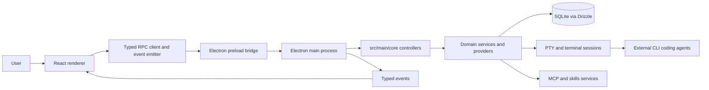

# Project Overview

Switchdash is a cross-platform, local-first Electron app for orchestrating multiple AI
coding agents in parallel. Each agent runs in its own session at the project root (there
are no Git worktrees). An agent runs either locally or — when configured remote — on an
SSH host, where it runs inside tmux next to a switchdash-deployed sidecar so it keeps
working and listening to its Switch rooms while switchdash is closed (CHOO-1059). It
combines provider-agnostic CLI agent execution, session and conversation management,
terminal sessions, MCP and skills, and packaging for desktop releases.

Switchdash is an open-source fork; upstream attribution is recorded in `NOTICE`. The
product is fully rebranded to switchdash: packages (`@switchdash/*`), the app directory
(`apps/switchdash-desktop/`), the user-data directory, the per-project config file
(`.switchdash.json`), the macOS app id (`com.switchdash.*`), release artifact names
(`ARTIFACT_PREFIX`), and the agent-hook HTTP protocol (`X-Switchdash-*` headers) all carry
the switchdash name. The **update feed** points at GitHub Releases on the private
`sandbox-quantum/switch` repo (see `electron-builder.config.ts` `publish`): the app
distributes to repo-readers and authenticates the updater with the user's `gh` CLI token
(`src/main/core/updates/github-token.ts`). The SQLite database file is `switchdash.db`;
installs upgrading from a pre-rebrand build are migrated forward from their legacy database
on first launch — see `LEGACY_DB_FILENAMES` in `src/main/db/default-path.ts` and the
copy-migration in `database-file.ts` (those legacy filenames are the only place the
pre-rebrand name is retained).

## Repository Structure

This is a pnpm workspace monorepo. The Electron app lives in `apps/switchdash-desktop/`
(package `@switchdash/switchdash-desktop`). Unless prefixed otherwise, `src/...`, `drizzle/`,
`scripts/`, `build/`, and config-file paths in this document and in `agents/` docs are
relative to `apps/switchdash-desktop/`.

Repo root:

- `.claude/` - Local Claude agent settings for this checkout.
- `agents/` - Agent-facing architecture, workflow, convention, integration, and risk docs.
- `apps/switchdash-desktop/` - The Electron desktop app (everything below).
- `packages/` - Shared workspace packages: core runtime, shared primitives, and plugins.
  - `packages/core/` - Transport-agnostic core runtime primitives.
  - `packages/shared/` - Shared workspace primitives.
  - `packages/plugins/` - Plugin interfaces and helpers.
- Root config files - `pnpm-workspace.yaml`, root `package.json` with aggregate scripts,
  `.nvmrc`, `.oxfmtrc.json`, `.oxlintrc.json`.

Inside `apps/switchdash-desktop/`:

- `build/` - Electron packaging assets; avoid edits unless working on packaging or signing.
- `drizzle/` - Generated Drizzle SQL migrations and metadata.
- `scripts/` - Release, verification, and build support scripts.
- `src/main/` - Electron main process, RPC controllers, services, database, PTY.
- `src/preload/` - Typed Electron preload bridge exposed to the renderer.
- `src/renderer/` - React app organized around `app/`, `features/`, `lib/`, and tests.
- `src/shared/` - Shared IPC primitives, provider metadata, events, MCP, skills, and types.
- `src/types/` - Ambient and cross-cutting TypeScript declarations.
- `tooling/` - App-level dev and test infrastructure that is not bundled into production.
- App config files - Electron Vite, Vitest, TypeScript, Drizzle, Nix, and packaging config.

## Build & Development Commands

The repo root has aggregate scripts (`dev`, `build`, `test`, `lint`, `format`,
`format:check`, `typecheck`) that fan out through the pnpm workspace. App-specific
commands run from `apps/switchdash-desktop/`.

Install dependencies (repo root):

```bash
pnpm install
```

Start the full workspace dev setup from the repo root. This builds `packages/**`
once, then runs package watch builds and the Electron app in parallel:

```bash
pnpm run dev
```

Start only the Electron app from `apps/switchdash-desktop/`:

```bash
cd apps/switchdash-desktop
pnpm run dev
pnpm run d
```

Run main-process or renderer-only dev watches:

```bash
pnpm run dev:main
pnpm run dev:renderer
```

Run with debug logging:

```bash
pnpm run dev:debug
```

Use an isolated development database for schema or migration work by pointing
`SWITCHDASH_DB_FILE` at a scratch path. From the repo root this starts the full workspace
dev setup:

```bash
SWITCHDASH_DB_FILE=/tmp/switchdash-scratch.db pnpm run dev
```

From `apps/switchdash-desktop/`, this starts only the Electron app:

```bash
cd apps/switchdash-desktop
SWITCHDASH_DB_FILE=/tmp/switchdash-scratch.db pnpm run dev
```

Reset the dev databases from `apps/switchdash-desktop/`:

```bash
pnpm run db:reset
```

Build the app:

```bash
pnpm run build
pnpm run build:main
pnpm run build:renderer
```

Package desktop artifacts locally:

```bash
pnpm run package
pnpm run package:mac
pnpm run package:linux
pnpm run package:win
```

Run formatting, linting, type checks, and tests:

```bash
pnpm run format
pnpm run lint
pnpm run typecheck
pnpm run test
```

Run focused database validation:

```bash
pnpm run db:setup
pnpm run db:fixtures
pnpm run test:migrations
```

Rebuild native Electron dependencies after native dependency changes:

```bash
pnpm run rebuild
```

Clean and reset dependencies:

```bash
pnpm run clean
pnpm run reset
```

## Code Style & Conventions

- Use Node `24.14.0` from `.nvmrc` and `pnpm@10.28.2`.
- Use `pnpm` for root project work; do not introduce npm or yarn lockfile churn.
- Format with `oxfmt`; config is `.oxfmtrc.json`.
- Keep formatted lines near the configured `printWidth` of 100 characters.
- Use 2 spaces, semicolons, single quotes in TS, double quotes in JSX, LF endings,
  trailing commas where valid in ES5, and sorted imports.
- Lint with `oxlint`; config is `.oxlintrc.json` with correctness errors,
  TypeScript, React hooks, and local repo rules enabled.
- TypeScript strict mode is enabled in `apps/switchdash-desktop/tsconfig.json`, the single
  tsconfig for all app targets.
- Avoid `any`; if a registry or boundary needs it, keep the escape local and documented.
- Use top-level `import` statements; do not use `require()`.
- Never re-export as a shortcut; import from the original source.
- Components use `PascalCase`; hooks use `useX` camelCase or an existing local pattern.
- Tests use `*.test.ts` or `*.test.tsx`.
- Main-process RPC handlers live in `src/main/core/*/controller.ts` and delegate to
  imported operation or service functions.
- Renderer RPC calls go through `rpc` from `src/renderer/lib/ipc.ts`.
- Feature UI lives under `src/renderer/features/<feature>/`; shared renderer
  primitives, stores, hooks, modal infrastructure, PTY, Monaco, and UI live under
  `src/renderer/lib/`.
- New modals must be registered in `src/renderer/app/modal-registry.ts`.
- New views must be registered in `src/renderer/app/view-registry.ts`.
- New commands should use `src/renderer/lib/commands/registry.ts` and view-level
  `commandProvider` hooks where possible.
- Commit messages should follow Conventional Commits:

```text
<type>(<scope>): <short imperative summary>

Examples:
fix(opencode): change initialPromptFlag from -p to --prompt for TUI
feat(docs): add changelog tab with GitHub releases integration
```

## Architecture Notes



The app boots from `src/main/index.ts`, loads environment and database state,
registers RPC controllers through `src/main/rpc.ts`, creates the Electron window,
and exposes a typed preload API from `src/preload/index.ts`. The renderer is a
React app that calls typed RPC methods, subscribes to typed events, and coordinates
views, modals, command providers, project state, terminals, and session workflows.
Shared IPC primitives, provider metadata, events, MCP types, skills types, and
domain types live under `src/shared/`.

Major main-process domains live under `src/main/core/`: agent hooks, agents, app,
conversations, dependencies, execution context, fs, projects, prompt library, PTY,
resource monitor, runtime, search, secrets, sessions, settings, switch agents,
terminal shell, terminals, updates, view state, and workspaces. Stateful
main-process concerns use singleton services; expected failures should use the
`Result<T, E>` pattern from `src/main/lib/result.ts`.

## Testing Strategy

- Local merge gate:

```bash
pnpm run format
pnpm run lint
pnpm run typecheck
pnpm run test
```

- Unit tests run with Vitest in the `node` project for `src/**/*.test.ts`.
- Main database integration tests run in the `main-db` Vitest project.
- Migration tests run in the `migrations` project via `pnpm run test:migrations`.
- Fixture generation runs in the `fixtures` project via `pnpm run db:fixtures`.
- Renderer browser tests run in the `browser` project using Playwright-backed
  `@vitest/browser-playwright`.
- Main-process tests are colocated in `src/main/core/**/*.test.ts`.
- Renderer unit tests live under `src/renderer/tests/`.
- Renderer browser tests live under `src/renderer/tests/browser/`.
- Integration-style tests create temporary projects in `os.tmpdir()`.
- Run the consistency checks locally before merging:

```bash
pnpm run format:check
pnpm run typecheck
pnpm run lint
```

- Run the tests locally before merging as well.

## Security & Compliance

- The project is licensed under Apache-2.0; see `LICENSE.md`.
- Do not commit secrets, tokens, private keys, app databases, logs, build artifacts,
  or generated dependency folders.
- Application secrets are stored through encrypted app secret services and Electron
  safe storage.
- The app ships no telemetry or analytics; do not add tracking or phone-home behavior.
- File logging redacts common secret patterns; preserve this behavior when touching
  logging or error-reporting code.
- PTY environment passthrough must use the allowlist in `src/main/core/pty/pty-env.ts`.
- Treat shell escaping and PTY spawning as security-sensitive.
- Do not bypass path-safety, shell escaping, or validation helpers.
- Use `pnpm-lock.yaml` for dependency integrity and review dependency changes.

## Agent Guardrails

- Load only the relevant `agents/` docs for the area being changed.
- Do not hand-edit numbered Drizzle migrations or `drizzle/meta/`.
- Use `pnpm run db:generate` for new migrations, then update fixtures and migration tests.
- Avoid editing `dist/`, `release/`, `out/`, `build/`, and generated package artifacts
  unless the task is explicitly about packaging, signing, or release behavior.
- Do not dispatch release workflows, publish packages, or upload artifacts unless the
  user explicitly asks for release work.
- Treat `src/main/core/pty/`, `src/main/db/`, and updater code as high risk and read
  the matching `agents/risky-areas/` page first.
- Do not weaken shell quoting, spawn behavior, env allowlists, or secret redaction casually.
- Prefer existing service, provider, RPC, modal, view, and store patterns over new abstractions.
- New RPC methods belong in the appropriate `src/main/core/*/controller.ts` and are
  registered through `src/main/rpc.ts`.
- Keep renderer-main calls on typed RPC and typed events. The preload bridge in
  `src/preload/index.ts` should stay small; add direct `window.electronAPI` surface
  only when a browser/Electron primitive cannot fit the RPC/event path.
- Access session and project MobX stores through selectors and session view hooks:
  `getSessionStore`, `asProvisioned`, `sessionViewKind`, `getSessionManagerStore`,
  `getProjectStore`, `asMounted`, `useSessionViewKind`, `useWorkspace`,
  `useWorkspaceId`, `useDevServers`, `useWorkspaceViewModel`, and
  `useSessionAgent`.
- Never use `asProvisioned(...)!` or `asMounted(...)!`; use explicit null checks.
- State guards must check `kind !== 'ready'` rather than enumerating non-ready states.
- Access session managers through `getSessionManagerStore(projectId)`, not `project.sessionManager`.
- Access mounted projects through `asMounted(getProjectStore(id))`, not inline guards.
- Session selectors live in `src/renderer/features/sessions/stores/session-selectors.ts`.
- Project selectors live in `src/renderer/features/projects/stores/project-selectors.ts`.
- For provider changes, update shared provider metadata, PTY env passthrough if needed,
  hook/plugin integrations, renderer assumptions, and tests for non-standard behavior.
- For MCP changes, keep canonical data in shared types and adapt provider formats at edges.
- Run the local merge gate before merging:

```bash
pnpm run format
pnpm run lint
pnpm run typecheck
pnpm run test
```

## Extensibility Hooks

- Agent providers are defined in `src/shared/core/agents/agent-provider-registry.ts`.
- Provider detection lives in `src/main/core/dependencies/dependency-manager.ts`.
- Provider PTY behavior and env passthrough live under `src/main/core/pty/`.
- Provider event hooks and plugins live under `src/main/core/agent-hooks/`.
- Modal definitions are centralized in `src/renderer/app/modal-registry.ts`.
- View definitions and navigation guards are centralized in `src/renderer/app/view-registry.ts`.
- MCP types live under `src/shared/core/mcp/`.
- Skills types and validation live under `src/shared/core/skills/`.
- Per-project runtime settings can be supplied through `.switchdash.json`:
  `preservePatterns`, `scripts.setup`, `scripts.run`, `scripts.teardown`, and
  `shellSetup`.
- Project settings such as `tmux` and `workspaceProvider` are DB-backed, not
  `.switchdash.json`.
- Optional environment variables:
  `SWITCHDASH_DB_FILE`, `SWITCHDASH_DISABLE_NATIVE_DB`,
  `SWITCHDASH_DISABLE_PTY`, `SWITCHDASH_REGISTER_DEEPLINK`, `CODEX_SANDBOX_MODE`,
  and `CODEX_APPROVAL_POLICY`.
- Deeplinks in dev: `pnpm run dev` does **not** claim the `switchdash://` OS URL
  scheme by default — doing so hijacks the handler from the installed app and the
  registration outlives the dev process (on macOS it sticks in Launch Services),
  so later deeplinks open the bare dev Electron's welcome window instead of the
  installed app. To test deeplinks against the dev build, run with
  `SWITCHDASH_REGISTER_DEEPLINK=1 pnpm run dev`; afterwards run
  `pnpm run deeplink:reset` (macOS) to hand the scheme back to the installed app.
- Path aliases are defined in `tsconfig.json` and mirrored in `electron.vite.config.ts`:
  `@/*`, `@renderer/*`, `@main/*`, `@shared/*`, and `@root/*`.
- Versioned JSON column schemas are defined in `src/shared/` using
  `defineVersionedSchema()` from `src/shared/lib/versioned-schema.ts` and wired to
  Drizzle via `versionedJsonColumn()` from `src/main/db/versioned-column.ts`.
  See `agents/conventions/versioned-schemas.md` for the full guide.

## Further Reading

- [Agent docs map](agents/README.md)
- [Quickstart](agents/quickstart.md)
- [Architecture overview](agents/architecture/overview.md)
- [Main process architecture](agents/architecture/main-process.md)
- [Renderer architecture](agents/architecture/renderer.md)
- [Shared modules](agents/architecture/shared.md)
- [Data model (switchdash vs. its upstream origin)](agents/architecture/data-model.md)
- [Testing workflow](agents/workflows/testing.md)
- [Provider integration](agents/integrations/providers.md)
- [MCP integration](agents/integrations/mcp.md)
- [IPC conventions](agents/conventions/ipc.md)
- [Main-process patterns](agents/conventions/main-patterns.md)
- [Renderer patterns](agents/conventions/renderer-patterns.md)
- [TypeScript and React conventions](agents/conventions/typescript.md)
- [Config file rules](agents/conventions/config-files.md)
- [Versioned schema conventions](agents/conventions/versioned-schemas.md)
- [Database risk notes](agents/risky-areas/database.md)
- [PTY risk notes](agents/risky-areas/pty.md)
- [Updater risk notes](agents/risky-areas/updater.md)
- [Contributing guide](CONTRIBUTING.md)
- [Project README](README.md)
