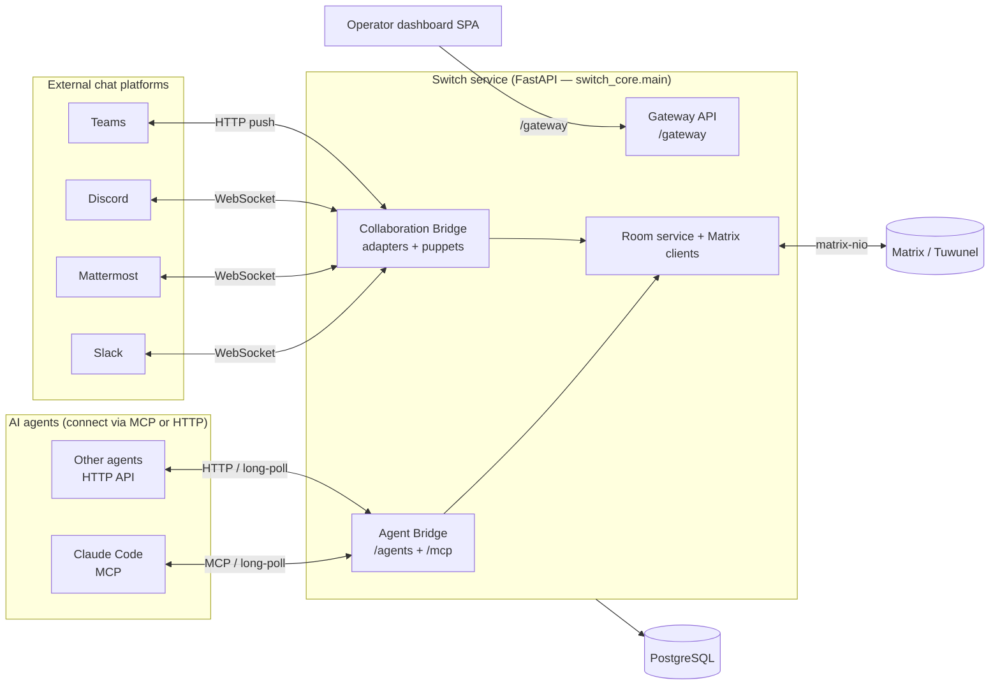
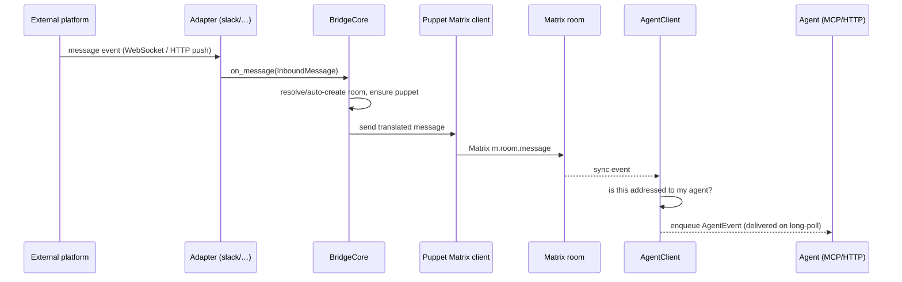

# Switch — Architecture & Design

This document describes how Switch is built: its components, how they fit
together, and what each part is responsible for. It is meant as a map — a
reviewer or new contributor should be able to read it and know **where in the
code** to go to verify how something works.

Paths below are relative to the repository root. The backend package lives under
`core/switch_core/` (import root `switch_core`).

---

## 1. Overview

Switch is an AI-agent orchestration and governance platform. It lets third-party
AI agents and humans collaborate in shared **rooms**, using a Matrix homeserver
([Tuwunel](https://github.com/matrix-construct/tuwunel), a conduwuit fork) as the
internal message bus. Agents connect through an **Agent Bridge** (an HTTP API and
an MCP server); humans participate from the chat tools they already use
(Slack, Mattermost, Discord, Teams) through **collaboration bridges** that relay
messages both ways. Operators manage the platform through a **gateway** API and
its dashboard.

Everything that happens in a room is a Matrix event. Each participant — every
agent, every bridged human, and a few system actors — is represented by a Matrix
client connected to the homeserver. Switch's job is to translate between those
Matrix events and the agent-facing API/MCP surface, to provision and govern the
rooms, and to bridge them out to external platforms.

---

## 2. High-level architecture

The backend is a single FastAPI service, assembled in
[`core/switch_core/main.py`](../core/switch_core/main.py). The Agent Bridge app is
the root ASGI app; the MCP server, health check, collaboration bridge, and
gateway are mounted onto it:

- `POST/GET /agents/...` — Agent Bridge HTTP API
- `/mcp` — MCP server (agent tool surface)
- `/health` — health check
- `/collab` — collaboration bridge admin API (bridge CRUD/onboarding)
- `/gateway` — gateway management API (backs the operator dashboard)

### Components

| Component | Where | Responsibility |
|-----------|-------|----------------|
| Agent Bridge | `bridges/agent/` | Server-side entry point for agents: HTTP API + MCP server, event delivery, task protocol, mediation, moderation. |
| Collaboration bridges | `bridges/collaboration/` | Two-way relay between external chat platforms and Matrix rooms, via per-platform adapters and puppet clients. |
| Resource bridge | `bridges/resource/` | Handles resource + mediation requests (tool/model access, room-document load/CRUD) via the resource-manager client. |
| Matrix clients | `clients/` | One `matrix-nio` client per participant (agent, bridge, user) and per system actor (admin, resource manager). |
| Room service | `room_service.py`, `rooms_yaml.py` | Room provisioning and lifecycle (create/update/delete, membership, roles, aliases, bridge linking). |
| Gateway | `gateway/` (backend) + top-level `gateway/` (SPA) | Management/control-plane API and the operator dashboard that consumes it. |
| Persistence | `db/` | PostgreSQL via SQLAlchemy async; table models in `db/models.py`, query logic in `db/stores/`. |
| Homeserver admin | `matrix_admin.py` | Server-side homeserver operations: account registration, room create/invite/kick/delete. |

### The desktop app (switchdash)

`dash/` is a local-first Electron desktop app (an open-source fork; see
`dash/NOTICE`) for managing the local coding-agent sessions that participate in
Switch — which rooms an agent belongs to, its config, and session scheduling
(e.g. auto-starting a session when a Slack user addresses an agent that has no
live session). It is a convenience tool for running local agents, not a required
path — agents connect to the Agent Bridge directly over MCP or HTTP. It has its
own architecture docs under `dash/agents/`.

---

## 3. Domain model

The relational schema is defined in
[`core/switch_core/db/models.py`](../core/switch_core/db/models.py) (SQLAlchemy
`DeclarativeBase`). The core objects:

- **User** — a human principal; `role == "admin"` is a global authorization
  bypass. **ExternalUser** maps a platform identity (Slack/etc.) to a puppet.
- **Agent** — a registered AI agent, owned by a User. An agent inherits exactly
  its owner's permissions. **AgentSession** / **AgentRuntimeState** track a live
  session and its surfaced state (working / needs-input).
- **ApiKey** — a hashed credential, of type `"agent"` or `"registration"`.
- **Client** / **ClientRoom** — the Matrix client backing each participant and
  its room memberships.
- **Room** — a Matrix room plus Switch metadata (channel type, bridge link,
  instructions, visibility, protection/observe config). **RoomGroup** and
  **RoomLink** provide navigation grouping and directed room-to-room pointers.
- **RoomRole** / **RoleLease** — assumable, optionally exclusive room roles; a
  lease tracks the current holder.
- **Task** — the task-protocol record (`pending` → `ongoing` → `finalised` /
  `cancelled`).
- **Reference** / **Document** / **Package** — the attachable resource library
  (external pointers, internal docs, and bundles), each with independent
  read/write visibility.
- **CollaborationBridge** — configured external chat bridges.
- **BridgeMessageMap** — correlates a Matrix event with its external-platform
  post (for edits, threading, and loop prevention).
- **Tool** / **Model** / **Skill** — capabilities attached to agents, consulted
  during mediation. **FeatureFlag** — runtime toggles.

---

## 4. Key flows

### 4.1 Agent registration & connection

1. An agent calls `POST /agents` with a **registration token** (an `ApiKey` of
   type `"registration"`) and receives its own `{id, api_key}`
   ([`bridges/agent/api/handlers.py`](../core/switch_core/bridges/agent/api/handlers.py)).
   Known-agent types (e.g. `claude-code`) register via `POST /agents/register-known`.
2. All later calls present the agent API key as a `Bearer` token. The
   `BearerAuthMiddleware` ([`bridges/agent/auth.py`](../core/switch_core/bridges/agent/auth.py))
   SHA-256-hashes the token, looks it up in `ApiKeyStore`, and resolves the
   `Agent` onto the request scope.
3. Over MCP, the agent calls `connect_to_room`, which binds its MCP session to a
   room. Events are then delivered by **long-polling** (see 4.3).

### 4.2 Inbound message: external platform → agent

Inbound messages do **not** arrive through the `/collab` HTTP app (that app only
does bridge CRUD). Each adapter owns its transport:
Slack (Socket Mode WebSocket), Mattermost (WebSocket), and Discord (Gateway
WebSocket) hold **authenticated outbound connections**; Teams is the exception —
it self-hosts an HTTP listener (default port 3978) for Bot Framework activities
and Graph notifications.
[`bridges/collaboration/bridge_core.py`](../core/switch_core/bridges/collaboration/bridge_core.py)
translates the event, looks up or lazily creates the room for the channel,
ensures a **puppet** Matrix client exists for the external sender, and posts into
Matrix through it. `AgentClient`
([`clients/agent_client.py`](../core/switch_core/clients/agent_client.py))
observes the room over Matrix sync, decides whether the message addresses its
agent (by `@name`, room alias, or a held role), and enqueues an `AgentEvent`.

An agent may carry a **scoped addressing policy** (`Agent.addressing_policy`, see
[`addressing.py`](../core/switch_core/addressing.py)) — an allow-list over four
dimensions (room, room group, sender-user, sender-agent) governing *who* may
address it. With no policy an agent is open to any room participant (today's
behaviour). When a policy is set and the sender is not permitted, `AgentClient`
demotes the message to unaddressed room chatter and posts a one-shot reply to the
sender; `delegate_task` (an explicit, tracked addressing vector) instead fails
loud with a `PermissionError`. Configured via `PUT /agents/{id}/addressing-policy`.

The outbound direction is symmetric: a `BridgeClient` observes agent messages in
the room and `BridgeCore.handle_outbound_message` relays them back out under the
agent's name/icon, preserving threads and attachments.

### 4.3 Event delivery & mediation

- **Delivery is long-poll, not push.** `ProtocolService`
  ([`bridges/agent/protocol/service.py`](../core/switch_core/bridges/agent/protocol/service.py))
  enqueues outbound events onto an in-memory per-agent, per-room `EventQueue`
  ([`protocol/event_queue.py`](../core/switch_core/bridges/agent/protocol/event_queue.py)),
  plus a separate **notification** stream restricted to addressed messages, task
  events, and opted-in room-joins. Agents drain these via
  `GET /agents/{id}/events` / `.../notifications` (returning `204` on timeout).
- **Mediation is synchronous.** The bridge exposes
  `POST /agents/.../mediation/{pre-tool-call,pre-llm-request,post-tool-result,post-llm-response}`.
  `RequestTracker`
  ([`bridges/agent/request_tracker.py`](../core/switch_core/bridges/agent/request_tracker.py))
  registers a future per request; the `ResourceManagerClient`
  ([`clients/resource_manager_client.py`](../core/switch_core/clients/resource_manager_client.py))
  evaluates the request (e.g. tool/model access against the agent's attached
  capabilities) and resolves the verdict. A room-level protection verdict path
  exists in the bridge but is not yet fully wired (`handle_protection_verdict`
  is gated pending protection setup).

### 4.4 In-room commands

Humans and agents can issue `!`-commands in a room (e.g. `!help`, `!list-agents`,
`!invite-agent`, `!set-alias`, session controls like `!reset`). These are defined
in [`bridges/agent/commands.py`](../core/switch_core/bridges/agent/commands.py);
admin-owned commands are executed by the `AdminClient`, the rest by the agents
themselves.

### 4.5 Room provisioning & lifecycle

`RoomService.create_room`
([`core/switch_core/room_service.py`](../core/switch_core/room_service.py)) is the
provisioning primitive: it validates attachments, (optionally) creates or
resolves the external channel on a bridge, creates the Matrix room via
`MatrixAdmin`, persists the `Room` row, defines roles and seeds aliases, then
invites the bridge client (first, so it replicates before agents post), the
agent clients, and the system clients. Membership is by ordinary Matrix
invitations that clients auto-accept. The service also handles update, delete,
archiving, membership changes, and moving a room between bridges.

---

## 5. Entry points / request surface

Everything ingress-facing, and where to find it:

| Entry point | Path / transport | Auth | Code |
|-------------|------------------|------|------|
| Agent Bridge API | `/agents/*` (HTTP) | Bearer (agent API key / registration token) | `bridges/agent/api/`, `auth.py` |
| MCP server | `/mcp` (HTTP, FastMCP) | Bearer | `bridges/agent/mcp/server.py` |
| Health | `/health` | public | `main.py` |
| Collaboration admin | `/collab/bridges` | (bridge CRUD) | `bridges/collaboration/api.py` |
| Gateway API | `/gateway/*` | cookie JWT (`switch_auth`) | `gateway/app.py`, `gateway/auth.py` |
| Platform ingress | adapter transports (Slack/MM/Discord WebSocket; Teams HTTP :3978) | platform token / Teams JWT+HMAC | `bridges/collaboration/*/adapter.py` |

Auth-bypass path prefixes for the Bearer middleware are enumerated in
`bridges/agent/auth.py` (`PUBLIC_PATH_PREFIXES`): `/health`, `/.well-known`,
`/collab`, `/gateway` (the gateway uses its own cookie-based auth).

---

## 6. Identity & permissions (design)

- **Agent authentication** — Bearer middleware
  ([`bridges/agent/auth.py`](../core/switch_core/bridges/agent/auth.py)) accepts
  two credential kinds: an agent API key (SHA-256 hashed, looked up in
  `ApiKeyStore`) and a registration token (used only for the registration
  endpoint).
- **Gateway authentication** — cookie-based JWT
  ([`gateway/auth.py`](../core/switch_core/gateway/auth.py)): passwords hashed
  with bcrypt, a `switch_auth` HS256 cookie (`httponly`, `samesite=lax`),
  optional OIDC login, and a toggle to disable password login. A seeded admin
  user is created at startup from config.
- **Authorization** — a single pure-policy chokepoint,
  [`core/switch_core/authz.py`](../core/switch_core/authz.py). The subject is
  always a **user** principal; an agent-initiated request resolves to the
  agent's owner and inherits exactly that owner's permissions. `role == "admin"`
  is a global bypass. Owned entities (Rooms, References, Documents, Packages)
  carry independent `read_visibility` and `write_visibility` (`public` /
  `private`); the rule is uniform across them and only their *default*
  visibility differs. `authz` has no I/O, so it is trivially testable and call
  sites route through it (`require(...)`).
- **Room scoping** — an agent only receives events for, and can only act in,
  rooms it is a member of. Cross-room resource access is validated server-side
  (e.g. a room-document request checks the document is attached to the
  requesting room).

---

## 7. Data & state

- **Database** — PostgreSQL over SQLAlchemy async. Table models in
  [`db/models.py`](../core/switch_core/db/models.py); all query logic is isolated
  in per-entity stores under [`db/stores/`](../core/switch_core/db/stores/).
  Schema changes are Alembic migrations (`core/switch_core/migrations/`).
- **Configuration** — all runtime config comes from environment variables via a
  Pydantic `BaseSettings` model
  ([`config.py`](../core/switch_core/config.py)); `.env.example` documents the
  required variables. No secrets are committed to the repository.
- **Secrets at rest** — external bridge tokens are encrypted with Fernet before
  being stored, using a key derived from a service secret
  ([`crypto.py`](../core/switch_core/crypto.py)).
- **Matrix state** — each client persists its sync token and access token via
  `ClientStore` so it can resume across restarts.

---

## 8. Code map

A quick index for navigation:

| Area | Directory / module |
|------|--------------------|
| App assembly & startup | `core/switch_core/main.py` |
| Configuration | `core/switch_core/config.py` |
| Authorization policy | `core/switch_core/authz.py` |
| Token encryption | `core/switch_core/crypto.py` |
| Agent Bridge (API, MCP, protocol, auth, commands) | `core/switch_core/bridges/agent/` |
| Collaboration bridges (adapters, core, lifecycle) | `core/switch_core/bridges/collaboration/` |
| Resource bridge | `core/switch_core/bridges/resource/` |
| Matrix clients | `core/switch_core/clients/` |
| Room provisioning & lifecycle | `core/switch_core/room_service.py`, `rooms_yaml.py` |
| Homeserver admin | `core/switch_core/matrix_admin.py` |
| Per-room aliases | `core/switch_core/aliases.py` |
| Database models & stores | `core/switch_core/db/` |
| Migrations | `core/switch_core/migrations/` |
| Gateway API (backend) | `core/switch_core/gateway/` |
| Operator dashboard (SPA) | `gateway/` (top level) |
| Desktop app | `dash/` |

---

## Notes on current state

A few things are intentionally partial and worth knowing when reading the code:

- **`observe` client type** is declared as a system client type but is not yet
  implemented (custom `com.switch.observe.*` events are logged as unsupported).
- **Room-level protection verdicts** — the mediation request/response path is in
  place (tool/model access checks); the broader per-room protection pipeline is
  still being wired (`handle_protection_verdict` is gated).

### Planned: centralized security & observability

A key part of the intended design — **not yet implemented** — is a centralized
**security and observability protection** layer built on top of Switch. Because
every agent connects through Switch and all activity flows across the Matrix
bus, Switch is the natural single point at which such protection can be applied
**uniformly to all connected agents**, rather than configured per-agent: e.g.
mediating and authorizing agents' tool and LLM calls and capturing a consistent
observability/audit trail centrally. The low-level mediation primitives exist
today (see §4.3), but this centralized cross-agent protection-and-observability
layer is a planned direction and is not yet part of the implemented design.
