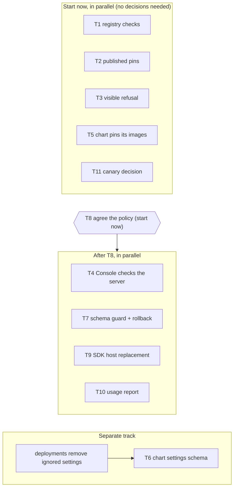
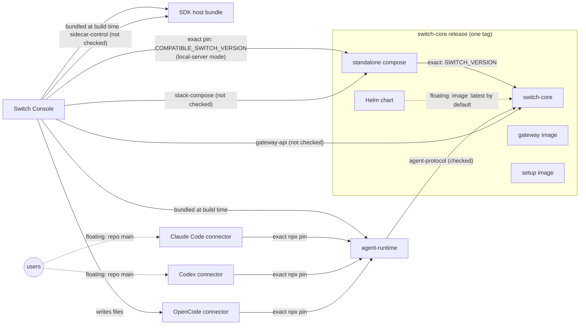

# Artifact versioning, dependencies and updates

Switch is not one program that upgrades in one step. It is a set of artifacts that
are released on their own schedules and upgraded by different people at
different times: an operator upgrades the server, a user's desktop app
auto-updates, a connector plugin changes only when someone clicks Update, and a
remote agent host changes when some Console next touches it. At any moment a
given agent is running a combination of versions that nobody chose as a set.

This note describes how that works today: what the artifacts are, what depends
on what, how each one is updated, what checks compatibility, and where it can
break. It ends with proposals for making changes safely and draft follow-up
work.

It is a map of the current state, not a spec. Where it and the code disagree,
the code wins; fix the note. The mechanics of cutting a release are in
[`RELEASING.md`](../RELEASING.md); the registry itself is
[`artifacts.yaml`](../artifacts.yaml).

**How to read the claims.** Every failure mode is tagged with how we know it:

- **Observed** — it has happened, or the inconsistency exists in the tree today.
- **By construction** — the code guarantees it; read from the source, not seen
  in an incident.
- **Predicted** — a plausible risk nobody has seen yet.

Anything in the policy section that has not been agreed is marked
**Proposal**. Failure modes are numbered F1–F15, proposals P1–P11 and tasks
T1–T11; [At a glance](#reference) lists them all with links.

## At a glance

**Sections:** [1. The artifacts](#1-the-artifacts) ·
[2. What depends on what](#2-what-depends-on-what) ·
[3. How each artifact is updated](#3-how-each-artifact-is-updated) ·
[4. What checks compatibility today](#4-what-checks-compatibility-today) ·
[5. Failure modes](#5-failure-modes) ·
[6. Making changes safely](#6-making-changes-safely) ·
[7. Draft follow-up tickets](#7-draft-follow-up-tickets) ·
[8. Out of scope](#8-deliberately-out-of-scope)

### Proposals

None of these are agreed yet. [T8](#t8) is the task that decides them.

| ID | In plain words | Put into practice by |
|---|---|---|
| [P1](#p1) | Change an interface in two steps: add the new one, remove the old one later | [T8](#t8) (the rule) |
| [P2](#p2) | The server supports older clients, and a client that is too old or too new says so | [T3](#t3), [T4](#t4) |
| [P3](#p3) | Every interface between separately upgraded pieces is checked, and a mismatch is shown to a person | [T3](#t3), [T4](#t4), [T9](#t9) |
| [P4](#p4) | A Console never replaces a remote host built by a newer Console | [T9](#t9) |
| [P5](#p5) | Old versions stay supported for a set number of releases *and* a set time | [T8](#t8) (the numbers) |
| [P6](#p6) | Usage data helps decide when to drop support, but is not the only test | [T10](#t10) |
| [P7](#p7) | Anyone cut off by a removal is told what to update and can do it in one step | [T3](#t3), [T4](#t4) |
| [P8](#p8) | The server refuses to start on a database a newer version has changed | [T7](#t7) |
| [P9](#p9) | A deliberate rollback is allowed, with an explicit and logged override | [T7](#t7) |
| [P10](#p10) | Deploys check before going backwards, and each deployment has one version pin | deployment tooling (outside this repo) |
| [P11](#p11) | Users may install older clients; compatibility checks, not version numbers, keep that safe | [T3](#t3), [T4](#t4) |

### Tasks

"Waits for" lists hard dependencies only. Everything with no entry can start now.

| ID | What it does | Fixes | Waits for | Size |
|---|---|---|---|---|
| [T1](#t1) | CI catches every registry mismatch, including the compose one that has already drifted | [F1](#f1), [F2](#f2), [F5](#f5) | — | small |
| [T2](#t2) | CI fails if a connector pins a runtime version that isn't published | [F10](#f10) | — | small |
| [T3](#t3) | An agent refused for its version stops retrying and says what to update | [F6](#f6), [F12](#f12), [F13](#f13) | — (final wording after [T8](#t8)) | medium |
| [T4](#t4) | Console checks up front that it can talk to the server, remote ones included | [F7](#f7) | [T8](#t8) | medium |
| [T5](#t5) | Installing chart version X runs images X by default | [F8](#f8) | — | small |
| [T6](#t6) | A misspelt or renamed chart setting stops the install instead of being ignored | [F9](#f9) | one release's notice; deployments clean their own config first | medium |
| [T7](#t7) | The server refuses a newer database unless a rollback is explicitly confirmed | [F4](#f4), [F15](#f15) | [T8](#t8) | medium |
| [T8](#t8) | Decide the proposals above and write the agreed rules into `RELEASING.md` | — | — | decision |
| [T9](#t9) | Two Console versions stop replacing each other's remote host | [F3](#f3) | [T8](#t8); coordinate with the in-flight one-stream-per-agent work | medium |
| [T10](#t10) | Operators can see which client versions are still in use | [F12](#f12), [F13](#f13) | [T8](#t8) | medium |
| [T11](#t11) | Either build the Console canary or remove it | [F5](#f5) | — | small |

Two failure modes have no task on purpose: [F11](#f11) (merging a connector
change releases it) and [F14](#f14) (the local-server pin lags the server). Both
are trade-offs that need a decision, not a fix.

### Work order

- **Start now, in parallel:** [T1](#t1), [T2](#t2), [T5](#t5) and [T11](#t11)
  need no decisions and do not touch each other. [T3](#t3) can be built now;
  only its message text waits for [T8](#t8). Start [T8](#t8) now too, because
  most of the rest waits for it.
- **After [T8](#t8), in parallel:** [T4](#t4), [T7](#t7), [T9](#t9) and
  [T10](#t10). They touch different parts of the system.
- **On its own schedule:** [T6](#t6) waits until deployments have removed the
  settings the chart already ignores. Otherwise their next deploy fails. It
  also needs a release's notice.
- **Before anyone drops support for an old version:** [T3](#t3) and
  [T10](#t10) must both be done, so that people who are cut off are told, and
  the decision can be based on usage.

## 1. The artifacts

`artifacts.yaml` is the registry: every artifact's release version, and,
separately, which interface revisions (contracts) it speaks. `just artifacts`
generates the same data into Python and TypeScript modules, and
`just artifacts-check` (CI) verifies that the files a packaging tool owns —
`pyproject.toml`, the `package.json`s, the plugin manifests — agree with it.

| Artifact | Version lives in | Published as | Who upgrades it, and how |
|---|---|---|---|
| **switch-core** (server + gateway API) | `core/pyproject.toml` | container images, tag `switch-v<version>` | an operator, by deploying a release |
| gateway, setup images | none — `version_from: switch-core` | container images, same tag | with switch-core |
| Helm chart | none — `version_from: switch-core` | OCI chart, same tag | an operator, with switch-core |
| standalone compose | none — `version_from: switch-core` | OCI artifact, same tag | Console local-server mode, or an operator |
| **Switch Console** (desktop app) | `console/apps/switch-console-desktop/package.json` | GitHub Release + auto-update feed, tag `switch-console-v<version>` | each user, via auto-update |
| **agent-runtime** (protocol client + MCP server) | `console/packages/switch-agent-runtime/package.json` | npm, tag `switch-agent-runtime-v<version>` | nobody directly — consumers pin it |
| **SDK host** (the code Console runs on a remote agent host) | `artifacts.yaml` `sidecar` (unused — see §4) | shipped inside Console, uploaded over SSH | Console, automatically |
| **Claude Code connector** | `connectors/claude-code-plugin/.claude-plugin/plugin.json` | plugin marketplace = this repo's `main` branch | each user, via Update |
| **Codex connector** | `connectors/codex-plugin/.codex-plugin/plugin.json` | plugin marketplace = this repo's `main` branch | each user, via Update |
| **OpenCode connector** | `connectors/opencode-plugin/package.json` | not published; Console writes the files | each user, via Update in Console |

Two things are notable about publishing:

- **Connector plugins have no release step.** The marketplace serves whatever is
  on `main`, so merging a plugin change *is* releasing it. There is no tag.
- **The SDK host has no release step either.** It ships inside each Console
  build and is identified by the hash of its bundle, not by a version.

## 2. What depends on what

The edges, by how tightly they are held:

| Edge | Held by | Kind |
|---|---|---|
| Console → switch-core (local-server mode) | `switch-console.pins.switch-core` in `artifacts.yaml`, mirrored as `COMPATIBLE_SWITCH_VERSION` in `app-identity.ts` / `app-identity.canary.ts` and the bundled compose copy | exact; checked by `artifacts-check` |
| compose → images | `${SWITCH_VERSION:?required}` | exact, no default |
| Helm chart → images | `values.yaml` image fields | **floating** — `:latest` with `imagePullPolicy: Always` unless the operator overrides it; the chart version does not select its images |
| connectors → agent-runtime | `npx @sandboxaq/switch-agent-runtime@<version>` in each connector's MCP config and `SWITCH_AGENT_RUNTIME_PIN` | exact; the pins agree with each other (`runtime-pin.test.ts`, `connector-assets.test.ts`) but nothing checks the pinned version is published |
| Console → agent-runtime | pnpm `workspace:*` | built from source into each Console build |
| Console → SDK host | built into each Console build | exact by content hash |
| users → Claude/Codex connectors | marketplace on `main` | floating — whatever `main` held when the user last updated |
| Console → any **remote** switch-core | nothing | unconstrained — the user points Console at a server of any version |
| gateway UI → switch-core API | same image and release | coupled by construction |

**Independently chosen versions are expected, not a defect.** A user on last
month's Console connecting to this week's server is the normal case, and the
design should keep supporting it. The gap is that the rules for which
combinations are supported are unwritten, and most of them are not checked.

## 3. How each artifact is updated

| Artifact | Bumped by, when | Released by | A consumer picks it up when | A stale copy can linger in |
|---|---|---|---|---|
| switch-core | the releaser, as the first step of a release | pushing `switch-v<version>` | an operator deploys that version; Console's local-server stack restarts after a Console update moves its pin | a deployment not yet rolled; a managed local stack until restarted (Console shows a drift notice) |
| Switch Console | the releaser | pushing `switch-console-v<version>`; macOS assets need an approval before the release is complete | auto-update installs it | users who defer or disable updates |
| agent-runtime | the developer, in the commit that changes it | pushing `switch-agent-runtime-v<version>` | **after** a later commit moves the connector pins to it and users update those connectors; Console picks it up at its next release | every connector install still pinning an older version |
| SDK host | nothing — identified by bundle hash | shipping in a Console release | a Console on the new build starts, opens a remote session, or changes watcher settings for that agent; the host is replaced and live sessions on the old build restart onto the new one. Update in settings re-runs the same path | sessions of an agent with auto-session off, until next opened |
| Claude / Codex connectors | the developer, in the commit that changes it | merging to `main` | the user clicks Update. Console also runs a one-off catch-up update, bounded by a generation counter and a retry cap | any install whose user has not clicked Update. A Codex install with no Switch tools until upgraded, because Codex caches an install per version |
| OpenCode connector | the developer, in the commit that changes it | shipping in a Console release (the files are embedded) | the user clicks Update; the install records the connector's own version and Console compares that against the version it carries | installs whose user has not clicked Update |

**The runtime takes three steps to reach an agent.** A runtime change is
bumped with the change, the runtime is published by tag, and only then do the
connector pins move to it. Each connector user must then update. `console/AGENTS.md`
describes the ordering; nothing enforces it.

**Release and deploy are separate.** A release publishes artifacts and changes
no environment; deploying rolls an already-published version onto an
environment and happens later, by someone else. `RELEASING.md` covers the first.
Deployments are operated outside this repository.

## 4. What checks compatibility today

Part 1 of the contract work (switch-core 0.12.4) built declarations: every
artifact states its version and contract ranges, switch-core discloses its own
on authenticated surfaces, and it records what connecting clients declare. Its
own changelog entry says *nothing acts on the declarations yet*. That is still
mostly true.

| Contract / pairing | Checked? | What happens on a mismatch |
|---|---|---|
| **agent-protocol** (runtime ↔ switch-core) | **Yes.** The runtime declares its range when it opens the event stream; switch-core refuses a non-overlapping range with a structured 409 naming the side that is behind. A client that declares nothing is admitted and recorded as unknown. | The runtime treats the 409 as a generic HTTP error and **retries forever** with backoff, logging a warning at power-of-two failure counts. No person is told why. |
| **gateway-api** (Console ↔ switch-core) | No. switch-core returns its declaration on every session response; no client reads it. | Whatever the changed endpoint does. |
| **stack-compose** (Console ↔ compose) | No runtime comparison. | Local-server mode drives whatever compose it has bundled. |
| **sidecar-control** (Console ↔ SDK host) | No. | Replacement is by *build equality*: any running host on a different build is replaced, newer or older. |
| **db-schema** (internal to switch-core) | Declared, never compared. | Startup runs `alembic upgrade head`. An older release against a schema a newer release migrated is expected to fail at boot, because Alembic cannot locate the newer revision. Nothing explains this in Switch's own terms. |
| Console local-server pin | Yes, at start. Console writes its pinned version into the stack's environment, reads back the running version, and shows a drift notice: Restart when the stack is older, an explanation when it is newer, a warning when unreadable. | Visible and recoverable. |
| Console ↔ remote switch-core version | No. | — |
| Helm chart `values.yaml` | No contract (documented gap in `RELEASING.md`). Helm ignores unknown keys. | A renamed or removed key an operator still sets is silently dropped. |
| Connector install freshness | Yes: installed version vs. the version the marketplace or Console advertises; drives "update available". | Visible; the user decides. |

The `sidecar` version in `artifacts.yaml` is not read by any deploy or host code.
The SDK host's real identity is its bundle hash, and the ranges the old sidecar
used to negotiate went away with it.

## 5. Failure modes

[↑ At a glance](#reference)

### Observed

- **F1. A published contract declaration has drifted from the registry.** The
   standalone compose file declares `stack-compose` `speaks: 1`, while
   `artifacts.yaml` says 2 and the release workflow stamps 2 onto the published
   artifact. `artifacts-check` does not compare the file.
- **F2. The registry check can be skipped on a PR.** CI path-filters the
   `artifacts` job, and the filter omits `connectors/opencode-plugin/package.json`
   (a `declared_in` file) and the compose files. A PR touching only those skips
   the check until it runs on `main`.
- **F3. Two Console versions managing one remote host replace each other.** Hosts
   are replaced whenever their build differs from the calling Console's, so
   each Console restarts the other's SDK host and its sessions on every start or
   launch, and an older Console downgrades a host a newer one deployed. It is
   recorded as pre-existing in the work on sharing a remote host across
   accounts, which reduces interference *between accounts* but not between
   versions.
- **F4. A deployment has run an older release against a database a newer release
   had already migrated.** It happened on an internal deployment when the
   version was pinned in two places and one was stale, and was rolled forward
   within minutes. Nothing in the deploy path checks for it.
- **F5. Stale documentation about versions:** the `CHANGELOG.md` header still
   names the old `dash/` paths and a `sidecar-version.ts` that no longer
   exists. The Console canary build configuration references a release script
   that is absent, and no workflow builds canary.

### By construction

- **F6. A protocol refusal is invisible.** See §4: a runtime too old or too new
   for its server retries forever, and the agent looks "offline" with no reason
   given.
- **F7. Console cannot tell a remote server is incompatible.** It never reads the
   gateway-api declaration and never checks a remote server's version, so a
   breaking API change surfaces as whatever error the changed endpoint returns.
- **F8. The chart's version does not pin its images.** An operator who pins the
   chart but not the image tags gets whatever `:latest` is at pull time, and
   `imagePullPolicy: Always` means a restart can change the running version.
- **F9. Chart setting renames fail silently.** Helm drops unknown keys, so a
   renamed value that an operator still sets reverts to its default without a
   warning. `RELEASING.md` asks for such changes to be called out in the
   changelog; nothing enforces it.
- **F10. A connector pin can name an unpublished runtime.** The pins are checked
    against each other, not against npm. Pinning ahead of the tag points every
    session using that connector at a version the registry does not have.
- **F11. Merging a connector change releases it.** Every user who clicks Update
    after the merge gets `main`, with no tag, release note or staged rollout.
- **F12. Old connector installs keep old runtimes indefinitely.** A user who never
    clicks Update keeps whatever runtime their connector pinned. switch-core
    records their declaration but does not use it, so nobody can see how many
    such agents exist without querying the database.

### Predicted

- **F13. Raising `accepts` strands agents nobody can see.** A server that stops
    accepting an old agent-protocol revision will refuse every agent on an old
    connector install, and by (6) those agents will retry silently. There is no
    report of which revisions are in use to decide whether that is safe.
- **F14. The local-server pin lags switch-core.** The pin moves only when a
    Console release chooses to bundle a newer server, so local-server users can
    fall behind released fixes. This is deliberate: pinning ahead of a
    published image breaks local mode for everyone. But it is only noticed if
    the releaser checks.
- **F15. Deploy-time downgrades will recur** wherever a version is pinned in more
    than one place, or a rollback is done without restoring the database.

## 6. Making changes safely

[↑ At a glance](#reference)

### What is agreed today

- A **version** says where an artifact is; a **contract revision** says what it
  can talk to. They move independently (`RELEASING.md`).
- Raise `speaks` when an interface changes. Raise `accepts` only to drop an
  older revision, and never past what is running in the field
  (`RELEASING.md`, "Bumping a contract").
- Pins move only to versions that are already published: the connector
  runtime pins after the runtime tag, and the Console local-server pin after
  the switch-core tag.

### Proposal — not agreed: compatibility rules for independently chosen versions

- **P1. Change interfaces in two steps.** Add the new shape alongside the old
  one and raise `speaks`. Remove the old shape — and raise `accepts` — only in a
  later release, after the support window below.
- **P2. The server is the compatibility anchor.** Clients (Console, runtime,
  connectors, SDK host) are upgraded by users whenever they like. So
  switch-core should accept every client revision still inside its support
  window, and a client talking to a server outside its own range should say so
  and name the fix, rather than half-working.
- **P3. Every contract that crosses an independent upgrade boundary is
  checked by at least one side,** and a mismatch produces a message a person
  sees: the agent's room, Console, or the operator log, as appropriate. A
  declaration nobody compares is removed rather than kept for show.
- **P4. The SDK host is replaced by preference, not by equality.** A Console
  should not replace a host built by a newer Console, and should replace an
  older one only if it can talk to it.

### Proposal — not agreed: support window and deprecation

- **P5. A window, stated in releases and time.** For example: switch-core
  keeps accepting a client contract revision for at least N switch-core
  releases *and* at least M weeks after the release that superseded it,
  whichever is longer. The numbers are to be agreed.
- **P6. Usage informs removal but does not decide it alone.** Before raising
  `accepts`, look at the client declarations switch-core already records. No
  recent use of a revision is necessary but not sufficient: the window must
  also have elapsed, and the release notes must have announced the removal one
  release ahead.
- **P7. Every removal ships with a recovery path.** An agent or Console
  refused for being too old is told what to update, and the update is
  reachable from where they are: the Console Update button for connectors, and
  auto-update for Console. Nobody should be left needing to hand-edit config
  to recover.

### Proposal — not agreed: downgrades and rollback

A blanket ban on lower version numbers is too crude. A deliberate rollback
after a bad release, or a restore from a backup, is legitimate and must stay
possible. The thing to prevent is the *accidental* unsupported downgrade.

- **P8. switch-core refuses to start against a schema newer than it knows,**
  with a clear message saying which release migrated it and what the options
  are. That replaces today's opaque migration failure.
- **P9. A verified rollback is explicit.** Starting an older release against a
  newer schema requires an operator to state it: either they restored a
  matching database, or the newer migrations are known to be
  backward-compatible. The override is logged.
- **P10. Deploy tooling compares the target version with what is running** and
  asks for the same explicit confirmation before going backwards. Each
  deployment keeps its version pinned in exactly one place.
- **P11. Client-side downgrades are allowed, but checked.** Users can install
  an older Console or connector. Compatibility checks (P3) are what keep that
  safe, not version ordering.

## 7. Draft follow-up tickets

[↑ At a glance](#reference)

These are drafts for the ticketing process, not tickets. Implementation is
separate from this note. Order is by dependency first, then value.

### T1 — Close the registry's blind spots

- **Outcome:** every declaration the registry is the source for is checked,
  and the check runs on every PR that can change one.
- **Affected consumers:** release engineering; Console local-server mode (it
  reads the compose contract).
- **Dependencies:** none.
- **Work:** generate or check the compose file's `x-switch-contract` against
  `artifacts.yaml`, and correct the current drift. Add every `declared_in` file
  and the compose files to the CI path filter. Fix the stale `CHANGELOG.md`
  header in a release commit.
- **Acceptance:** a PR that edits only the compose contract block, or only the
  OpenCode `package.json` version, fails `artifacts-check` in CI when it
  disagrees with the registry.
- **Manual checkpoint:** open a throwaway PR changing only the compose
  `speaks` and see the job run and fail.

### T2 — Check that pins name published versions

- **Outcome:** a connector's runtime pin can never point at a version npm does
  not have.
- **Affected consumers:** every Claude Code, Codex and OpenCode agent.
- **Dependencies:** none.
- **Work:** a CI check that resolves `SWITCH_AGENT_RUNTIME_PIN` against the
  registry. It runs where network access is acceptable — on PRs touching the
  pins at minimum.
- **Acceptance:** a PR pinning an unpublished runtime version fails with a
  message naming the version and the tag to push first.
- **Manual checkpoint:** try it on a branch with a pin one patch ahead of the
  latest publish.

### T3 — Make a protocol refusal visible, and stop retrying it

- **Outcome:** an agent whose runtime is outside the server's agent-protocol
  range stops reconnecting and tells a person what to update.
- **Affected consumers:** all agents; Console (it shows agent state); users on
  old connector installs.
- **Dependencies:** none to build it. Its wording should follow the agreed
  recovery path ([T8](#t8)).
- **Work:** the runtime recognises the structured protocol-refusal 409 and
  surfaces it as a terminal error through the MCP server's error and tool
  results. Console surfaces it on the agent's card with the Update action.
- **Acceptance:** with a runtime whose `accepts` is forced above the server's
  `speaks`, the agent does not retry in a loop; the agent session and Console
  both show which side is behind and what to do.
- **Manual checkpoint:** run an agent against a local server built with a
  raised `accepts`, then confirm the message and that Update recovers it.

### T4 — Console checks the server it is talking to

- **Outcome:** Console reads the gateway-api declaration from any server,
  local or remote, and refuses clearly or warns when their ranges do not
  overlap.
- **Affected consumers:** Console users of remote servers; operators, who are
  asked to upgrade.
- **Dependencies:** [T8](#t8), for which side must move and within what window.
- **Acceptance:** Console connected to a server whose gateway-api range does
  not overlap its own shows a blocking notice naming the fix, before a failed
  call does. Overlapping ranges show nothing.
- **Manual checkpoint:** point Console at a local server with a raised
  gateway-api `accepts`.

### T5 — The chart pins its own images

- **Outcome:** installing chart version X runs images X unless the operator
  overrides them.
- **Affected consumers:** operators who install the published chart.
- **Dependencies:** none.
- **Work:** default the image tags to the chart's `appVersion`, and make the
  default pull policy compatible with immutable tags.
- **Acceptance:** `helm template` of a published chart with no image overrides
  renders `:<chart version>` tags.
- **Manual checkpoint:** install the chart into a scratch cluster with default
  values and inspect the pod images.

### T6 — Unknown chart settings fail instead of vanishing

- **Outcome:** a renamed, removed or misspelt value is an install error.
- **Affected consumers:** operators with existing values files, which may
  start failing on keys that were already being ignored. That is the point,
  but it needs a release note.
- **Dependencies:** deployments must first remove the settings the chart
  already ignores, or their next deploy fails. Announce it one release ahead
  (see [P7](#p7)). [T5](#t5) is in the same area but independent.
- **Work:** add `values.schema.json` with `additionalProperties: false` at the
  levels operators write to.
- **Acceptance:** `helm install` with an unknown top-level or nested key fails
  and names the key; the chart's own defaults and documented examples pass.
- **Manual checkpoint:** run it against a real deployment's values file before
  release, to list keys that would start failing.

### T7 — Schema-aware startup and explicit rollback

- **Outcome:** switch-core refuses to start against a newer schema with a clear
  message, and allows it when an operator explicitly confirms a verified
  rollback. See P8–P9.
- **Affected consumers:** operators; the Console local-server stack.
- **Dependencies:** agreement on [P8](#p8)–[P9](#p9).
- **Acceptance:** an older image against a database migrated by a newer one
  exits with a message naming both revisions and the override. With the
  override set it starts, and logs a warning that it did.
- **Manual checkpoint:** migrate a local database with the newer release, then
  start the older one, with and without the override.

### T8 — Agree the compatibility policy (decision, not code)

- **Outcome:** P1–P11 are accepted, changed or rejected, and the accepted
  rules move into `RELEASING.md` with the support window's numbers filled in.
- **Affected consumers:** everyone who changes an interface.
- **Dependencies:** none. It unblocks [T3](#t3)'s wording, [T4](#t4), [T7](#t7) and [T10](#t10).
- **Acceptance:** `RELEASING.md` states the window, the deprecation steps and
  the recovery-path rule; this note's proposals are marked agreed or dropped.
- **Manual checkpoint:** a review with the owners of core, Console and the
  connectors.

### T9 — Version-aware SDK host replacement

- **Outcome:** Console never downgrades a host a newer Console deployed, and
  two Console versions on one host stop replacing each other.
- **Affected consumers:** remote agent hosts, and users running more than one
  Console version, or several machines, against the same host.
- **Dependencies:** [T8](#t8) ([P4](#p4)). It interacts with the in-flight work on one event
  stream per agent, which lists a supported-version boundary as still open.
- **Work:** record a comparable version (and the `sidecar-control` revision)
  alongside the build hash, and replace only an older or incompatible host.
  Either make the registry's `sidecar` version that number or remove it.
- **Acceptance:** with hosts from two Console builds, the older Console leaves
  the newer host running and says so; the newer Console replaces the older
  host as today.
- **Manual checkpoint:** two Console builds against one remote host, started
  alternately.

### T10 — Show which client revisions are in use

- **Outcome:** an operator can see, per contract and per revision, how many
  agents and Consoles have connected recently. That is the evidence P6 needs
  before raising `accepts`.
- **Affected consumers:** operators; release engineering.
- **Dependencies:** [T8](#t8) for the time window the report is judged over.
- **Work:** switch-core already records each client's declaration. Expose a
  summary on an authenticated operator surface, and keep it out of anything
  externally facing, as `db-schema` is today.
- **Acceptance:** the summary lists each revision with a count and last-seen
  time; a client that declares nothing is shown as unknown rather than
  omitted.
- **Manual checkpoint:** connect agents on two runtime versions and check both
  appear.

### T11 — Decide on the orphaned canary build

- **Outcome:** Console's canary configuration either has a workflow that
  builds it, or is removed along with its `COMPATIBLE_SWITCH_VERSION` mirror.
- **Affected consumers:** release engineering.
- **Dependencies:** none.
- **Acceptance:** either a canary build is produced by CI, or no canary files
  remain and `artifacts-check` no longer checks them.
- **Manual checkpoint:** none beyond the review.

## 8. Deliberately out of scope

- Implementing any of the above. This note changes no behaviour and no version.
- Hosted-worker images, which bake a runtime and verify its checksum at launch.
  They are in flight, and their versioning should be folded in here when they
  land.
- Deployment specifics. These live with the deployment tooling, not in this
  public repository.
