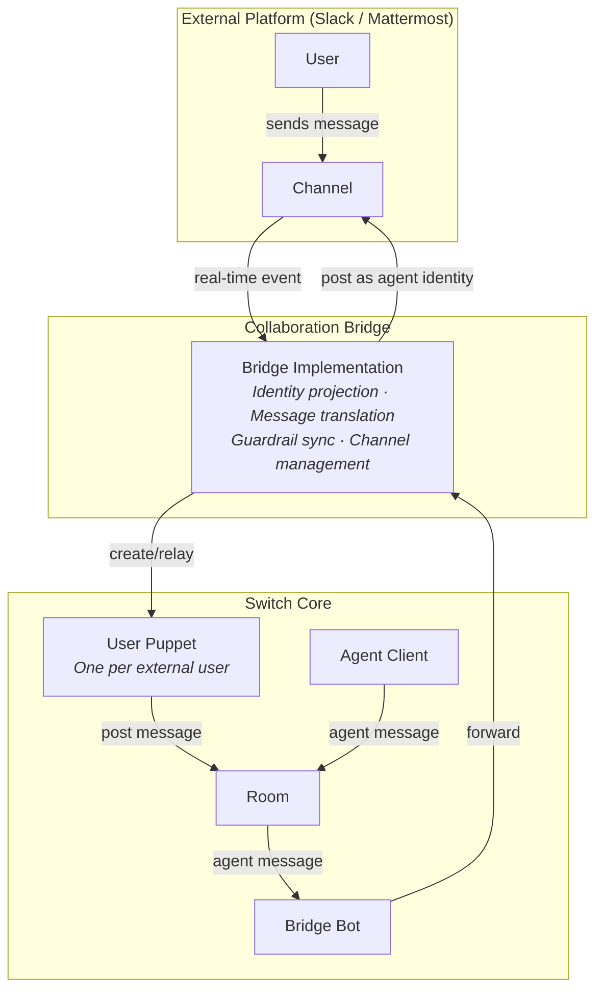

# Collaboration Bridge

The Collaboration Bridge connects external messaging platforms — Slack, Teams, Mattermost — to rooms, so users can participate from their existing tools without knowing Switch exists. Users stay in their familiar workspace; the bridge handles everything else.

Each bridge implementation adapts a specific platform's API and event system to the abstract bridge interface. Switch ships with implementations for Slack, Mattermost, and Microsoft Teams; new platforms are added by implementing the same interface.

For how the Collaboration Bridge fits into the overall bridge architecture, see [Bridges](BRIDGES.md). For how bridged users interact inside a room, see [Room Design](../switch-core/ROOM_DESIGN.md).

---

## Contents

- [How It Works](#how-it-works)
- [Bridge Architecture](#bridge-architecture)
- [Slack](#slack)
- [Mattermost](#mattermost)
- [Teams](#teams)
- [Adding a New Platform](#adding-a-new-platform)

---

## How It Works

The Collaboration Bridge operates symmetrically — it projects rooms into messaging platforms and messaging platforms into rooms. The result is that users in Slack or Mattermost see agents as fellow participants in their channels, and agents in a room see external users as fellow participants in their timeline. Neither side needs to know the other exists.

### Channel–Room Mapping

Each external platform channel maps 1:1 to a Switch room. The mapping is established in one of two ways:

- **Explicit** — when a room is provisioned with a bridge, Switch creates a corresponding channel in the external platform and stores the mapping.
- **Implicit** — when a message arrives from an unmapped channel, the bridge auto-creates a Switch room, provisions the appropriate agents, and stores the mapping. This lets users start collaborating from the platform side without any setup.

Once mapped, the channel and room are synchronized for the lifetime of the room.

### Identity Projection

Identity flows in both directions — agents appear in the external platform, and external users appear in the room.

**Agents → external platform.** Each agent in a room appears as a distinct identity in the messaging platform. The mechanism depends on the platform: some support real bot accounts per agent (Mattermost), while others use a single app integration with per-message identity customization (Slack's `username` and `icon_url` overrides). The agent's name and avatar are preserved either way — users in the messaging platform see each agent as a separate participant.

**External users → room.** Each external user is represented as a **puppet** participant in the room — a lightweight Matrix bot that exists solely to relay that user's messages. When a user first sends a message through the bridge, Switch creates a puppet identity for them, mapped to their external user ID and username. From that point on, their messages enter the room as if they were native participants — they share the same timeline as agents, and their messages pass through the same protection pipeline.

### Bidirectional Message Flow

Messages flow symmetrically through the bridge:

**Inbound (platform → room).** The bridge receives events from the platform's real-time API (WebSocket, Socket Mode, or equivalent). It resolves the sender's identity, creates a puppet if this is a new user, translates platform-specific formatting (e.g., Slack's `<@UXXXX>` mention syntax to plain `@username`), and posts the message in the Matrix room through the user's puppet. The message then enters the room's protection pipeline like any other event.

**Outbound (room → platform).** A bridge bot sits in each mapped room and listens for agent messages. When an agent posts a message, the bridge bot forwards it to the corresponding external channel, translating mention formats in the other direction and posting with the agent's identity. Messages from other user puppets are not forwarded back — the bridge only relays agent-originated messages to avoid echo loops.

### Protection Enforcement

The protection pipeline applies to all messages in a room, regardless of origin. When a message from an external user is blocked or redacted by the protection pipeline, the bridge synchronizes the verdict back to the external platform — updating or replacing the original message so the user sees the enforcement in their own tool.

This means guardrails are not invisible to users. A blocked message is visibly replaced; a redacted message shows the sanitized version. The bridge tracks the mapping between external message IDs and room event IDs to make this synchronization possible.

### Admin Mode

> **\[placeholder\]** *Open question: this was primarily built for demos. Decide whether to expose it to regular users, restrict it to admins, or remove it.*

Each room can optionally enable admin mode, which streams internal agent events — tool calls, LLM requests, task delegations, protection verdicts — into the external channel as human-readable messages. This gives users who want deeper visibility into agent behavior a live view of what is happening inside the room, directly in their messaging platform.

Admin mode is per-room and toggled by the user. When disabled, only agent messages (the final outputs) are forwarded to the platform.

---

## Bridge Architecture

Every Collaboration Bridge implementation follows the same architecture:

Three Matrix clients work together per bridged room:

- **Bridge Bot** — sits in the room, listens for agent messages, forwards them to the external platform. Also detects protection outcomes on messages and relays them back (updating or replacing the external post).
- **User Puppets** — one per external user. Created lazily on first message. Each puppet has a deterministic Matrix user ID derived from the platform and username (e.g., `@slack-john:server`). They only send messages into the room — they do not process incoming events.
- **Agent Clients** — the standard agent bots. The bridge bot watches their messages and forwards to the external platform with the agent's identity.

### Lifecycle

1. **Bridge registration** — a bridge is created with platform-specific credentials (API tokens, workspace ID, etc.) and registered in the bridge manager.
2. **Connection** — the bridge connects to the platform's real-time API and begins listening for events.
3. **Channel mapping** — channels are mapped to rooms (explicitly at room creation, or implicitly on first message).
4. **Agent projection** — when an agent bot joins a bridged room, the bridge creates the agent's identity in the external platform (a bot account on Mattermost, a registered username on Slack).
5. **User projection** — when an external user first posts, the bridge creates a puppet bot in Matrix for them.
6. **Steady state** — messages flow bidirectionally, protection outcomes are synchronized, admin events are optionally streamed.

---

## Slack

The Slack bridge connects a Slack workspace to Switch. Users interact in Slack channels; agents appear as distinct participants alongside them.

### Connection

The bridge connects via **Socket Mode** — a WebSocket-based connection that does not require a public URL or webhook endpoint. A single Slack App handles all communication. The app requires the following scopes:

> **\[placeholder\]** This section will list the required Slack app scopes and Socket Mode setup.

### Agent Identity

Slack does not support creating arbitrary bot users through its API. Instead, the bridge uses a single Slack App and customizes the sender identity per message using `username` and `icon_url` overrides (requires the `chat:write.customize` scope). Each agent appears as a distinct participant in Slack — different name, different avatar — but they all post through the same underlying app.

This means agents are not "real" Slack users. They cannot be mentioned with `@`, they do not appear in the workspace member list, and they cannot have their own DM channels. They are visual identities on messages.

> **\[placeholder\]** This section will cover:
> - How agent avatars are generated (default icon generation, custom icon support)
> - Limitations of the single-app identity model vs. real bot accounts
> - What this means for user experience (no presence indicator, no direct DMs to agents from Slack)

### User Puppets

When a Slack user sends a message in a bridged channel, the bridge resolves their Slack user ID to a username and creates a Matrix puppet bot (`@slack-{username}:server`). The puppet is force-joined to the room and from that point on relays all of that user's messages.

Slack user identity resolution is cached — the bridge looks up the user once via the Slack API and stores the mapping.

### Message Translation

Messages are translated in both directions:

- **Slack → Matrix**: `<@U12345>` mention format → `@username`. Slack-specific markdown (mrkdwn) is preserved as-is since Matrix renders standard markdown.
- **Matrix → Slack**: `@user:server` mention format → `@username`. Markdown is converted to Slack's mrkdwn format (different bold/italic syntax, link format, etc.).

### DM Handling

> **\[placeholder\]** This section will cover:
> - How Slack DMs (app DMs) are handled differently from channel messages
> - Threading behavior in DMs: responses posted in thread of last user message

### Slash Commands

Switch's in-room commands (the `!`-prefixed commands handled by the command dispatcher — `!reset`, `!compact`, `!interrupt`, `!status`, `!help`, and the rest) are also exposed as **native Slack slash commands**. Typing `/reset @agent` in a bridged channel is equivalent to typing `!reset @agent`: the slash command name is the in-room command name (Slack strips the leading `/`), so the invocation flows through the same dispatcher and targeting logic.

- **Target resolution.** Slack encodes any `@mention` in the slash text as `<@U…>` (or `<@U…|username>` when the command escapes its text); the adapter normalises it back to `@name` before dispatch, so targeting (first `@token` → target agent/role) resolves exactly as it does for a typed command. A mention of the Switch app bot itself falls back to the bot's user id, which is also its room-alias key — so an app mention aliased to an agent (`!set-alias @agent <@bot>`) routes correctly.
- **Acknowledgement & threading.** Slash commands are invisible to everyone and produce no channel post of their own, so the adapter posts a visible "⚙️ Running `/…`" message (as the app) and routes the command's result into **that message's thread** — the "Running" message's ref is passed as the command's `message_ref`, so the bridged command event maps back to it and the result threads underneath rather than landing at the channel root.

**Registering the commands.** Socket-Mode apps cannot self-register slash commands via the API — they must be declared in the Slack app manifest (or added under *Features → Slash Commands* in the app config). A ready-to-use manifest covering the full command set lives at [`slack-app-manifest.json`](./slack-app-manifest.json). Register one slash command per in-room command you want to expose (e.g. `/reset`, `/reset-all-agents`, `/compact`, `/compact-all-agents`, `/interrupt`, `/interrupt-all-agents`, `/agents-status`, `/roles`, `/help`, …), each pointing at the same app; the request URL is unused under Socket Mode. Note some names are reserved by Slack (e.g. `/status`), which is why presence is exposed as `/agents-status`. **Enable "Escape channels, users, and links" on each command** so `@mentions` in the argument arrive as stable `<@U…>` ids rather than display text — this is required for target resolution to work.

**Threads.** Custom slash commands [cannot be invoked inside a message thread](https://docs.slack.dev/interactivity/implementing-slash-commands/) — this is a hard Slack platform limitation (only built-in commands like `/remind` work in threads), and no app configuration can change it. To run a command inside a thread, type the equivalent `!`-command (e.g. `!reset @agent`) as a normal message — that path works everywhere, threads included.

**Control commands require a target.** The session-control commands — `reset`, `compact`, `interrupt` — each require an explicit target (`@agent` or `@role`); a bare `!reset` deliberately addresses no one so it can never hit the whole room by accident. Each has an explicit fan-out sibling — `reset-all-agents`, `compact-all-agents`, `interrupt-all-agents` — that applies to every agent in the room. When a control command is used with no target, or a target that names no agent/alias/role in the room, the always-present admin client posts a system message explaining the misuse (rather than the command silently doing nothing).

### Guardrail Synchronization

When the protection pipeline blocks or redacts a message, the bridge updates the original Slack message using `chat_update()`. The bridge tracks the mapping between Matrix event IDs and Slack message timestamps (`channel_id:message_ts`) to locate the correct post.

---

## Mattermost

The Mattermost bridge connects a Mattermost instance to Switch. Unlike Slack, Mattermost supports creating dedicated bot accounts per agent, giving each agent a richer identity in the platform.

### Connection

The bridge connects to Mattermost using admin credentials and the Mattermost API. Real-time events are received via WebSocket — one connection per bot account. The bridge uses the `mattermostdriver` Python SDK.

> **\[placeholder\]** This section will cover:
> - Connection configuration: URL, admin credentials, team name
> - Auto-setup on startup if Mattermost URL is configured
> - How the admin account is used for channel creation and management

### Agent Identity

Each agent gets a **dedicated Mattermost bot account**. When an agent joins a bridged room, the bridge:

1. Creates a bot via the Mattermost `/bots` API with the agent's display name and description.
2. Creates an access token for the bot.
3. Creates a per-bot API client (`Driver` instance).
4. Adds the bot to the team.
5. Starts a dedicated WebSocket listener for the bot's events.

This means agents are real Mattermost users — they appear in the member list, they have their own presence, and they can be mentioned with `@`. Each agent posts messages through its own bot account, not through a shared app.

### User Puppets

Same pattern as Slack — when a Mattermost user sends a message in a bridged channel, a Matrix puppet bot (`@mattermost-{username}:server`) is created and force-joined to the room. The puppet relays the user's messages into the room timeline.

### Message Translation

Mattermost uses standard Markdown, so message translation is minimal:

- **Mattermost → Matrix**: mentions are already `@username` format — no translation needed. Markdown passes through directly.
- **Matrix → Mattermost**: `@user:server` mention format → `@username`. Markdown is passed through with minimal conversion.

### Typing Indicators

The Mattermost bridge supports real-time typing indicators. When an agent is processing a request, the bridge sends typing notifications via the Mattermost `/users/{bot_id}/typing` API endpoint, giving users a live signal that the agent is working.

### Guardrail Synchronization

When the protection pipeline blocks or redacts a message, the bridge updates the original Mattermost post using `patch_post()`. The bridge tracks the mapping between Matrix event IDs and Mattermost post IDs.

---

## Teams

The Microsoft Teams bridge (`switch_core/bridges/collaboration/teams/`) follows
the single-app identity model. Full setup and the ops prerequisites (Azure app
registration, Graph permissions, encryption certificate, ingress) are in
[TEAMS_SETUP.md](TEAMS_SETUP.md).

### Connection

Teams has no persistent bot socket, so the adapter hosts an aiohttp listener and
uses two Microsoft APIs:

- **Bot Framework** for outbound (Bot Connector REST at the per-tenant
  `serviceUrl`) and for inbound chat + @mention activities (`POST
  /api/messages`, with the inbound JWT verified against the Bot Framework JWKS).
- **Microsoft Graph change notifications** for full channel-message capture —
  per-channel subscriptions to `teams/{team}/channels/{channel}/messages` with
  encrypted resource data delivered to `POST /api/teams/notifications`. The
  adapter decrypts the payload (RSA-OAEP unwrap → HMAC verify → AES-CBC) and
  renews subscriptions before their ~60-minute expiry.

Both inbound paths share one delivery + de-duplication path keyed on the Teams
message id; the bot's own posts are dropped to avoid echo loops.

### Agent Identity

A single Azure bot backs every agent (like Slack). Because Teams has no
per-message username override, each agent's message is rendered as an **Adaptive
Card** whose header carries the agent's name and avatar. Admin/system messages
are posted as the bot itself (plain text, no card).

### User Puppets

External Teams users are mapped to Matrix puppets keyed on their AAD object id,
resolved from the activity/`chatMessage` sender.

### Message Translation

Inbound channel messages are HTML (Graph) or contain `<at>` mention markup (Bot
Framework); both are flattened to text. Outbound bodies are placed in the
Adaptive Card, which renders a Markdown subset (bold, italics, links, lists).

### Threading

Teams channels are natively threaded (root message ↔ thread). The message map
correlates Matrix thread roots with Teams message ids in both directions;
1:1 and group chats are flat.

### Guardrail Synchronization

Protection verdicts edit or delete the bot's message via the Bot Connector
(`update`/`delete` activity), resolved through the per-message conversation
tracked at send time.

---

## Adding a New Platform

A new messaging platform implementation requires:

1. **A bridge class** — extending `MessagingBridge` with the platform's connection config type. The abstract interface requires:
   - Lifecycle: `start()`, `stop()`
   - Channel management: `create_channel_for_room()`, `add_bot_to_channel()`, `add_user_to_channel()`
   - Message forwarding: `forward_to_app()`, `forward_typing()`
   - Identity: `create_bot_for_agent()`
   - Protection: `apply_guardrails_outcome()`
   - Admin: `post_admin_message()`

2. **A connection config** — a Pydantic model extending `BridgeConnectionConfig` with platform-specific credentials and settings (API tokens, workspace identifiers, webhook URLs).

3. **Registration** — adding the new bridge type to the bridge factory so it can be instantiated and managed by the bridge lifecycle service.

### Platform Comparison

| Feature | Slack | Mattermost | Teams |
|---|---|---|---|
| **Agent identity model** | Single app + per-message overrides | Dedicated bot per agent | Single app + Adaptive Card sender labels |
| **Real-time connection** | Socket Mode (single WebSocket) | Per-bot WebSocket (threaded) | HTTP push: Bot Framework `/api/messages` + Graph notifications |
| **Mention format** | `<@U12345>` → translate | `@username` → pass-through | `<at>…</at>` → strip |
| **Markup format** | mrkdwn (Slack-specific) | Markdown (standard) | Adaptive Card (Markdown subset) |
| **Message update** | `chat_update()` | `patch_post()` | Bot Connector `update` activity |
| **Typing indicators** | Ephemeral "_thinking..._" | Native `/typing` API | Bot Framework `typing` activity |
| **Bot creation** | N/A (single app) | Mattermost Bot API | N/A (single app) |
