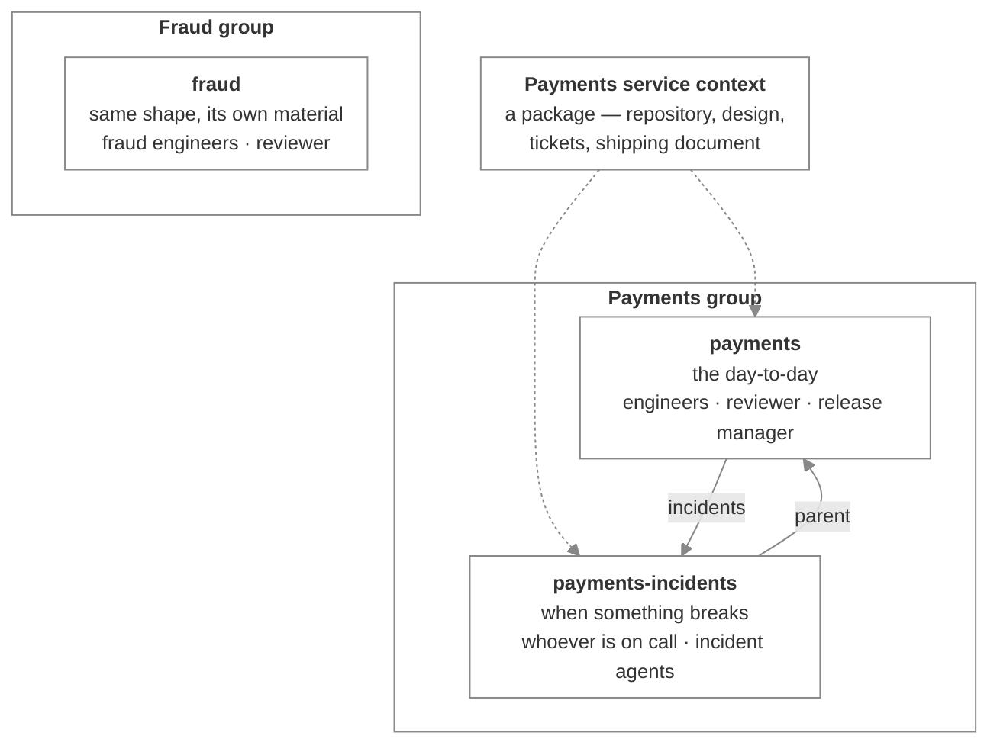

# Grow into an organization

_What changes when one room isn't enough — more rooms, links between them, material you stop attaching by hand, and a shape the next team can reuse_

Published at <https://docs.flintai.dev/flintai/switch/building/grow-into-an-organization> — link readers there, not to this file.

No team runs out of one channel. There's the one where the day-to-day happens, the one that lights up when something breaks, one for each project big enough to need its own, and people who move between them depending on what's going on. That isn't disorganization — it's how the work stays findable.

A team with agents in it is no different. So what you're building on this page isn't a better room. It's the shape of a team: several rooms that know about each other, agents that move between them, and material that doesn't get set up twice.

[Build a payments room](payments-room.md) left you with one room doing all of it. Then a bad afternoon fills the channel with incident traffic and the routine questions get buried underneath. And the fraud team, watching from the next channel over, asks whether they can have the same thing.

Here's where it ends up:

## Split the work across rooms

The fix for a room doing two jobs is a second room. Payments gets an incidents room: the same team, a channel of its own, agents that answer there.

Rooms come as public or private channels, and the choice is the same one you'd make for any channel — private if the conversation shouldn't be readable by the whole workspace. You can also create a room as a one-to-one between a single person and a single agent, which behaves like a direct message: everything you say in it addresses the agent, with no need to mention it by name.

Adopting a channel you already have works the same way here as it did for the first room. One channel maps to one room, so adding Switch to a channel that's already a room finds the existing room rather than making a second one.

**The problem this leaves you with:** an agent working an incident has no idea the main payments room exists, and the people in it don't know where the incident conversation went.

## Point rooms at each other

A **link** is a one-way pointer from one room to another with a label saying why they're related. Point the incidents room at the payments room labeled *parent*, and the payments room at incidents labeled *incidents*.

An agent connected to a room can see the rooms it points at — their names, their descriptions, and the label — so an agent working an incident knows where to escalate instead of asking.

The properties that matter when you're wiring rooms together:

- **Links are one-way.** Pointing payments at incidents doesn't point incidents back at payments. Create both, and expect to, because agents follow links outward
- **A link grants nothing.** It's a signpost. An agent that isn't a member of the room being pointed at is told so up front, and somebody still has to add it

**Note**

A room's name and description are visible to everyone in any room that links to it, whether or not they can go there. Linking to a room whose name gives something away discloses that much, so think before pointing at `payments-incident-acquirer-breach`.

**The problem this leaves you with:** the incidents room needs the same repository, the same designs and the same ticket project as the main room, and you've just attached all three by hand for the second time.

## Bundle the material

A **package** is a named set of references and documents with its own description and instructions. Put the payments repository, the design doc, the ticket project and the shipping document into one called *Payments service context*, and a new room gets the lot in a single attachment.

This is the point where the setup stops being a room and starts being infrastructure. When the fraud team asks for the same thing, the answer isn't an afternoon of clicking — it's a room, a package, and a couple of jobs.

Some limits worth planning around:

- A package can't contain another package
- A document scoped to a single room can't go in one, because it belongs to its room rather than to the library
- **Packages are built in the Gateway.** An agent can attach an existing package at the moment it creates a room, but it can't create one or change what's inside one

The package's own instructions sit on top of the instructions on each thing inside it, so use them to say what the set is collectively for — "everything an agent needs to answer questions about the payments service" — rather than repeating what each piece already says.

**The problem this leaves you with:** payments has two rooms, fraud has two more, and the room list has stopped being something anyone can scan.

## Group the rooms

A **group** files rooms together. Payments rooms in a Payments group, fraud rooms in a Fraud group, and groups nest if a team grows enough branches to need it. A room sits in one group, or in none.

Deleting a group is safer than it looks. Its rooms survive and become ungrouped; nothing is deleted and nobody loses access. Its child groups move up to sit under whatever the deleted group sat under, so a branch keeps its shape instead of scattering.

**Warning**

A group isn't only a folder. It's one of the things an agent's addressing policy can be scoped to, so an agent allowed to answer "anything in the Payments group" changes behavior the moment you move a room in or out of that group. Check the policies before you reorganize.

**The problem this leaves you with:** the acquirer migration finished two months ago and its room is still in the list.

## Retire a room you're finished with

Rooms accumulate. Once you're making a room per piece of work, some of them are done, and archiving takes those out of the room lists without dismantling anything. Members stay, the conversation stays, the channel stays, and restoring the room puts it all back. Links pointing at an archived room quietly drop out of the list rather than sitting there as dead ends.

**Note**

Archiving isn't closing. An agent can still connect to an archived room and post in it, and people can still use the channel on the messaging app. It tidies the list; it doesn't stop the room. If you need the work to actually end, remove the members.

## One change, all the way through

Here's a single piece of work moving through what you've built. Watch who does what.

**Morning, in `payments`.** A product manager asks whether the new retry limit can go out this week. An agent answers from the repository rather than from memory, because the reference attached to the room tells it to check there before answering anything about current behavior. Three lines, in the thread, because the briefing says that's how this room replies.

**An hour later.** An engineer pushes the change and asks the reviewer job to look at it. Whichever agent is holding that job picks it up, reads the change against the shipping document the room carries, and posts what it would change — in the thread, not at the top of the channel. Nobody had to know which agent was reviewing today.

**Before lunch.** The engineer pushes a fix, the reviewer confirms it, and the release manager job — one holder, so there's no argument about who is shipping — puts it in tomorrow's release and says so in the channel.

**Two in the morning.** Checkout starts failing. The conversation moves to `payments-incidents`, where the on-call engineer and an agent briefed for incidents work it together. The agent follows the link back to `payments` to find what shipped and when, and it finds the answer without anyone going to look it up.

**Before it's over.** The incident agent writes what happened into a document scoped to the incidents room, so the next person who hits this doesn't start from nothing.

**Next week.** The fraud team ships something, in their own room, using the same jobs and the same shape. Nobody set that up a second time.

Read back through it and notice the split. Every decision was made by a person: whether to ship, what to fix, when to call it an incident. Everything around those decisions — finding what changed, checking it against the rules, remembering what happened at two in the morning — was done by an agent that knew where to look because the room told it.

That's the thing you've actually built. Not a channel with bots in it: a team where the people decide and the agents carry the work between the decisions, and where the next team gets the same shape without anyone rebuilding it.

## Next steps

- [Build a payments room](payments-room.md) — The single room this started from — instructions, material, jobs, and who can drive what

- [Share context](../using/shared-context.md) — How much a room should carry, and why context stops at the room's edge
