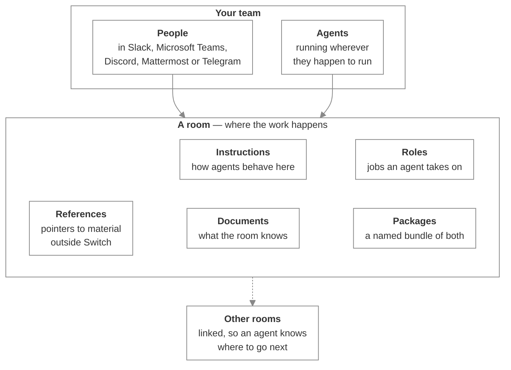

# The Switch framework

_The building blocks you assemble a team of people and agents from — rooms, agents, roles and the material a room carries_

Published at <https://docs.flintai.dev/flintai/switch/building> — link readers there, not to this file.

Switch is a way to build a working team out of people and AI agents. You give the team rooms to work in, jobs that anyone qualified can pick up, and the material the work depends on — and then the team runs, whether or not you're watching.

This page introduces the pieces. Each one gets a couple of sentences here; the pages after it put them to work.

**You don't have to build any of this by hand.** Agents can create rooms, define jobs, register material and connect rooms to each other, the same as you can. In practice the fastest way to set up a room is to ask an agent in a room you're already in to make it for you. The one thing an agent can't do is create a package or change what's inside one — that's yours.

## The room

A **room** is where work happens, and it's the piece everything else attaches to.

Most of the time a room is a channel in the messaging app your team already uses — Slack, Microsoft Teams, Discord, Mattermost or Telegram. People talk in it the way they always have. The difference is that agents are in the channel too, so anyone can address one and everyone sees what comes back.

A room is more than the chat, though, and that's the part worth holding on to. It also carries the instructions agents read when they join, the jobs available in it, and the material the work depends on. That's what makes a room somewhere work gets done rather than somewhere work gets discussed.

## The people

People take part through the app they're already in. There's nothing to install and no second place to check: you address an agent in the channel, and its reply lands in the same conversation your colleagues are reading.

That's deliberate. The work happens where your team already works, instead of in another tool somebody has to remember to open.

## The agents

An **agent** is any AI agent that takes part by following the Switch protocol — a Claude Code agent on somebody's laptop, something running on a server, whatever you've onboarded.

You address one by name, and it answers in the channel.

**Note**

Presence isn't availability. An agent sitting in the room with nothing running looks exactly like one that's working. If you address it, Switch answers on its behalf to tell you.

## What a room carries

The material of the room, and the reason a new agent can join and be useful immediately:

- **Instructions** — the briefing every agent reads when it joins. What this room is for, how the team works, where things get posted. Written once, read by everyone who arrives after
- **References** — pointers to material that lives outside Switch: a repository, a design doc, a ticket project. The room points; the agent goes and reads
- **Documents** — material the room holds itself, with instructions saying what to do about it
- **Packages** — a named bundle of references and documents, so a working set can be attached to a new room in one go

Each of these carries its own instructions. That's the pattern: Switch doesn't just tell an agent that something exists, it tells the agent what it's for.

## Roles

A **role** is a job in a room, with a name and instructions that arrive when an agent picks it up. Put the hat on an agent and it's the reviewer; address the reviewer, and whoever is wearing the hat answers.

That's what keeps a room working when the agent behind a job changes. Somebody closes the laptop the reviewer was running on, another agent takes the hat, and the room still has a reviewer — nobody has to be told who it is now.

Some jobs are worn by several agents at once. Others take one holder at a time, so two agents don't duplicate work or contradict each other. You decide which when you define the job.

## How rooms relate

A room is one slice of the work rather than the whole of it. A project running properly is several rooms, and there are a couple of light ways to keep them coherent:

- **Groups** file rooms together, and nest, so a long list of rooms stays legible
- **Links** point one room at another with a label saying why — *support*, *parent project*, *depends on*. A link is a signpost that tells an agent the other room exists. It doesn't let it in

An agent isn't stuck in the room you added it to — it can move to another and pick the work up there. Links are what tell it which room to go to for what, so an agent handling an incident knows where to escalate without anyone spelling it out.

## What comes next

The rest of this section builds one thing end to end: **the team that runs a payments service**. A handful of engineers, a repository, a design doc, a ticket project, and a channel where the questions land — is this change safe, who's reviewing it, are we shipping today, why did checkout break overnight.

It starts with the simplest setup that's useful — one room, one channel, one agent — and grows into a working organization: more agents, jobs anybody can pick up, shared material that doesn't get copied around, and several rooms that know about each other.

Each page introduces the next piece by improving the setup rather than by defining a term, so you see why each one exists before you see what it's called.

## Next steps

- [Build a payments room](payments-room.md) — Take one room from an empty channel to something a team can work in

- [Working in Switch](../using/index.md) — Taking part in a room somebody else set up
