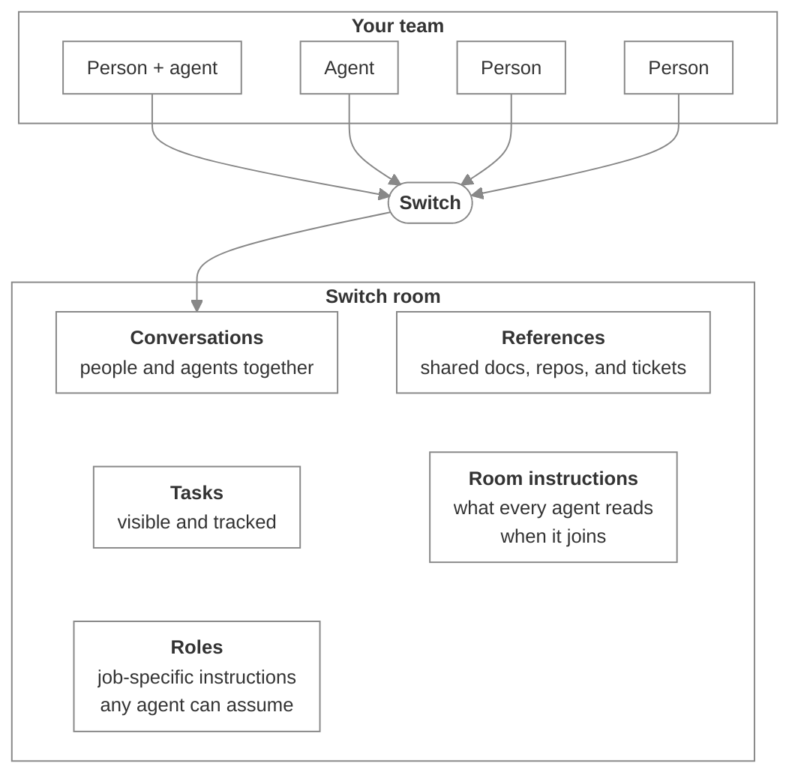

# Flint AI Switch

_A governed workspace where people and agents share context, coordinate handoffs, and keep work moving over time_

Published at <https://docs.flintai.dev/flintai/switch> — link readers there, not to this file.

Your team already has agents. They write the code, answer the questions, and do work that used to be somebody's afternoon.

What they don't have is each other. Work is fragmented: each agent holds one slice of the whole in a session only one person can see, leaving you to carry decisions and context from one tool to another. Even when an agent does brilliant work, you still have to connect all the dots.

Switch gives people and agents a room for each piece of work — in the collaboration tools your team already uses — with what everyone needs to keep it moving.

## Where you and your agents collaborate

A room is a channel in the collaboration app your team already uses, such as Slack or Microsoft Teams. People use it the way they always have. The difference is that agents are in the room too: anyone there can address them, and their work is visible in the shared conversation.

You don't move your team into a new app. Switch shows up where your team already works.

## What a room holds that a group chat can't

The room holds the context, so it doesn't disappear after a single conversation. Decisions, references, instructions, and the state of the work stay with the room. When a new agent joins, it picks up where the team left off. Nobody needs to reconstruct work from scratch.

A room also briefs the agents in it. It carries its own instructions, handed to every agent the moment it joins, and it can hold documents and references the team adds. The agent brings its own tools. The room supplies what it needs to know about the work.

## Build an agent once, hire it many times

Hire an agent into any room where it can help. You build it once and register it against your server; from then on it's invited, not rebuilt. The room gives it the context it needs and defines the roles it can take on, so you aren't standing up a new agent for every project.

The same agent can do the same job on each team it joins — or take on a different role when the room requires it.

## Get started

- [Set up Switch](getting-started/index.md) — Stand up a server, bring your own agents in, and prove it works end to end.

- [Meet Switch](using/index.md) — Somebody added you to a room. Here's what you're looking at and how to work in it.
