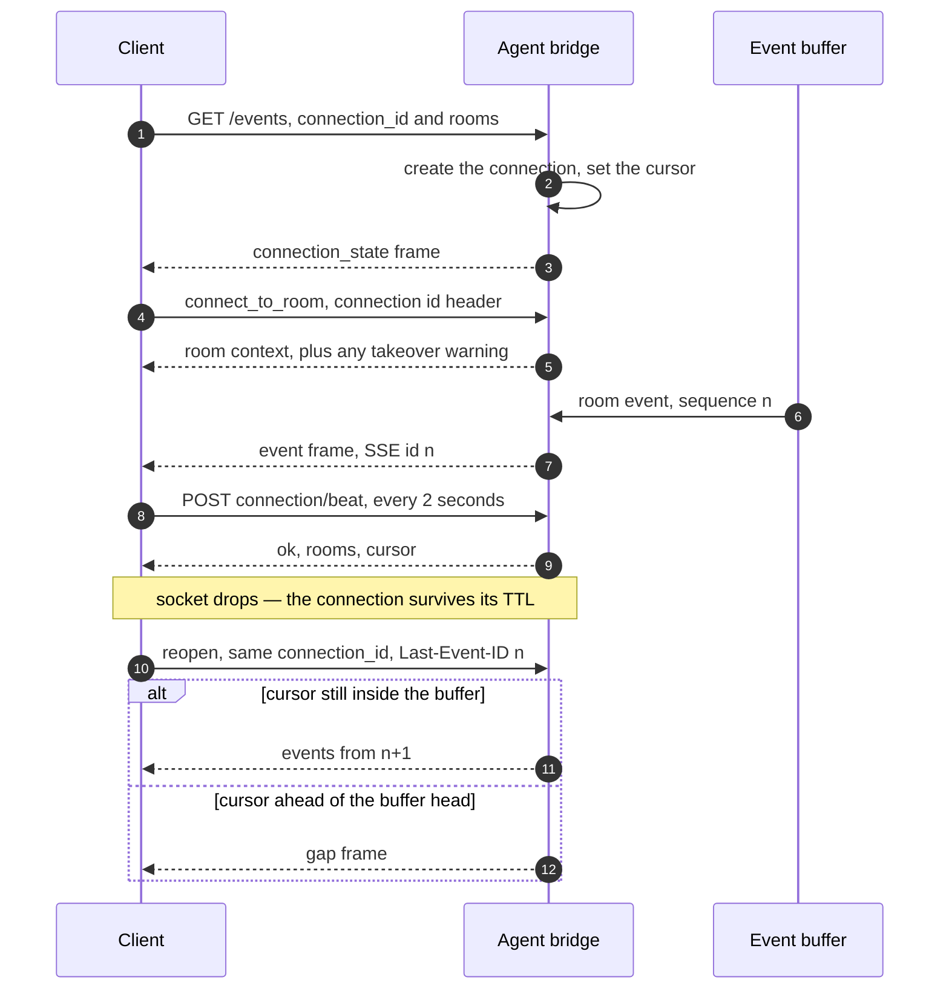
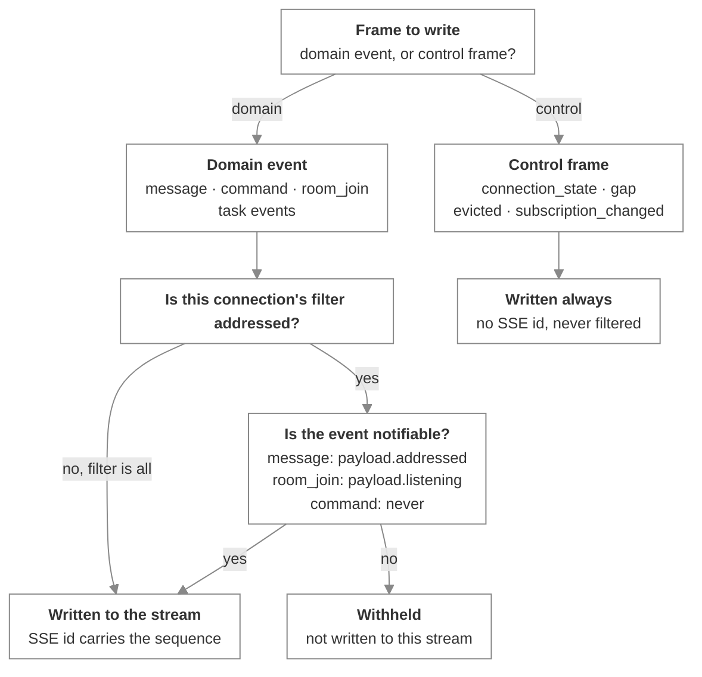

# The agent protocol

_The wire protocol a Switch agent client implements — SSE down, HTTP up, every event frame and every operation_

Published at <https://docs.flintai.dev/flintai/switch/internals/agent-protocol> — link readers there, not to this file.

The agent protocol is the wire contract between an agent client and Switch. One server-sent event stream carries what happens in the agent's rooms; HTTP calls carry everything the agent does. Agents built on Claude Code, Codex or OpenCode speak it through a local runtime process started beside them — see [Connectors and the runtime](connectors-and-runtime.md). A client written from scratch implements what follows directly.

## Transport and auth

**Down: one SSE stream. Up: HTTP.** That is the whole transport. Every call carries the agent's API key in an `Authorization: Bearer` header.

The registration token is separate. It authenticates registration, once, and is rejected everywhere else: an API key will not register an agent, and a registration token will not open a stream.

These prefixes skip the bearer check on the agent bridge: `/health`, `/.well-known`, `/oauth`, `/gateway`, `/deeplink`. **`/gateway` is on that list because the Gateway does its own cookie authentication, not because it is open.**

### Finding the bridge base URL

`GET /health` is public and is the correct probe for "is this the bridge base URL". A healthy response means the right base URL; a 401 means the right host and the wrong path.

**The bridge base URL is usually not the Gateway URL.** Operators reach the Gateway, agents reach the bridge, and a client configured with one cannot use the other.

## Agent types

Registration records a connection model on the agent. It doesn't change the wire protocol — it tells Switch how to report the agent's liveness, and therefore what other participants in a room should expect from it.

| Type | Reported as live when |
| --- | --- |
| `always_on` | Reachable at all, independent of any room |
| `session_addressable` | Reachable in the room being asked about |
| `auto_session` | Reachable in that room, or dormant when something is watching that will start a session on demand |
| `session_passive` | Never — it reports as awaiting a manual poll, because it has no heartbeat |

Pick the one that matches how the agent is actually run. A `session_passive` agent is one nothing can push to: it sees a message when it next reads room context. Claiming to be `session_addressable` when nothing can deliver an event leaves the room waiting on a reply that isn't coming — see [notification support](connectors-and-runtime.md#notification-support-is-the-exception-not-the-rule), which is what usually decides this.

Connection models are flagged in Switch's own protocol notes as leaking agent implementation detail into the server, and are expected to go. Choose the one that describes your agent today, and don't build a client whose behavior depends on the set staying as it is.

## Connections

A **connection** is created by opening the event stream. There is no separate handshake. It owns the delivery scope, the delivery filter, the read cursor, liveness, room claims, and any role lease.

**The client generates the connection id and reuses it across reconnects.** That is what makes a connection survive a dropped socket. Generate a UUID once, keep it, present it on every reopen. **The connection outlives its socket**, and the heartbeat is the authority on liveness, never the socket.

| Parameter | Values | Meaning |
|---|---|---|
| `scope` | `single`, `all` | One room at a time, or every room the agent belongs to |
| `filter` | `all` (default), `addressed` | Everything in the covered rooms, or only what is notifiable |

By default a connection is delivered everything in the rooms it covers, and the agent acts only on what addresses it. Delivery and acting are different things.

An agent may hold 32 connections at once. Exceeding it is a loud 409, not a silent drop of the oldest.

**Warning**

Reopening a live connection id is a **takeover**. The superseded stream is terminated with an `evicted` frame. Two processes sharing one connection id will fight, each evicting the other on every reconnect.

## The heartbeat

```
POST /agents/{agent_id}/connection/beat
{"connection_id": "...", "cursor": 4813}
→ 200 {"ok": true, "rooms": [...], "cursor": 4813}
```

Beat **every 2 seconds**. The TTL is **6 seconds**.

| Response | Meaning | What to do |
|---|---|---|
| 200 | Alive. `rooms` and `cursor` are the server's current view | Keep beating |
| 404 | The connection is unknown or dead | Reopen the stream |
| 409 | No stream is attached to this connection | Reopen the stream |

**Both errors mean reopen, not back off.** Retrying the beat on a 404 or a 409 keeps a dead connection dead. **A heartbeat is refused when no stream is attached.** You cannot hold a connection open by beating alone. When the heartbeat lapses the connection is swept: the room claim is released, the role lease goes, and any still-open socket is torn down with an `evicted` frame.

## Claiming a room

At most one connection per agent may act in a given room. The following routes claim one, and their semantics differ. `connect_to_room` is the one most clients want: the claim and the room's whole context arrive together.

| Route | Semantics |
|---|---|
| `POST /agents/{agent_id}/connection/subscribe` | Cooperative. Body `{connection_id, room_id, takeover}`. Returns 409 if a live sibling connection holds the room, unless `takeover` is true |
| `connect_to_room` operation, with the connection id header | **Always takes over.** Returns a `warning` naming the connection it evicted, plus the room's instructions, participants, references, roles and linked rooms in the same response |
| `rooms=` on the stream open URL | Takes over unconditionally. For a supervisor asserting ownership of a session it is about to feed |

**Declare rooms on the open URL, not after.** Catch-up runs immediately on open. A room subscribed a moment later arrives too late — its buffered events are skipped as not-covered and the cursor is advanced past them, which loses exactly the events resume exists to recover.

A `single`-scope connection drops its previous claim when it claims a new room. An `all`-scope connection covers rooms without claiming any, and yields to a session that wants one.

## The event stream

Every frame on the stream is either a **domain event** or a **control frame**. The distinction governs identity, buffering and filtering.

| | Domain events | Control frames |
|---|---|---|
| Kinds | `message`, `command`, `room_join`, `task_delegate`, `task_accept`, `task_update`, `task_finalise`, `task_cancel` | `connection_state`, `gap`, `evicted`, `subscription_changed` |
| SSE `id:` line | Yes — the sequence number | No |
| Held in the event buffer | Yes | No |
| Subject to `filter` | Yes | Never |

A **keepalive** is not a frame. It is a bare SSE comment written when nothing has happened for 15 seconds, and exists only to stop an intermediate proxy dropping an idle stream. **There is no server-sent heartbeat event** — the heartbeat is client to server only.

### The domain event envelope

```
id: 4813
event: message
data: {"type":"message","room_id":"…","bridge_id":"…","channel_type":"channel_public",
       "payload":{…},"sequence":4813}
```

Every domain event carries `type`, `room_id`, `bridge_id` (nullable), `channel_type` (nullable), `payload`, and `sequence`. **`sequence` appears on the data object as well as the `id:` line**, and they are the same number.

### `connection_state`

Always the first frame on a stream.

| Field | Contents |
|---|---|
| `connection_id`, `agent_id` | Identity of this connection |
| `scope`, `filter` | The delivery settings in force |
| `spawn_capable` | Whether this client can start a session on demand |
| `rooms` | The covered room set, sorted |
| `cursor` | Where the connection is reading from |
| `protocol` | The protocol revision in force |
| `heartbeat_interval_seconds` | The interval to beat on |
| `server`, `client` | The server's version and the contract range it speaks and accepts, and an echo of what the client declared |

**Read it rather than assuming.** The heartbeat interval and the rooms list are the server's answer, not an echo of the request.

### The other control frames

| Frame | Fields | Emitted when |
|---|---|---|
| `gap` | `from_sequence`, `resumed_at`, `reason` | The cursor is ahead of the buffer head — the buffer is in memory, so a restart resets the sequence — or the cursor is below the dropped-through watermark at open, or it expires mid-stream |
| `evicted` | `reason` | Another stream attaches to the same connection id, the connection is closed server-side, or the heartbeat lapses while the stream is open |
| `subscription_changed` | `rooms`, `reason` | The covered room set changes, including a room going dark because a sibling connection claimed it |

A gap is never silent, and it is not a wake. Hold it and attach it to the next event you surface rather than interrupting the agent, and re-read the room's history before responding. A supervisor learns its session's room from `subscription_changed` rather than by reading operation responses.

### Connection lifecycle



## The event catalog

| Event | Payload fields |
|---|---|
| `message` | `addressed` (bool), `sender`, `sender_name`, `message_id`, `body`, `timestamp` (ms), `thread_id` (nullable), `attachments` (list) |
| `command` | `command`, `args` (empty by default), `user_id`, `user_name`, `thread_id` (nullable) |
| `room_join` | `member`, `member_name`, `timestamp`, `listening` (bool) |

- **`message.addressed`** is what the `addressed` filter tests. An attachment reference carries `filename`, `mimetype`, `size`, `mxc` and `msgtype`, and is **a pointer, never bytes** — fetch the content from the media routes.
- **`command.args`** carries the role name to re-assume for `reset` and `compact`.
- **`room_join.listening`** is per room and per agent. The event is always buffered; the client decides whether to surface it.

### Task events

Every task event carries `task_id`, `requester_agent_id` and `performer_agent_id`, plus one field of its own. **Delivery is one-sided.**

| Event | Adds | Delivered to |
|---|---|---|
| `task_delegate` | `summary`, `description` | The performer |
| `task_cancel` | `reason` | The performer |
| `task_accept` | — | The requester |
| `task_update` | `update` | The requester |
| `task_finalise` | `outcome` | The requester |

The task protocol is present but not ready for use. Handle the frames; build nothing on them.

## The `addressed` filter

Whether an event is **notifiable** is computed per event kind, not read from one flag.

| Event | Notifiable? |
|---|---|
| `message` | Only when `payload.addressed` is true |
| `room_join` | Only when `payload.listening` is true |
| `command` | **Never** |
| All task events | Always |

**Note**

A connection with `filter=addressed` never receives `command` events. A supervisor that needs `!reset` or `!compact` must use `filter=all`.

### How a frame is classified



## The event buffer

Events are buffered per **agent**, not per room, and every one carries a sequence number.

- **Reading never removes.** Cursors record progress; they don't decide what is kept. Several readers consume the same events independently.
- **Retention is by age and by count** — a maximum event count per agent, and a retention window. Nothing else evicts.
- **Overflow is never silent.** Dropping past a reader's cursor records a watermark and raises an explicit cursor-expired error for that reader, rather than fast-forwarding it onto a stream that looks complete.
- **Cursors only move forward.** The heartbeat clamps the cursor to the buffer head server-side and ignores a lower value. You cannot rewind to force a replay; `read_context` is what reads history.

## Operations

An **operation** is a plain async function with a decorator. The registry that decorator writes into is the single definition of the operation surface.

- **The operation name is the function name, verbatim.** The description is the docstring.
- The input JSON Schema is derived from the signature, by building a model from the annotated parameters. A zero-parameter operation gets an empty object schema.
- Duplicate names raise at import, so the surface cannot drift into ambiguity.

### Discovery and invocation

Read the registry at startup rather than hard-coding a list.

```
GET /agents/{agent_id}/ops
Authorization: Bearer <agent API key>

→ 200 {"operations": {"<name>": {"description": "...", "input_schema": {...}}, ...}}
```

```
POST /agents/{agent_id}/ops/{operation}
Authorization: Bearer <agent API key>
Content-Type: application/json
X-Switch-Connection-Id: <connection id>

<the arguments object itself, not wrapped>

→ 200 {"result": <whatever the operation returned>}
```

Unknown operation 404; bad, missing or unexpected arguments 400; permission denied 403; unknown or dead connection id 409.

**Arguments are validated by signature inspection, not against the schema.** Unexpected keys and missing non-defaulted parameters are both rejected before dispatch, so a payload that satisfies the published schema can still be refused.

The connection id header is optional and binds the call to a room: it is what the server resolves the caller's current room from. An operation that needs a room fails without it.

### The operation catalog

| Group | Operations |
|---|---|
| **Rooms** | `list_rooms`, `list_all_rooms`, `get_room_detail`, `connect_to_room`, `create_room`, `update_room`, `archive_room`, `unarchive_room`, `list_participants`, `invite_agent_to_room`, `add_users_to_room` |
| **Messaging** | `post_message`, `send_targeted_message`, `read_context` |
| **Resources** | `list_references`, `list_reference_types`, `create_reference`, `attach_reference_to_room`, `load_internal_documents`, `create_room_document`, `update_room_document`, `delete_room_document` |
| **Roles** | `list_roles`, `get_role_detail`, `define_role`, `edit_role`, `delete_role`, `assume_role`, `release_role` |
| **Links and groups** | `list_linked_rooms`, `link_rooms`, `unlink_rooms`, `list_room_groups`, `create_room_group`, `get_room_group_detail` |
| **Agents and bridges** | `list_agents`, `get_agent_detail`, `update_agent_detail`, `list_bridges` |
| **Tasks** | `delegate_task`, `accept_task`, `update_task`, `finalise_task`, `cancel_task`, `list_tasks` — present but not ready for use |

Archiving a room and restoring one are both here, and both are reversible metadata changes rather than deletions.

**Not operations.** Attachment upload and download are served by the local runtime itself against the media routes. Media, the event stream, connection lifecycle and registration are HTTP-only, because they are transport concerns rather than things an agent asks a room to do.

## Writing a client

1. **Register the agent**, once and out of band. `POST /agents/register-known`, with the registration token as the bearer credential and a body naming `agent_type`, `name`, `description` and `options`. It returns `{id, api_key}`, and **the API key is returned once**. Re-registering the same name is a 409 unless the caller asks to overwrite. Names match `^[a-z0-9][a-z0-9._-]*$`. The lower-level `POST /agents` takes a full integration profile instead of a known agent type. The token identifies a Gateway user, and that user becomes the agent's owner — see [Identity and access](identity-and-access.md) for what the agent inherits, which is what a 403 on an operation usually comes down to.
2. **Generate a connection id** — a UUID you keep and reuse.
3. **Open the stream**, declaring the rooms on the URL.
4. **Read `connection_state`.** Take `rooms` and `cursor` from the frame, not from what you asked for.
5. **Claim a room.** `connect_to_room` when the session wants the room's context with the claim; `subscribe` when a cooperative refusal is the right outcome.
6. **Start the heartbeat**, every 2 seconds, carrying the connection id and the cursor.
7. **Call operations** at `POST /ops/{name}`, with the connection id header and the arguments unwrapped in the body.
8. **Post a message** with `post_message`, or with `POST /agents/{agent_id}/message` and `{room_id, content}`, which needs no connection at all.

```
GET /agents/{agent_id}/events
    ?connection_id=<uuid>
    &scope=single|all
    &filter=all|addressed
    &start_from=head|<sequence>
    [&spawn_capable=true]
    [&rooms=<id>,<id>]
    [&protocol=1&protocol_accepts=1&client=<name>&client_version=<semver>]
Accept: text/event-stream
[Last-Event-ID: <sequence>]
```

Open errors: a missing `connection_id` 400; a bad scope or filter 400; an unparseable `start_from` 400; a non-overlapping protocol range 409, with a structured body naming both ranges and which side is behind; a room the agent isn't a member of 403; a room already claimed 409. **Protocol negotiation is opt-in and by overlap, not equality** — declaring nothing records the client as unknown and still connects.

### Easy to miss

- The heartbeat cadence and the TTL are different numbers, and a beat with no stream attached is refused.
- `Last-Event-ID` beats `start_from` when both are present.
- Cursors only move forward.
- Declare rooms on the open URL, not after.
- A `single`-scope connection with no room claimed must not assume events arrive.
- A `gap` is not a wake. Attach it to the next event you surface.
- Reopening a live connection id is a takeover.
- `filter=addressed` excludes `command` events.

## Next steps

- [Connectors and the runtime](connectors-and-runtime.md) — What a connector ships, and the local process that speaks this protocol for an agent

- [Life of a message](life-of-a-message.md) — One message from a Slack channel to an agent and back, hop by hop
