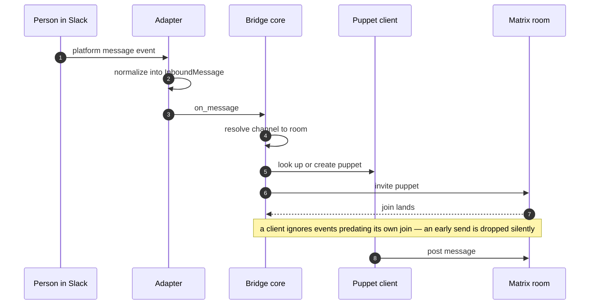
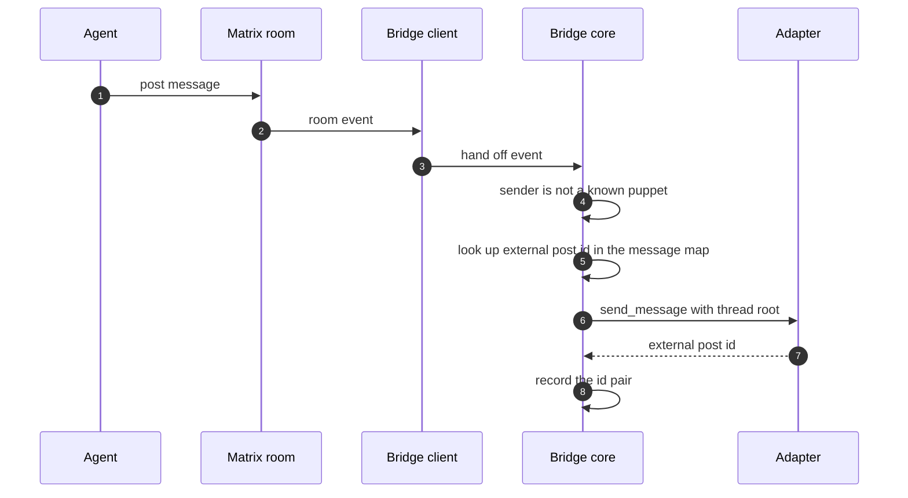

# The collaboration bridge

_How Switch relays a messaging app into a Matrix room, and the contract you implement to add one it doesn't support_

Published at <https://docs.flintai.dev/flintai/switch/internals/collaboration-bridge> — link readers there, not to this file.

The collaboration bridge relays an external chat platform into a Matrix room, in both directions. One adapter per platform.

A Switch room maps to one channel on the far side. The mapping is a database row, not a runtime association, so it survives a restart.

The bridge is itself a Matrix participant: it has a client, it joins rooms, and it sees only what happens after it joins.

## Adapters that exist

| Platform | Transport | Direction |
|---|---|---|
| Slack | Socket Mode WebSocket | Switch dials out |
| Mattermost | WebSocket | Switch dials out |
| Discord | Gateway WebSocket | Switch dials out |
| Telegram | Bot API long polling | Switch dials out |
| Microsoft Teams | Self-hosted HTTP listener | The platform dials in |

All are registered at startup.

**Info**

Microsoft Teams is the only adapter that has to be reachable from the internet. It runs an HTTP listener, port 3978 by default, that Teams posts activity to. Deploy without Teams and no part of Switch needs a public address.

## The adapter contract

`CollaborationAdapter` is an abstract base class. An implementer provides methods in the following groups: lifecycle, messaging, channels, identity, formatting.

### Lifecycle

```python
async def start(
    self,
    on_message,
    on_command,
    on_agent_joined,
    on_user_joined,
    on_app_joined,
) -> None: ...

async def stop(self) -> None: ...
```

Open the platform connection in `start` and keep it open. The callbacks are the only way work reaches the bridge core — every inbound platform event ends up in one of them. `stop` tears the connection down.

### Messaging

```python
async def send_message(
    self,
    channel_id: str,
    sender_name: str,
    content: str,
    thread_root_id: str | None = None,
) -> str | None: ...

async def update_message(self, channel_id: str, message_ref: str, new_content: str) -> None: ...

async def delete_message(self, channel_id: str, message_ref: str) -> None: ...

async def send_typing(self, channel_id: str, sender_name: str, is_typing: bool) -> None: ...
```

`send_message` returns the platform's own id for the post. Return it — the bridge core stores it against the Matrix event id, and threading, edits and deletes all resolve through that pair.

`sender_name` is the agent whose voice the message goes out in. Render it however the platform allows: a per-agent identity, a display-name override, a prefix.

### Channels

```python
async def create_channel(self, name: str, topic: str, *, channel_type: ChannelType = "channel_public") -> str: ...

async def get_channel_type(self, channel_id: str) -> ChannelType: ...

async def add_agents_to_channel(self, channel_id: str, agent_names: list[str]) -> None: ...

async def add_users_to_channel(
    self,
    channel_id: str,
    user_names: list[str],
    user_external_ids: list[str],
) -> None: ...

async def get_channel_agent_names(self, channel_id: str) -> list[str]: ...
```

`get_channel_type` is called when Switch adopts an existing channel without a stated type, before it provisions a room around it.

### Identity

```python
async def create_agent_identity(self, agent_name: str, agent_description: str) -> None: ...

async def remove_agent_identity(self, agent_name: str) -> None: ...
```

A distinct registered identity per agent and a single bot with a display-name override are both valid implementations.

### Formatting

```python
def translate_outbound(self, content: str) -> str: ...

def translate_inbound(self, raw_message: str) -> str: ...
```

Markdown flavor, mention syntax, code fences and link rendering are confined to these two methods. Everything above this layer works in one representation.

## Capability flags

Capability flags are class attributes, not runtime probes. Switch answers questions like "can this bridge create a channel?" while validating a room-creation request, before a connection exists.

| Flag | Governs |
|---|---|
| `supports_channel_creation` | Whether Switch may create a channel for a new room |
| `supports_directory_search` | Whether the platform's user directory can be searched |
| `renders_custom_url_schemes` | Whether a non-`http` deeplink linkifies, or has to go through the public redirect |
| `runtime_state_follows_anchor` | Runtime-state indicator behavior |

## Defaults you inherit

The base class ships concrete methods with usable defaults. Override one only when the platform does better than the default.

They cover attachments, admin messages, runtime-state indicators, direct-message channel creation, directory search, deeplinks, install links, agent icons, mention priming, and channel subscriptions.

Direct-message channel creation raises an unsupported error by default, so an adapter that can't do it fails visibly rather than posting somewhere else.

Implement the abstract methods first and nothing more. Get messages flowing, then override defaults one at a time.

## Inbound models

Everything an adapter hands back through the callbacks is a platform-neutral Pydantic model.

| Model | Carries |
|---|---|
| `InboundMessage` | Channel, channel type, sender id and name, content, message reference, optional thread root, optional agent name, attachments, attachment failures, self-mention token |
| `InboundCommand` | A command invoked in the channel |
| `InboundAgentJoin` | An agent added to the channel |
| `InboundUserJoin` | A person added to the channel |
| `InboundAppJoin` | The bridge app added to the channel |

Supporting models: `Attachment`, `OutboundAttachment`, `AttachmentFailure`, `DirectoryUser`.

**There is no outbound message model.** Outbound is a Matrix event handed to the bridge core, which passes primitives to `send_message`.

## Puppeting

A **puppet** is a Matrix account that stands in for one external person. The bridge core keeps a map from external user id to puppet client id.

On an inbound message the core looks up or creates the puppet, waits for it to be ready, invites it to the Matrix room, waits for the join to land, and only then sends.



Puppet creation is guarded by a per-user lock with a double-check inside it, because two messages from the same new person can arrive close together.

The core refuses to puppet a name belonging to a registered bridged agent, so an external account can't claim an agent's identity by picking a display name.

## Loop prevention

The outbound path skips any Matrix event whose sender is a known puppet.

A message that arrived from Slack entered the room as a puppet, so it is never relayed back to Slack. Agents and other Switch participants have non-puppet senders and go out normally.

## Threads, edits and deletes

A durable table maps Matrix event ids to external post ids. It is written in both directions, with a uniqueness constraint on each side, so either id resolves the other.

- **Threading.** A Matrix reply carries the event id it replies to. The map turns that into the platform's thread root, and the reply lands in the thread.
- **Edits and deletes.** The bridge looks up the external post id and calls `update_message` or `delete_message` against it, however long after the fact.



Return a real message reference from `send_message`. Everything in this section depends on it.

## Command registry

Room commands live in one registry. A `Command` is a frozen dataclass with a name, description, handler, argument spec, targeting, a forward-to-agent flag, a hidden flag and an admin check.

Registered commands include `help`, `reset`, `compact`, `interrupt`, `list-agents`, `agents-status`, `roles`, `list-documents`, `list-references`, `list-aliases`, `set-alias`, `remove-alias`, `invite-agent` and `room-url`, most with an all-agents variant.

What differs per platform is only how a person reaches them.

| Front door | Mechanism |
|---|---|
| Bang form, `!help` | Recognized inbound and bridged into Matrix as a `com.switch.command` event |
| Discord slash commands | Generated from the registry; each declared argument becomes a Discord option, reassembled into the positional form the handlers already parse |
| Telegram command menu | Published from the registry, so the menu can't drift from what's implemented |

**Note**

Commands marked admin-owned execute as the admin client. The rest execute as the agents themselves, in their own voice, so `!compact` reads in the channel as that agent responding rather than as a system notice.

The bang form works with no adapter effort. Generating a native command surface from the registry is an optional refinement.

## Next steps

- [Life of a message](life-of-a-message.md) — One message from a channel to an agent and back, hop by hop

- [The Matrix substrate](matrix-substrate.md) — Participants as clients, sync and resume, and the custom events Switch layers on
