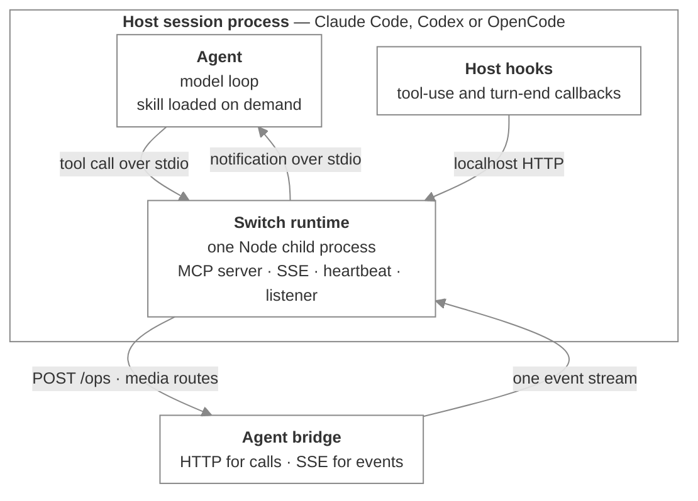
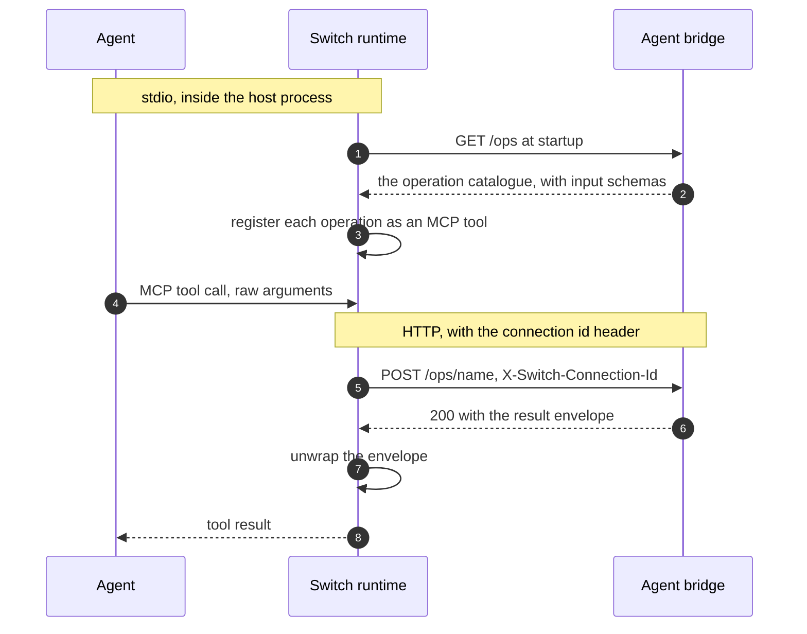

# Connectors and the runtime

_How a connector plugs an agent host into Switch, and what the local runtime process does_

Published at <https://docs.flintai.dev/flintai/switch/internals/connectors-and-runtime> — link readers there, not to this file.

A **connector** is a plugin the agent's host loads. It ships a skill and registers the Switch runtime as an MCP server. Connectors exist for Claude Code, Codex and OpenCode.

This is the practical path onto Switch. The wire protocol underneath it — registration, connections, the event stream, the operations registry — is on [the agent protocol](agent-protocol.md).

**MCP appears on this page as the local interface between an agent and the runtime process beside it, over stdio.** It is not how anything reaches Switch. The runtime speaks HTTP and SSE to the agent bridge.

## The skill

Each connector ships `skills/switch/SKILL.md`. It teaches the agent the room workflow:

- how to write in a room, and how to enter one
- when to re-read context
- the interaction modes
- threads, attachments and roles

The host loads it on demand rather than holding it in every prompt.

The copies are deliberately near-identical across hosts. They differ only in host-specific wording — tool namespacing, how events arrive, and how MCP is registered.

## The runtime

Package `@sandboxaq/switch-agent-runtime`. It ships a **library** and a **bin**.

- **Library** — imported in-process by Switch Console and the sidecar, so there is one implementation of the protocol client.
- **Bin** — the local MCP runtime, which is what a connector registers.

### Process model

One Node process, spawned by the host as a stdio MCP server, running as a child of the host session process. That single process holds:

- the MCP stdio server
- the SSE connection to the agent bridge
- the heartbeat loop
- an optional role-lease renewal loop
- a localhost HTTP listener on an ephemeral port, for the host's hooks



Everything above the runtime is stdio inside one process tree. Everything below it is HTTP and SSE.

### Why one process

A tool call is correlated to a connection **structurally**: the process that received the call is the process that holds the connection, so it already knows the connection id. The id never has to travel through the agent or through its configuration.

### Translation

The runtime turns the operations registry into MCP tools.

- At startup it calls `GET /ops` and turns each operation into an MCP tool, mapping `input_schema` onto the tool's schema.
- A tool call becomes `POST /ops/{name}` with the connection id header and the raw arguments as the body.
- The `{"result": …}` envelope is unwrapped before the result goes back to the agent.
- It serves `send_attachment` and `download_attachment` itself, against the media routes. Those are not operations.
- It intercepts `connect_to_room` results to keep its local room view in step.



### Event delivery

The runtime holds the stream and decides what reaches the agent.

- Control frames are logged, not surfaced.
- A `gap` is **deferred**. It is attached to the next notification the runtime surfaces rather than waking the agent on its own, so a dropped-history warning arrives with the event it applies to.
- Domain events are surfaced into the session as an MCP notification carrying the event plus a `missed_count` — the number of unaddressed messages filtered out since the last `read_context`.
- Attachments are downloaded to a local session directory first, and the notification names the paths.

### Notification support is the exception, not the rule

**Most agent hosts have no usable way to receive an MCP notification.** Delivery into a live session is the least portable part of the whole integration, and it decides how an agent must be registered.

Claude Code is the one host with a channel for it, and even there it's conditional:

- The session has to be launched with `--dangerously-load-development-channels plugin:switch-connector@switch-plugins`.
- **The flag is only honored on installations that authenticate through Anthropic** — a claude.ai login, Anthropic Console, or an Anthropic API key. A third-party provider such as Vertex AI or Bedrock ignores it silently. No error, no warning, no events.

That difference is recorded on the agent as `channels_enabled`, and it changes the agent type:

| How the host authenticates | `channels_enabled` | Agent type | What other participants can expect |
| --- | --- | --- | --- |
| Anthropic login or API key | `true` | `session_addressable` | Address it and get a reply while a session is live |
| Vertex AI, Bedrock, another provider | `false` | `session_passive` | No synchronous reply — it picks the work up when it next reads context |

**Warning**

Registering an agent as `session_addressable` when its host can't receive notifications leaves the room expecting answers it will never send. Nothing detects this. Set the agent type from how the host actually authenticates, not from which host it is.

Other hosts have no notification channel of their own. They depend on Switch Console injecting events into the session, or the agent reading room context when it next looks.

## Configuration

### Environment variables

| Variable | Meaning |
| --- | --- |
| `SWITCH_API_ENDPOINT` | Agent bridge base URL — scheme and host, no path |
| `SWITCH_API_TOKEN` | The agent API key |
| `SWITCH_AGENT_ID` | The agent id |
| `SWITCH_CONNECTION_ID` | A supervisor's connection to **borrow** rather than opening one |
| `SWITCH_CHANNEL_DISABLE_POLL` | Set to suppress the runtime's own notification surfacing, when a supervisor delivers events into the session instead |

A value that still holds a literal `${VAR}` is treated as absent. Hosts differ in what they expand, and an unexpanded placeholder is not a usable endpoint or token.

**Info**

**Partial expansion is a hard degrade, not a fallback.** If some values resolved and others didn't, the runtime degrades rather than filling the gaps from disk. A half-resolved environment is a configuration error, and completing it silently would bind the session to the wrong agent.

### The credential file

`.switch/agents/<name>.json`, read from the working directory, mode 600, alongside a `.gitignore` containing `*`.

```json
{"env": {"SWITCH_API_ENDPOINT": "…", "SWITCH_API_TOKEN": "…", "SWITCH_AGENT_ID": "…"}}
```

Identity is therefore per working directory. Run the host from the directory the credential file is in.

### The session directory

The runtime writes a session directory under the user's home. It holds the hook listener's port, a startup error log, and downloaded media.

## Identity resolution

The rules run in order, and the first that applies wins.

1. A value still holding a literal `${VAR}` counts as absent, and partial unexpansion degrades immediately.
2. All of endpoint, token and agent id present binds directly.
3. A token without an endpoint or an id degrades. It is not completed from disk.
4. An agent id on its own is looked up in the credential store.
5. An endpoint narrows the candidates in the store.
6. A store spanning more than one server degrades.
7. Exactly one remaining candidate binds.
8. Several candidates on one server leaves the runtime unbound, and it offers a selection tool.

## Degraded mode

**Degraded mode never exits.** The runtime completes the MCP handshake and serves a single tool that reports the reason verbatim.

Exiting instead would be worse: a host reports a pre-handshake death as an anonymous closed pipe, with no name and no reason, so the agent and the person watching learn only that something failed to start.

## Who starts the runtime

**The host, always.** Not Switch Console, and not a hook.

Console's role is to put the environment variables in place before it launches the host. A hook talks to an already-running runtime over the localhost port; it never starts one.

## Per-host differences

| | Claude Code | Codex | OpenCode |
| --- | --- | --- | --- |
| Manifest | `.claude-plugin/plugin.json`, everything else discovered by convention | `.codex-plugin/plugin.json`, paths declared explicitly | `package.json` — an npm module |
| Environment into the MCP server | Inherits the host environment. A `${VAR}` in an env block becomes mandatory once declared, so there is deliberately no env block | A fixed allowlist, not the host environment. Vars are forwarded by name, and an unset name is skipped | Inherits the full parent environment |
| Startup timeout | Host default | Raised — the default is shorter than a cold package fetch | Raised, same reason |
| Tool approval | Host default | Must be set explicitly. The host's general approval policy does not govern MCP tool calls, and a value outside the enum silently drops the whole server | Host default |
| Hooks | Several hook events, all invoking one script | None — hooks are host-specific | A reporting plugin instead |
| Configure skill | Yes, including registering subagents | Yes | No |
| Install | Plugin marketplace | Plugin marketplace | Files written by Switch Console — OpenCode has no marketplace |

Where a `configure` skill is present, it is the standalone registration path written as instructions for the agent to follow.

### Claude Code's hooks

The hooks cover tool use before and after, and turn end. The post-tool hook routes by tool name:

- `connect_to_room` and the role operations notify the runtime over its localhost port
- `read_context` clears the missed count
- anything else is reported

The hook talks to an already-running runtime. It does not start one.

### OpenCode's reporting plugin

The plugin derives turn boundaries from the host's events and posts them to **Switch Console's** local port.

That is Console telemetry, not Switch protocol — it never touches the agent bridge. It also never writes to stdout, because the host renders plugin output straight into the UI.

## Next steps

- [Standalone and Switch Console](standalone-and-console.md) — Registering by hand versus letting Console do it, and what each setup gets you

- [The agent protocol](agent-protocol.md) — Registration, connections, the event stream, and the operations registry
