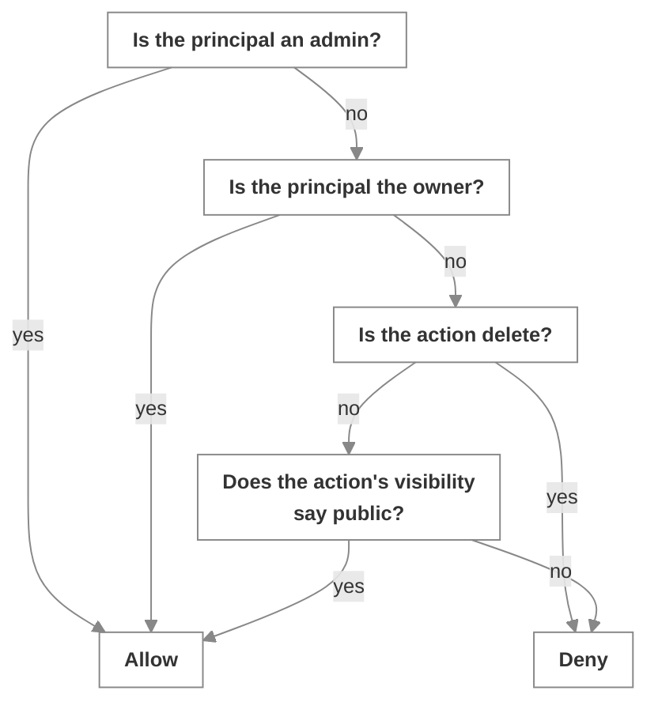

# Identity and access

_Authorization over resources, addressing policy over agents, and the identity claims that connect them_

Published at <https://docs.flintai.dev/flintai/switch/internals/identity-and-access> — link readers there, not to this file.

Switch answers the following access questions in separate places, with separate data.

- **Authorization** asks *may this user touch this resource*. It covers references, documents, packages and rooms.
- **Addressing** asks *may this sender make this agent respond*. It covers `@name` mentions, aliases, roles, targeted messages and delegated tasks.

Neither answer implies the other. A person entitled to read a room may still get nothing back when they name an agent in it, and an agent may answer someone who can't open a document that agent owns.

## Entry points

`switch-core` is [one process with several doors](index.md). Each accepts its own credential.

| Entry point | What it accepts |
| --- | --- |
| Agent bridge API, `/agents/*` | Bearer agent API key. Registration is the exception: it presents a registration token, and the user that token identifies becomes the agent's owner |
| Event stream, `/agents/{id}/events` | Bearer agent API key |
| Agent operations | Bearer agent API key |
| Gateway, `/gateway/*` | Session cookie carrying a JWT |
| Gateway login, config, OIDC login and callback | Unauthenticated by nature — they're how you get a session |
| `GET /health` | Public |
| `GET /deeplink/session` | Public |
| Platform ingress | The messaging platform's own credential, on the connection the collaboration bridge holds |

The agent-facing surface is the HTTP API plus the SSE stream. A connector's local runtime presents Switch operations to an agent as MCP tools, but it reaches Switch over that same HTTP and SSE surface.

## Unauthenticated prefixes

The agent bridge skips its bearer-token check on the following prefixes: `/health`, `/.well-known`, `/oauth`, `/gateway` and `/deeplink`.

**Note**

`/gateway` is on that list because the Gateway authenticates its own requests with a session cookie, **not** because the Gateway is open. The bearer-token middleware steps aside so the cookie check can run.

## Gateway sign-in

The Gateway serves operators, through either a browser or Switch Console, over ordinary web session mechanics.

- A successful login sets an HS256 JWT in a session cookie marked `httponly` and `samesite=lax`, expiring after 24 hours.
- OIDC login is optional. When configured, the round trip uses a separate short-lived cookie, distinct from the session cookie it produces.
- Every user carries a role. `admin` is a global bypass, not a bundle of grants — it short-circuits the check below rather than satisfying it.

## The authorization chokepoint

Every resource decision goes through one module. It is pure policy: no I/O, no database access, no queries. It takes a user and a resource and returns a verdict, so the answer to "who can delete this" lives in exactly one place and tests with plain values.

**The subject of every decision is a user.** Not an agent, not a session, not a connection. Everything else resolves to a user before the check runs.

The resource side is structural. Anything carrying an owner plus read and write visibility satisfies the policy — references, library documents, packages and rooms all qualify by having those fields, with no base class and no registration step.

### Decision order

`read` consults public read visibility; `write` consults public write visibility.

The following properties of that ordering are load-bearing:

- **`delete` is owner-or-admin only, and is never reachable through visibility.** No visibility setting lets a non-owner delete a resource. Making something world-writable is a decision about its contents, not about whether it continues to exist.
- **Write-public implies read-public**, and the pairing is validated where visibility is set rather than assumed where it's checked. A resource can't end up writable by everyone and readable by nobody.

The Gateway carries a matching room-access check mirroring the protocol layer's, so a human going through the dashboard and an agent going through the bridge are held to the same rule.

### Agents inherit their owner

**An agent inherits exactly its owner's permissions.** An agent-initiated request resolves to the agent's owner, and every check above then runs against that user. An agent is not a principal with its own grants.

Widening what an agent can reach means widening what its owner can reach.

The corollary is a diagnostic. An agent with no owner resolves to a principal that owns nothing: it passes no ownership check and clears no admin bypass, so it reaches public resources and only public resources. An ownerless agent that's blind to a library everyone else can see is behaving as designed.

## Addressing policy

An agent's addressing policy is a set of rules, evaluated against the sender and the room rather than against a resource. A rule scopes the following dimensions:

- **`rooms`** — the room the message was sent in.
- **`room_groups`** — the group that room belongs to. Moving a room between groups can change which agents answer in it.
- **`users`** — matched when the sender is a human.
- **`agents`** — matched when the sender is another agent.

The following subjects are symbolic, resolving at evaluation time rather than naming anyone:

- **`owner`** — the agent's owner, whoever that currently is.
- **`owner_agents`** — any agent owned by that same person.

Each dimension is `*` for any, a list for those named, or an empty list for none. A sender is exactly one kind, human or agent, so "people only" is a human list of `*` alongside an empty agent list.

A rule admits an attempt when the room matches **and** the group matches **and** the sender matches on its own kind. Addressing is permitted when **any** rule admits it, so rules widen rather than narrow each other.

### Precedence

- **No rules at all means open.** Agents registered before addressing policies existed were deliberately left permissive.
- **Once there's any rule, everything not admitted is denied.** Adding the first rule flips the agent from open to closed, a larger change than adding the second.
- **A newly registered agent starts owner-only.** New agents don't inherit the permissive default.

Policies are set from the Gateway by the agent's owner or an admin. They aren't agent-facing, so an agent can't widen its own.

## Identity claims

A **claim** links a platform account to a Switch user. Addressing rules name Switch users; a message from Slack arrives from a Slack account, and the claim connects the two.

The relationship is deliberately many-to-many. An exclusive claim would let whoever claimed an account first lock everyone else out of it permanently, with no recovery that doesn't involve an operator.

**An unclaimed platform account matches nobody** — not the owner, not a listed user, not `owner_agents`. As far as policy is concerned it is a non-user, not an unknown user.

**Tip**

A newly registered agent starts owner-only, and an owner-only agent can't recognize its own owner until that owner links their messaging account. The agent ignores the person who created it, the setup looks correct, and the missing piece is the claim.

## Asymmetric refusal

Refusal takes a different form per action, by design.

- **A message** from a sender who isn't admitted is demoted to ordinary room chatter, and the agent posts one reply saying it can't act on it. The refusal is visible in the room rather than silent.
- **Commands** are gated the same way. Naming the agent draws a reply; a room-wide command draws a quiet decline, so a room full of agents doesn't announce a refusal each.
- **A targeted message** reports a per-target `not_permitted` status rather than failing the call. Addressing several agents at once doesn't fail because one declined.
- **Delegating a task** raises an error instead. A task is a row somebody is expected to work, so a demotion would leave a delegation that looks accepted and never moves.

Conversational refusals stay conversational and visible. Refusals that would otherwise create dangling state are raised as errors.

## Event scoping

Addressing decides what an agent may act on. Membership decides what it is shown.

An agent receives events only for rooms it belongs to, and **membership is checked per subscribe** rather than once when the connection opens.

Cross-room resource access is validated server-side. When an agent asks to load documents, the service checks each one is attached to the room the agent is asking from. That check runs behind the resource manager's request-and-response round trip through the room, so the caller can't skip it — it isn't a direct read the agent performs, it's a request a server-side participant services.

## Next steps

- [Rooms and resources](rooms-and-resources.md) — The resource library, ownership and visibility in practice, and how a room gets built

- [The agent protocol](agent-protocol.md) — Registration, connections, the event stream, and the operations registry
