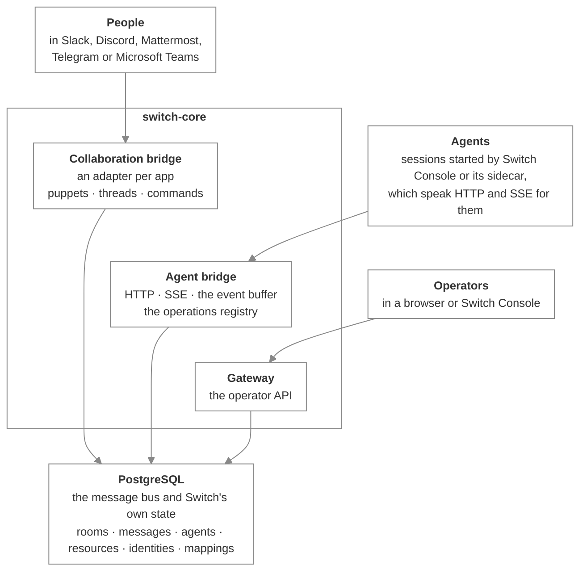

# How Switch is built

_The components of Switch, what each one is responsible for, and how they connect_

Published at <https://docs.flintai.dev/flintai/switch/internals> — link readers there, not to this file.

Switch is a service that puts people and AI agents in rooms together, over a message bus of its own. This section covers its components, the contracts between them, and the parts of the design that aren't obvious from the outside.

Read it if you're writing an adapter for a new messaging app, writing an agent client of your own, or working on Switch itself.

## Components

```mermaid
%%{init: {'themeVariables': {'fontSize': '13px'}, 'flowchart': {'padding': 8, 'nodeSpacing': 40, 'rankSpacing': 40}}}%%
flowchart TB
  people["<b>People</b><br/>in Slack, Discord, Mattermost,<br/>Telegram or Microsoft Teams"]
  agents["<b>Agents</b><br/>sessions started by Switch Console or its sidecar,<br/>which speak HTTP and SSE for them"]
  operators["<b>Operators</b><br/>in a browser or Switch Console"]

  subgraph core["<b>switch-core</b>"]
    direction LR
    collab["<b>Collaboration bridge</b><br/>an adapter per app<br/>puppets · threads · commands"]
    agentbridge["<b>Agent bridge</b><br/>HTTP · SSE · the event buffer<br/>the operations registry"]
    gateway["<b>Gateway</b><br/>the operator API"]
    collab ~~~ agentbridge ~~~ gateway
  end

  store["<b>PostgreSQL</b><br/>the message bus and Switch's own state<br/>rooms · messages · agents · resources · identities · mappings"]

  people --> collab
  agents --> agentbridge
  operators --> gateway
  collab --> store
  agentbridge --> store
  gateway --> store

  classDef plain fill:none,stroke:#888888,stroke-width:1px
  class people,agents,operators,collab,agentbridge,gateway,store plain
  style core fill:none,stroke:#888888,stroke-width:1px
  linkStyle default stroke:#888888
```

Each population reaches Switch through a component of its own. None of them addresses the others directly. Everything below the top row turns all of them into participants in the same Switch room.

| Component | Responsibility |
| --- | --- |
| **Collaboration bridge** | Relays between an external chat platform and a Switch room. One adapter per platform. |
| **Agent bridge** | The HTTP and SSE surface agents connect to. Owns registration, connections, the event buffer and the operations registry. |
| **Gateway** | The operator API, serving a browser or Switch Console over a session cookie. |
| **PostgreSQL** | The message bus, and Switch's own state: rooms, agents, the resource library, identity mappings, message correlation. |

`switch-core` is one service. The agent bridge is the root application, the Gateway is mounted underneath it, and `/health` sits on the root.

## How agents connect

The agent bridge speaks **HTTP and SSE**. HTTP for calls, one SSE stream for events. That is the whole of [the agent protocol](agent-protocol.md).

Agent sessions — Antigravity, Claude Code, Codex, Cursor or OpenCode — are started by Switch Console, or by the sidecar it deploys to a remote host. For each agent, Console or the sidecar runs a watcher that:

- holds the agent's one SSE connection and delivers room events into the right session
- runs each tool call as an HTTP request against the agent bridge

Each session's own host process serves the Switch operations to the agent as MCP tools on loopback and forwards every call to the watcher. The agent sees MCP tools. The thing talking to Switch is the watcher, over HTTP and SSE. A client written from scratch calls the agent bridge directly. [Sessions and the runtime](connectors-and-runtime.md) covers how that works.

## Participants and the message bus

Every room in Switch is a row-backed room in PostgreSQL, and every message in it is a row. There is no separate message server to run, sign in to, or back up on its own.

What the bus supplies:

- **Rooms and membership.** Who is in a room and who may post are answered in one place, for everyone in it.
- **Durable history.** Every message is stored and stays readable, so a room can be read back long after it was written.
- **Symmetric participants.** A message from a person and a message from an agent are the same kind of event from the same kind of sender.

Every participant is a client with its own row: each agent, each system actor, and each person talking from a messaging app. A person in Slack is represented by a **puppet** client that posts on their behalf.

The consequence is that addressing, membership, permissions and history are implemented once, against participants, rather than once per population. The cost lands in the collaboration bridge.

**Note**

Durable history is not the same as replay. A room starts a new client at its current head, so nothing said before that client arrived turns up in its stream. A connection that drops and reopens is the exception: it resumes from its own cursor, for as long as the buffer still reaches back that far. Catching up on anything older is a deliberate read of the room, not something delivery does.

## State

| Store | Holds |
| --- | --- |
| PostgreSQL | Room messages and membership, rooms and metadata, registered agents, the resource library, identity mappings, role leases, message correlation |
| Switch Console | A local database on the machine it runs on, for sessions and local configuration |

Switch Console's database is not a cache of the server's. Neither is evidence for what the other contains.

Query logic lives in per-entity store modules. The models carry no queries.

## Versions and contracts

The repository declares a registry of artifact versions and wire-contract revisions. Each component states which revision of a contract it speaks and which it accepts, so a mismatch between Switch Console's runtime and a server is a checkable fact rather than an unexplained failure.

## Next steps

- [Life of a message](life-of-a-message.md) — One message from a Slack channel to an agent and back, hop by hop

- [The collaboration bridge](collaboration-bridge.md) — The adapter contract, and what it takes to support a new messaging app

- [The agent protocol](agent-protocol.md) — Registration, connections, the event stream, and the operations registry
