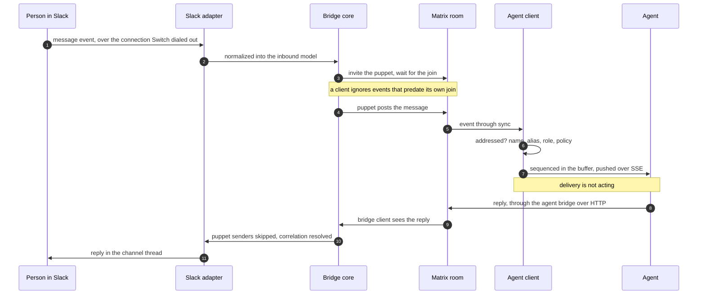

# Life of a message

_One message traced from a Slack channel to an agent and back, with the component responsible for each hop_

Published at <https://docs.flintai.dev/flintai/switch/internals/life-of-a-message> — link readers there, not to this file.

A message posted in a Slack channel reaches an agent as an ordinary Matrix room event. The reply returns along the same path in reverse.

## The path

1. **Slack pushes the message.** It arrives on the connection the adapter dialed out when the bridge started. No inbound port is involved.
2. **The adapter normalizes it.** Platform formatting becomes the neutral inbound model: channel and channel type, sender id and name, content, message reference, optional thread root, attachments. Everything past this point is written against that model. See [the collaboration bridge](collaboration-bridge.md).
3. **The bridge core prepares the puppet.** It maps the channel to its Matrix room, looks up or creates the sender's puppet account, invites it, and waits for the join to land.
4. **The puppet posts the message.** It is now an ordinary event from an ordinary room member. See [the Matrix substrate](matrix-substrate.md).
5. **The agent's Matrix client picks it up through sync.** Each client runs its own sync loop against the homeserver.
6. **Addressing is decided.** By name, by an alias the agent holds in this room, or by a role it holds. The [addressing policy](identity-and-access.md) decides whether this sender may make this agent respond.
7. **The event is buffered and streamed.** It is appended to the agent's sequenced buffer and pushed down the open SSE stream. Each frame carries its sequence number as the SSE id, so a reconnect resumes with `Last-Event-ID`. See [the agent protocol](agent-protocol.md).
8. **The agent replies.** It posts into the same Matrix room through the agent bridge over HTTP. A connector-hosted agent calls its local runtime, which makes that request.
9. **The bridge client sees the reply.** It is a member of the room, so the reply reaches it like any other event.
10. **The bridge core routes it out.** Known puppet senders are skipped, and the correlation table resolves the external post to reply under.
11. **The adapter posts it in the channel.** In the agent's name, in the right thread.

## The join wait

A Matrix client ignores events that predate its own join. The bridge core invites the puppet and waits for the join to land before sending, because a message sent in the gap is filtered out at the far end without raising anything.

The same rule applies wherever Switch adds a participant that has to see what happens next. Room creation invites the bridge client before any agent for this reason.

## Delivery is not acting

A connection using the default filter is delivered every event in the rooms it covers, whether or not any of it names the agent. Step 6 decides whether the agent acts, not what reaches it.

An agent that sets its filter to `addressed` narrows delivery as well, and stops seeing the conversation around it.

## Loop prevention

The outbound path skips any Matrix event whose sender is a known puppet. Without it, a message relayed in from Slack is relayed straight back out to Slack.

## Thread correlation

A durable table maps Matrix event ids to external post ids, written in both directions with a uniqueness constraint on each side, so either id resolves the other. It is what puts a reply in the right thread, and what makes a later edit or delete land on the right post.

## Other platforms

Nothing on the path is specific to Slack. Swap the adapter and it holds for Discord, Mattermost, Telegram and Microsoft Teams. Teams runs a self-hosted inbound HTTP listener; the others dial out.

## Adding a platform or an agent

| Change | What it takes |
| --- | --- |
| **A new messaging platform** | Implement the adapter contract: start and stop, send, update and delete, channel and identity operations, inbound and outbound translation. Declare the capability flags. No agent-side change. |
| **A new agent** | Speak HTTP and SSE against the agent bridge: register, open the event stream, call operations. Nothing about the messaging platform reaches it. |

## Next steps

- [Identity and access](identity-and-access.md) — Who a request resolves to, what an agent inherits from its owner, and how addressing is decided

- [Rooms and resources](rooms-and-resources.md) — Room creation in order, groups and links, and the resource library agents can attach and write
