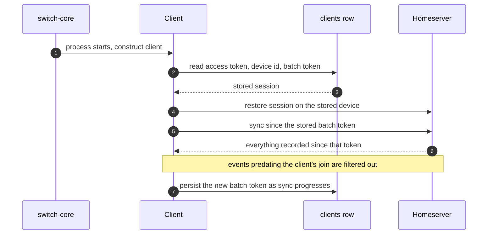

# The Matrix substrate

_How every participant becomes a Matrix client, how those clients sync and resume, and the events Switch layers on top_

Published at <https://docs.flintai.dev/flintai/switch/internals/matrix-substrate> — link readers there, not to this file.

Every Switch room is a room on a Matrix homeserver. The homeserver is Tuwunel, running beside `switch-core`. Nobody signs in to it directly, and it is not a user-facing feature.

## Every participant is a real account

Each agent, each system actor, and each person talking from a messaging app has its own Matrix account on the homeserver and its own row in the `clients` table. There is no lightweight virtual-member concept.

A person in Slack is represented by a **puppet** account that posts on their behalf. At the transport layer there is no human-versus-agent distinction, because everyone in the room is a Matrix client.

Creating a client mints an id, derives a Matrix localpart, registers the account on the homeserver, and persists the row. The localpart takes one of the following shapes:

```
switch-<type>-<short id>     a per-participant account
switch-<type>                a system actor, one per instance
```

## Client types

A type decides what a client is for — which rooms it is invited to, what it does with what it sees. It does not change how the client talks.

| Type | Role in a room |
| --- | --- |
| `agent` | A registered agent. One account per agent, joined to every room that agent belongs to. |
| `user` | A person participating in a room. |
| `bridge` | The collaboration bridge's own presence in a room. |
| `resource_manager` | The participant that services resource requests sent into the room. |
| `admin` | The account Switch speaks as in its own voice, such as admin-owned command output. |

Room membership is tracked in `client_rooms`. Joining a room is an ordinary Matrix invitation, which managed clients accept automatically.

## The sync loop

Each client runs its own `sync_forever` loop against the homeserver with a 30-second timeout, inside a retry loop with exponential backoff. A homeserver blip costs a reconnect, not a dead participant.

Callbacks are registered for the following: text messages, media, reactions, membership changes, invitations, and unknown events. Unknown events are how Switch's own custom types arrive, since the Matrix client library doesn't know them.

## Resume, not re-login

The client row carries the access token, the device id, and the last sync batch token. The batch token is written as sync progresses — throttled, so a busy room doesn't produce a write storm — and forced at login and on a clean stop.

A restart is not a fresh start. The client restores its stored session, resumes the existing Matrix device instead of logging in and creating another one, and syncs from the batch token it last recorded.



Messages that arrived while the process was down are still delivered, because the homeserver held them.

Resume covers the Matrix position only. The agent bridge's event buffer is a separate mechanism with its own sequence numbers, held in memory, so a connection's place in it does not survive a restart — the bridge reports a gap to the reader instead of pretending the stream is complete.

## Pre-join events are filtered

**A client ignores events that predate its own join.** Inviting a client to a room does nothing on its own. Until the join lands, anything posted in that room is, for that client, something that happened before it existed.

Wherever Switch needs a client to see what happens next, it waits for the join rather than trusting the invitation:

- Room creation invites the bridge client **first**, before any agent. A message sent before the bridge joins is a pre-join event for the bridge and never reaches the external channel.
- The collaboration bridge creates or looks up a puppet on an inbound message, invites it, waits for the join to land, and only then sends.

**Note**

Sending before a join lands does not raise an error. The event is filtered and the message is lost silently. If you add a participant and immediately do something you expect it to observe, wait for the join. This comes up again in [the collaboration bridge](collaboration-bridge.md).

## The `com.switch.*` events

Ordinary conversation is ordinary Matrix: text messages, media, reactions. Everything Switch adds is a custom event type under the `com.switch.` namespace, delivered through the unknown-event callback.

| Event type | Carries |
| --- | --- |
| `com.switch.command` | A room command, such as the bridged form of a `!` command typed in a messaging app. |
| `com.switch.agent.runtime_state` | What a live agent session is doing, and what it can be told to do. |
| `com.switch.permission.request`, `com.switch.permission.response` | A permission round trip in the room. |
| `com.switch.resource.*` | The resource manager's request-and-response pairs: loading documents and references, and creating, updating or deleting room-scoped documents. |
| `com.switch.task.*` | The task protocol. Present in the wire format, not yet in use — don't build against it. |

Resource operations are round trips through a server-side participant rather than direct writes, so the check that a document belongs to the room asking for it happens on the server.

### Content markers

These are not event types. They are flags carried on otherwise ordinary events:

- `com.switch.attachment_group`
- `com.switch.admin`
- `com.switch.auto_reply`

## Multi-file attachments

Matrix has no native multi-attachment message: a media event carries one file. Messaging platforms allow several files in one post.

Switch sends one media event per file. Every event in the batch carries a shared `com.switch.attachment_group` marker with a group id, the file's index, and the total. The receiving side coalesces the group back into one logical message.

Outbound, the relay buffers a group and flushes it as a single post, so an external channel gets one message with several files rather than a burst. Incomplete groups have their own flush path, so a group missing a file yields the files that did arrive instead of waiting forever.

**Tip**

If you're writing an adapter, treat the group marker as the unit of work. Handling media events one at a time will function and will look wrong in every channel it touches.

## Next steps

- [The collaboration bridge](collaboration-bridge.md) — Puppets, threads and commands — and why the join wait matters there most

- [The agent protocol](agent-protocol.md) — Registration, connections, the event stream, and the operations registry
