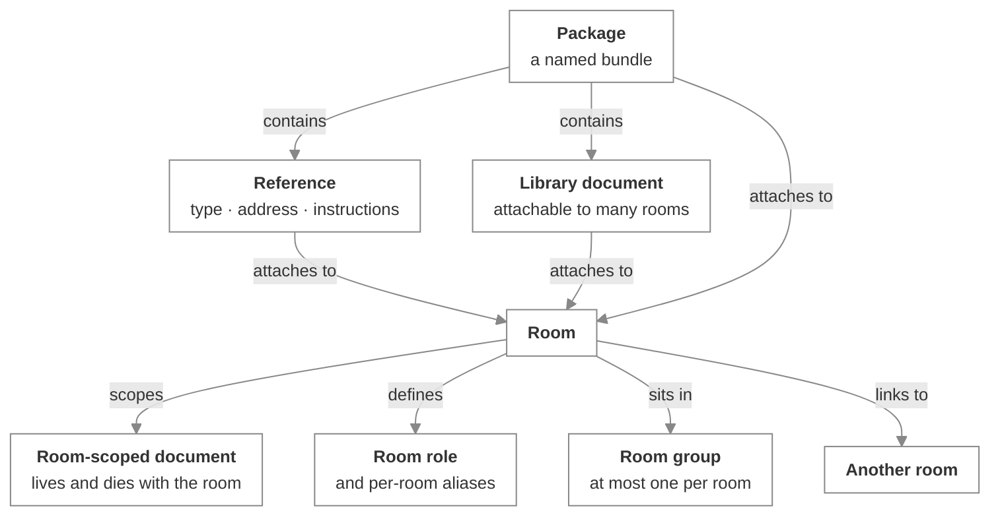

# Rooms and resources

_The developer's view of the resource model and the room lifecycle — what's scoped where, and the ordering that matters_

Published at <https://docs.flintai.dev/flintai/switch/internals/rooms-and-resources> — link readers there, not to this file.

A Switch room carries metadata, a position in a group tree, links to other rooms, roles its members can hold, and attached resources drawn from a library that exists outside any one room. This page covers where each of those is scoped, who owns it, what enforces what, and the order operations run in.

For what a reference or a document is *for*, see [Share context](../using/shared-context.md).

**Note**

**Terminology hazard.** In the repository, "artifacts" means release versions and wire contracts — the declared registry of what each component ships and which contract revisions it speaks. It has nothing to do with the attachable resource library. The Gateway calls that library **Resources**, and so does this page.

## The resource model

Everything attachable is either **library-wide** — it exists independent of any room and can attach to many — or **room-scoped** — it's part of one room and is deleted with it.

| Concept | Scope | Ownership | Attaches to |
|---|---|---|---|
| **Reference** | Library-wide | Owner required, with independent read and write visibility | Rooms and packages |
| **Library document** | Library-wide | Owner, with read and write visibility | Rooms and packages |
| **Room-scoped document** | One room, deleted with it | Owner, plus the agent that created it | Its own room only |
| **Package** | Library-wide bundle | Owner required, with visibility | Rooms; contains references and documents |
| **Room group** | A tree, through an optional parent | No visibility model | A room belongs to at most one group |
| **Room link** | Directed, with a free-text label | — | One room to another; a room can't link to itself |
| **Room role** | Per room, name unique within it | — | Assumable by any room member |
| **Role lease** | The current holder | — | One lease per agent, heartbeat-based |
| **Alias** | Per room and agent | — | A short handle that addresses the agent in that room |

### Reference types

A reference records a type, an address and instructions. The types are a closed set: Google Drive, Confluence, GitHub, Jira. There's no open type field for a new integration.

### Room-scoped documents

Room-scoped documents are the agent-writable kind. A room-scoped document is deleted with its room, records the agent that created it, and has a name unique within that room.

An agent can change or delete only a document it created. Authorship is enforced, not advisory.

Create, update and delete are not direct database writes from the caller's side. Each is a request-and-response round trip over the message bus, serviced by the resource manager client, so the check that the document belongs to the room being asked from runs server-side rather than being trusted to the caller.

### Room groups

A group is a tree node with an optional parent. A room belongs to at most one group.

Deleting a group doesn't delete rooms. Its rooms become ungrouped, and its child groups are moved up to sit under whatever the deleted group sat under.

**Warning**

Groups scope addressing rules, so **moving a room between groups can change which agents will answer in it**. A rule that admitted a sender in the old group may not admit them in the new one, and a responsive agent can go quiet with nothing else changed. Treat a group move as a permissions change.

### Role leases

A lease is keyed to the agent and is room-agnostic: an agent holds at most one lease globally, whatever room the role lives in.

Leases are heartbeat-based. A stale lease is logically free, and no reaper process sweeps it up, so the stored row alone never tells you a lease is dead — code that reads one has to check freshness itself.

## Gateway and agent surfaces

Almost everything here is reachable from either side: from the Gateway with a cookie session, as a human operator, and as an agent operation invoked over HTTP. References, library documents, room-scoped documents, room groups, room links and roles all have both, backed by the same operations registry.

Packages are the exception. **Creating a package and editing its contents are Gateway-only.** An agent can attach an existing package to a room it's creating; it can't assemble one or change what's inside.

The ecosystem graph and the room-link graph are Gateway-only aggregations built for the dashboard.

## Creating a room, in order

Room creation touches PostgreSQL, the Matrix homeserver and an external chat platform. The order is deliberate, and some of it exists to prevent specific bugs.

### Validate everything first

The attachments and the group id are validated before anything is provisioned, so a request naming a reference that doesn't exist fails while it's still free to fail — no orphaned Matrix room, no stray external channel to clean up.

### Resolve the participants

The named agents are resolved, along with which of them should receive join events in this room.

### Resolve the bridge

The room gets a named bridge, or no bridge at all if it's internal-only, or the instance default. A default bridge that's configured but not running **raises** here rather than quietly producing a room with no route out to a chat platform.

### Settle the external channel

If the room is adopting an existing channel and the caller didn't state its type, the adapter is asked what type it is. If a new channel is being created, the operator's channel-creation switch is checked first, and then the adapter creates it.

### Mark the channel as provisioning

Creating a channel makes the bot auto-join it, and that join arrives back as an inbound event before the room mapping is committed. Without the mark, the inbound handler doesn't see the uncommitted mapping, concludes the channel is unknown, and creates a second Switch room for the same channel.

### Create the Matrix room

The room on the homeserver is created. Everything after this point takes membership in it.

### Persist in one transaction

The room row, its group, its agents, its roles and its seeded aliases are written and committed together, so the durable state either exists completely or not at all.

### Register the mapping, and always clear the mark

The channel-to-room mapping is registered and the provisioning mark is cleared in a `finally`, so a failure above doesn't leave the channel permanently marked as provisioning.

### Invite the bridge client before any agent

The bridge client is invited ahead of every agent, because a Matrix client ignores events that predate its own join. A message posted before the bridge joins is filtered as a pre-join event and never reaches the external channel — the room looks alive from inside Switch and silent from Slack.

### Populate the external channel

The agents and users are added on the platform side, so the channel's membership matches the room's.

### Invite the remaining participants

The agent clients and the system clients are invited together, and then the membership rows are persisted and committed. Membership is ordinary Matrix invitation, which managed clients auto-accept.

### Attach references, packages and links

Attachment failures are collected per item rather than aborting the operation, so a bad reference costs you that attachment and not the room.

Rooms can also be created from a YAML definition through the Gateway, which runs this sequence rather than a parallel one.

## Room lifecycle

- **Update** changes metadata, instructions, group membership and the agent list.
- **Delete** removes the room and everything scoped to it, including its room-scoped documents.
- **Archive** sets a reversible metadata-only flag. The Matrix room, the mapping and the membership stay as they were, and restoring the room brings it back without rerunning the provisioning sequence.
- **Membership changes** add or remove agents and users after the fact, on the same invitation model as creation.
- **Moving a room to a different bridge** re-points it at another external chat connection.

## The durable model

Switch's own state lives in PostgreSQL beside `switch-core`. The tables that carry rooms and resources:

- `rooms` — the Matrix room plus Switch metadata: bridge, external channel, channel type, instructions, group, owner, visibility, archive flag
- `room_groups` and `room_links` — the tree, and the directed graph over it
- `room_agents` — which agents are in a room, carrying the alias and the join-event flag
- `room_roles` and `role_leases` — roles defined per room, and who currently holds one
- `references`, `documents`, `packages` and their association tables — the library and what it's attached to
- `agents` — name, description, integration profile, owner, optional parent agent for subagents, addressing policy
- `clients` and `client_rooms` — one Matrix account per participant, with its sync state, and the rooms it's in
- `collaboration_bridges` — a configured external chat connection; at most one is the default
- `bridge_message_map` — the Matrix-to-external correlation, written in both directions
- `external_users` and `external_user_claims` — platform identity to puppet client, and the claims linking a platform account to a Switch user
- `agent_sessions` and `agent_runtime_states` — reachability and transport-to-room binding, and what a live session is doing

Query logic lives in per-entity store modules. The model classes carry no queries. Schema changes are managed with Alembic.

## Next steps

- [Identity and access](identity-and-access.md) — Ownership, what an agent inherits from its owner, and who's allowed to make it respond

- [Share context](../using/shared-context.md) — What references and documents are for, from a user's point of view
