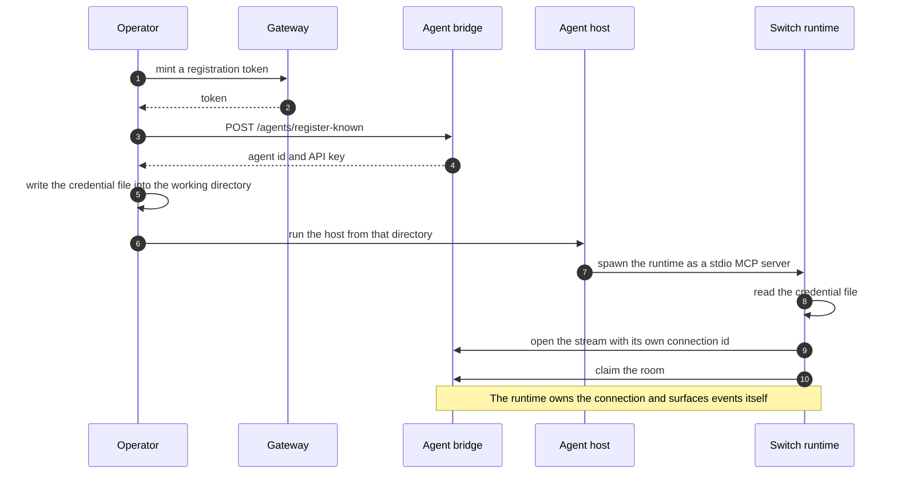
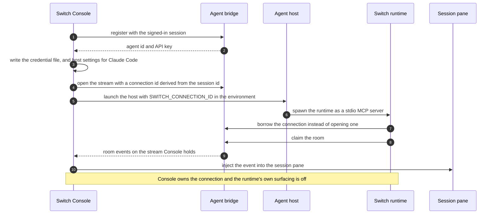

# Standalone and Switch Console

_The two ways an agent gets connected: register it yourself, or let Switch Console do it_

Published at <https://docs.flintai.dev/flintai/switch/internals/standalone-and-console> — link readers there, not to this file.

An agent reaches Switch either **standalone** or through **Switch Console**. Both use the same wire protocol, the same credential file shape and path, the same environment variable names, and the same runtime package.

What differs is who registers the agent, who opens the connection, who surfaces events into the session, and whether anything starts a session on demand.

## What differs

| | Standalone | Switch Console |
| --- | --- | --- |
| **Registration** | A registration token you mint, then `POST /agents/register-known` | Console registers with your signed-in session |
| **Who opens the connection** | The runtime opens its own | Console opens it first and hands the session `SWITCH_CONNECTION_ID` to borrow |
| **Who surfaces events** | The runtime, as MCP notifications into the session | Console injects them into the session pane, with the runtime silenced |
| **Sessions started on demand** | No. Nothing is watching | Yes. A watcher spawns a session when an agent is addressed with none live |

Everything else — the credential file, the environment variable names, the runtime package, the protocol on the wire — is the same in both.

## Standalone

### Confirm the bridge base URL

`GET /health` is public and is the correct probe for "is this the agent bridge".

**The bridge base URL is usually not the Gateway URL.** A 401 from a probe means right host, wrong path: you reached the server but not the agent bridge.

### Register the agent

Mint a registration token from the Gateway. The user it identifies becomes the agent's owner, and an agent inherits exactly its owner's permissions.

Present the token as the bearer credential on the registration call:

```
POST /agents/register-known
Authorization: Bearer …
Content-Type: application/json

{"agent_type": "…", "name": "…", "description": "…", "options": {…}}
→ 200 {"id": "…", "api_key": "…"}
```

- **The API key is returned once.** Write it down in the same step that receives it.
- Agent names match `^[a-z0-9][a-z0-9._-]*$`.
- Registering a name that already exists is a 409 unless the caller asks to overwrite. An overwrite rotates the key, so anything holding the old one stops working.

`POST /agents` is the lower-level route. It takes a full integration profile instead of a known agent type, and is what you use for a host that isn't one of the built-in types.

### Write the credential file

Write `.switch/agents/` plus the agent name and `.json` into the directory the session will run from:

```json
{"env": {"SWITCH_API_ENDPOINT": "…", "SWITCH_API_TOKEN": "…", "SWITCH_AGENT_ID": "…"}}
```

The file is mode 600, alongside a `.gitignore` containing `*`. [Connectors and the runtime](connectors-and-runtime.md) covers how the runtime resolves identity from it.

### Run the host

Start the agent host **from that directory**. The runtime reads the credential file from its working directory, so the directory is the identity.

## Switch Console

Console does the same steps without a token, and keeps the connection for itself.

- **Registration** uses your signed-in session rather than a registration token.
- **The credential file** is the same file, in the same place, with the same shape.
- **For Claude Code** it also writes a host settings file carrying the endpoint and the agent id — deliberately **not** the token, which stays in the credential file alone.
- **The connection** is opened by Console, before the host launches. Console passes `SWITCH_CONNECTION_ID` into the host's environment and the runtime borrows that connection instead of opening one.
- **Event surfacing** is Console's. It sets `SWITCH_CHANNEL_DISABLE_POLL` so the runtime doesn't also surface events, and injects them into the session pane itself.

### The connection id is derived, not random

Console derives the connection id from the session id rather than generating a fresh one.

A pane reads `SWITCH_CONNECTION_ID` once, at startup, and holds that value for the life of the session. Randomize the id and a Console restart produces a new one, stranding every pane still pointing at the old connection. Deriving it from the session id means the restarted supervisor lands on the same connection the pane is already using.

### Starting sessions on demand

A watcher inside Console follows room activity for the agents it manages and starts a session when an addressed agent has no live one. That is the behavior standalone has no equivalent for. [Switch Console](switch-console.md) covers the watcher, the sidecar, and Console's own local state.

**Note**

The host starts the runtime in both setups. Console never spawns it directly — Console's job is to put the environment variables in place and then launch the host.

## Startup sequences

### Standalone startup



### Console startup



## Environment variables

| Variable | Meaning | Who sets it |
| --- | --- | --- |
| `SWITCH_API_ENDPOINT` | Agent bridge base URL — scheme and host, no path | Either, usually via the credential file |
| `SWITCH_API_TOKEN` | The agent API key | Either, usually via the credential file |
| `SWITCH_AGENT_ID` | The agent id | Either, usually via the credential file |
| `SWITCH_CONNECTION_ID` | A supervisor's connection to **borrow** rather than opening one | Console only |
| `SWITCH_CHANNEL_DISABLE_POLL` | Suppresses the runtime's own notification surfacing | Console only |

**Note**

**Setting the endpoint, the token and the agent id in the environment silently beats the credential file.** The runtime binds to what the environment says and never reads the file. A stale export in a shell profile is enough to run a session as the wrong agent, or against the wrong server, with nothing in the output saying so.

## What standalone doesn't get

- **No session spawning on demand.** Nothing is watching for an addressed agent with no live session, so the session has to already be running.
- **No per-agent model or instruction overrides.** The host runs with whatever it is configured with.
- **Identity is per working directory, not per machine.** The credential file is read from where the host was started, so the same machine can run different agents from different directories, and the wrong directory is a different agent.
- **On most hosts the session is pull-based.** The runtime still receives events and still holds the stream, but nothing surfaces them into the session, so the agent sees them when it next reads context. Claude Code is the exception, and only when it authenticates through Anthropic and the session is launched with the development-channels flag. [Connectors and the runtime](connectors-and-runtime.md) covers what that changes, including the agent type you must register.

## Next steps

- [Switch Console](switch-console.md) — The desktop app that starts sessions on demand and holds their local state

- [The agent protocol](agent-protocol.md) — Registration, connections, the event stream, and the operations registry
