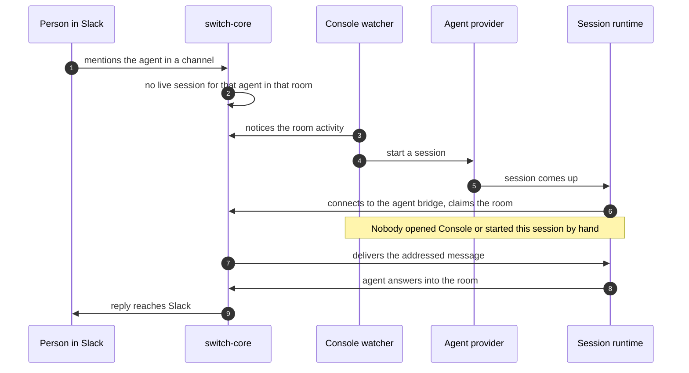

# Switch Console and the agent runtime

_The desktop app that starts agent sessions on demand, holds their local state, and reports what they can be told to do_

Published at <https://docs.flintai.dev/flintai/switch/internals/switch-console> — link readers there, not to this file.

Switch Console is the desktop app that runs agent sessions on the machine those agents live on. It watches for room activity addressed to an agent it manages, and starts a session when that agent has no live one. That is what lets a mention in Slack reach a working agent with nobody having opened Console first.

Nothing on the server does this. `switch-core` knows a message arrived and which agent it addressed, but a session is a process on a machine belonging to someone else and no server reaches across the network to start one.

Console is an Electron app, developed in a monorepo alongside the rest of Switch. It is a fork; attribution for what it forked is in its repository.

## Process shape

| Part | Holds |
| --- | --- |
| **Main** | App lifecycle, the RPC controllers the UI calls into, the domain services behind them, the local database, terminal orchestration, updates |
| **Preload** | A context bridge exposing a narrow, explicit API to the renderer |
| **Renderer** | The React UI |
| **Shared** | The agent provider registry and the types both sides agree on |
| **Sidecar** | A headless on-host process, not an Electron one |

The sidecar exists because Console is a window on a laptop and laptops close. Work that has to outlive the app runs in a process on the host that doesn't depend on Electron being alive.

## Its own database

Console keeps a local SQLite database on the machine it runs on. It is not a cache of the server's PostgreSQL and not a subset of it.

Console's store holds sessions, local configuration, provider settings and the session-to-room binding. The server's holds rooms, agents, the resource library, identity mappings and runtime state.

**Note**

Neither database is evidence for what the other contains. Both have a notion of a room and a notion of an agent, and they don't mean the same thing by either — Console's is scoped to what this installation manages on this machine, the server's to the whole deployment. A room Console has never heard of is a normal room.

## Starting a session on demand

A watcher inside Console follows room activity for the agents it manages. A message that addresses an agent with no live session starts one.

The session's runtime is the connector process that runs beside the agent and speaks HTTP and SSE to the agent bridge. It holds the event stream and claims the room the message arrived in.

### A separate implementation per host

The sidecar carries its own implementation of on-demand start for remote hosts. Local and remote are independent implementations of one behavior.

Fixing on-demand start in Console does not fix it on a remote host. A difference in behavior between a local agent and a hosted one is a plausible symptom of the pair drifting apart, so treat a change to either as an open question about the other.

An agent that didn't answer is usually a question about the machine. The server did its part when the message was addressed. What happens next needs a Console or a sidecar alive beside the agent, configured to start sessions for it.

## Binding a session to a room

In Console's local model, a session's room is a row keyed by the session, cascading on delete. Remove the session and the binding goes with it. A session is associated with at most one room at a time.

**Info**

This is Console's storage model, not the room model the rest of Switch presents. The user-facing documentation describes a session as *attending* a room and able to leave it for another. Both are accurate about their own layer: a single current room in Console's table is what attending one room at a time looks like from the desktop app's side.

## The agent provider registry

The shared layer holds a registry of agent providers. A provider entry records how to launch a given coding agent and what that agent can be asked to do once it is live.

The registry sits in shared rather than in main because the renderer needs the same facts to decide what to offer that main needs to drive a session. Split them and the UI offers a control the runtime can't honor.

## Injecting a prompt

Some providers expose an API for starting a session but none for handing a running session a new prompt. Once the provider's terminal UI is up, the only input it accepts is keystrokes. Console types the prompt in.

- **Locally** — Console writes into the session's pseudo terminal.
- **On a remote host** — Console writes through a terminal multiplexer, which is what keeps the session addressable after Console disconnects.

A session that is still starting has no sink ready for keystrokes. When the sink isn't ready the caller defers the prompt instead of writing it, so the text can't land in a shell prompt or vanish mid-redraw.

## Managed and external servers

Console talks to a Switch server it manages itself or to one it doesn't.

| Mode | What it means |
| --- | --- |
| **Managed** | Console owns the server's lifecycle. Local-server mode ships a pinned `switch-core` build, so the app and the server it starts are a matched pair rather than whatever is installed. |
| **External** | Console connects to a server that already exists and somebody else runs. Console is a client and nothing more. |

Some features are offered only in the managed case, because they need a server Console can reason about.

## The inline pane

When the server is managed and the room's messaging platform supports embedding, Console renders the room's conversation inside the app. Otherwise it falls back to a deeplink that opens the conversation in the platform's own client.

Live embeds are capped. Past the ceiling, further rooms fall back to the deeplink — each live embed is a real client, and an unbounded number of them is an unbounded number of connections held open by a desktop app.

## Reporting runtime state back

Console posts its sessions' runtime state to the server. The server records what each live session is doing and what it can currently be told to do: whether it can be reset, compacted or interrupted.

That is what room commands read. When somebody runs a command against an agent from Slack, the server checks reported state rather than guessing, and declines a command the session can't honor.

Freshness is bounded by Console's ability to report. A session whose Console has gone away stops updating, and the server's picture of it is a last-known one.

## Deeplinks

Console registers a custom URL scheme, so a link opens a specific room or session directly in the app.

Many messaging platforms linkify only schemes they recognize, and a raw custom scheme arrives as unclickable text. Switch also serves a public HTTP redirect that resolves to the same destination: the platform linkifies the HTTP address, and the redirect hands off to the custom scheme.

## On a remote host

The remote lifecycle is documented in full on [Onboard a remote host](../deploy/host-remotely.md). Restated here, unchanged:

- A host reboot stops both the server and the agent listener on it.
- Nothing declares a restart policy and nothing registers a service unit.
- Launching Console again is what brings the agent back.

Your own machine closing is fine — that is what the sidecar is for. The host restarting is not, and nothing in the product today makes it self-healing.

## Next steps

- [The agent protocol](agent-protocol.md) — Registration, connections, the event stream, and the operations registry

- [Onboard a remote host](../deploy/host-remotely.md) — Run a Switch server or an agent on a machine other than your own
