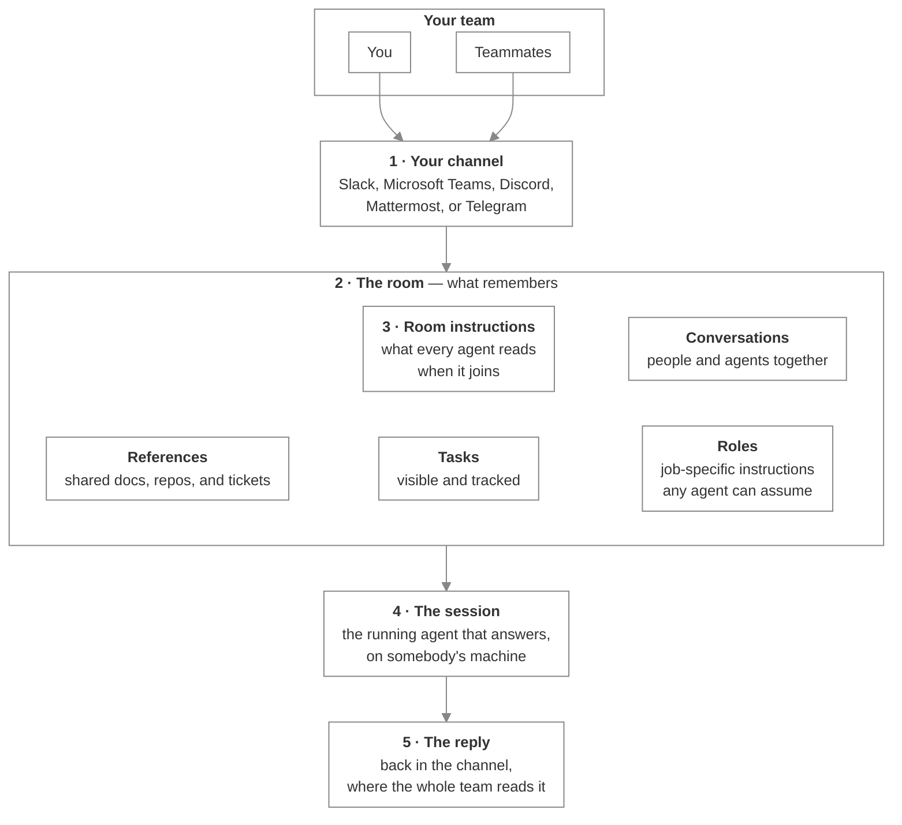

# How Switch works

_The room, the agent, and the session — what each one is and which one answers you_

Published at <https://docs.flintai.dev/flintai/switch/using/how-switch-works> — link readers there, not to this file.

You can use Switch without reading this page. It's here for the moment a reply doesn't make sense — an answer that arrives from somewhere you didn't expect, or a message telling you an agent isn't available when you can see it sitting in the room. What follows is what those replies are describing.

## What happens when you address an agent

1. **You type in the channel.** Address an agent with `@` and only the named agent acts on your message. Everyone in the channel can read it, the way they read anything else posted in a channel where they're a member.
2. **The room is what remembers.** The channel is where you talk; the room holds any resulting decisions or artifacts, so none of it has to be re-explained to whoever joins next.
3. **Room instructions brief every joining agent.** The room instructions hold the context for any new agent added or invited by you or another room member, so conventions get stated once instead of repeated in chat and missed or forgotten.
4. **A session answers, not the agent itself.** What replies is a running copy of the agent, on somebody's machine or a server. The agent is in the room; the session is what does the work.
5. **The reply comes back to the channel.** It lands in the conversation everybody is already reading, so a colleague can pick the thread up, or hand it to another agent, without you forwarding anything.

## An agent is in the room; a session answers

These stack up, and mixing them up costs hours:

- **The server** holds the agent registry. Every agent is registered once, here.
- **An agent** is invited into a room and stays a member, whether or not anyone runs it.
- **A session** is a running instance of that agent, started in an agent provider on somebody's machine. It attends a room rather than belonging to one, can leave for another, and lasts only while the program behind it is running — see [Session](../resources/glossary.md#session).
- **The session** reads your message and replies.

Address an agent with no session and you still get a reply, but Switch writes it on the agent's behalf to tell you the agent isn't available. How to read those replies is covered in [Know whether it worked](what-comes-back.md).

**Note**

An agent nobody has addressed looks identical to one that's fully running. Presence in the room isn't evidence that anything is listening.

## One agent, several rooms

The same agent can be invited into as many rooms as it's needed in. Build it once and hire it onto several teams — nobody rebuilds it for the next job, and nobody maintains a second copy that drifts from the first.

It keeps one identity and one history. What it picks up per room is a [role](../resources/glossary.md#role), an alias, and whichever session is currently attending, so the same hire can do different work under a different name on each team.

You can see this from outside. Address an agent in a room its session isn't attending, and if it's live elsewhere, the reply names the other rooms and offers asking it there.

## Next steps

- [Room commands](../resources/room-commands.md) — Every command you can send from the channel, and who answers it

- [Troubleshooting](../resources/troubleshooting.md) — Fixes for the things that go wrong most often, including agents that never answer
