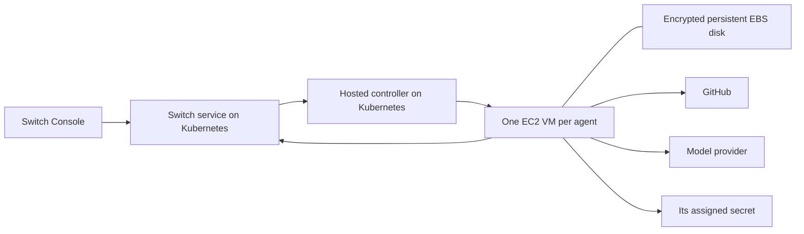

# PRD: Switch Hosted Agents

Status: Updated draft for product and engineering review; not deployed
Updated: 2026-09-21
Implementation base: `main` (SDK/server split and subsequent fixes integrated)
Audience: Product, application engineering and infrastructure engineering

## Current position

We are building an optional managed execution service for Switch: users create
coding agents in Console, supply personal provider credentials, connect GitHub
and work with their agents without arranging a server or execution machine.
Local and SSH execution remain supported.

The first backend is **one ordinary EC2 VM per agent with encrypted persistent
EBS storage**, managed by a controller on existing Kubernetes. Kubernetes hosts
the control services; agent VMs are not Kubernetes nodes. We have selected EC2
for the initial experiment; it is not yet approved as a production-ready backend.

The headless runtime and an operator-controlled EC2 implementation are written,
locally tested, adversarially reviewed and published as draft stacked PRs. The
next milestone is one internal end-to-end cloud experiment. Hosted Console
onboarding and the complete managed service do not exist yet.

### What exists, and what does not

| Area | Current evidence | Remaining work |
| --- | --- | --- |
| SDK foundation | Server-authorized sessions, commands, approvals and history on the SDK branch. | Deploy a compatible test backend and verify the deployed protocol. |
| Headless hosted runtime | Shared configuration builder, foreground bootstrap/supervisor, file-based credentials and secret redaction. | Real cloud/provider validation, including Claude setup-token execution. |
| EC2 controller | Operator CLI, SQLite desired state, revision-fenced reconciliation, create/start/stop/delete, retained encrypted EBS, per-assignment IAM/secret references. | Live AWS permission/lifecycle tests and service-owned assignment integration. |
| Worker launcher | Root launcher, unprivileged agent, artifact checks, tmpfs credential delivery and instance/boot identity validation. | Bake and inspect a real pinned Linux AMI; test mounts, reboot and isolation. |
| Packaging | Generic Terraform, controller container, Helm chart and standalone runtime builder. | Private environment configuration, published image digests and a reviewed deployment plan. |
| GitHub workflow | Optional personal-token delivery through tmpfs, startup credential checks, non-persistent Git HTTPS helper and GitHub CLI environment implemented in the next stacked slice. | Live repository permission checks, checkout/setup and clone/build/push/PR proof; Console connection UI. |
| Console experience | Existing SDK session surfaces provide a foundation. | Hosted creation, connections, readiness, lifecycle and actionable errors. |
| Provider coverage | Five SDK adapters exist; the current EC2 worker slice configures Claude. | Noninteractive hosted authentication and lifecycle certification for every provider. |

Read-only AWS/Kubernetes discovery succeeded. The inspected candidate test
backend is deployed at version 0.18.0, which predates the SDK session API, and
no usable public HTTPS agent endpoint was established. A compatible backend and
worker-reachable endpoint are explicit prerequisites, not assumed existing
capabilities. Private resource identifiers, account configuration and raw
inventory remain outside this public document.

### Implementation stack

The SDK/server work is now integrated in `main`. Review/merge order:
1. [Hosted runtime foundation — PR #502](https://github.com/sandbox-quantum/switch/pull/502), based on `main`.
2. [Operator-controlled EC2 workers — PR #503](https://github.com/sandbox-quantum/switch/pull/503), based on the runtime foundation.

The rebase preserves the newer Console-owned local watcher lifecycle, detached
remote supervision and build-aware process ownership from `main`.

At this checkpoint, the hosted PR checks passed; one existing recovery-test
assertion needed a rerun. Adversarial review found lifecycle defects, which were
fixed with regression coverage; the follow-up found no remaining actionable
findings in the reviewed scope. This is code-level evidence, not proof of live
cloud isolation, authentication, recovery or production readiness. No hosted
pilot resources have been created.

## 1. Problem and outcome

Using Switch today requires users to arrange a Switch server and an execution machine with installed, authenticated agent providers. Coding agents also need repository access, build dependencies and a workspace. This setup prevents a new user from quickly getting to useful work, and makes unattended execution their responsibility.

Switch Hosted Agents adds an optional service operated by Switch. A user signs into Switch Console, supplies personal provider credentials, connects GitHub, selects a repository and creates an agent. Switch supplies the server, execution environment and persistent storage. The agent can clone repositories, run builds, change code and open pull requests while Console is closed.

Console remains the primary management interface, with Local, SSH and Hosted execution choices. Existing local and SSH agents continue to work. Hosted execution is optional and does not automatically move existing agents or their conversations.

## 2. Agreed product scope

| Area | MVP requirement |
| --- | --- |
| Service ownership | Switch operates the server and hosted execution. Users do not provision infrastructure. |
| Primary workflow | Coding agents working against GitHub repositories, including private repositories, builds and PR creation. |
| Providers | Codex, Claude Code, OpenCode, Antigravity ACP and Cursor. One provider may be implemented first; all five are required for the full MVP. |
| Provider authentication | Personal API keys and provider-issued tokens supplied by the user, explicitly including Claude setup tokens. No interactive provider browser-login flow in Switch. |
| Ownership | Personal agents and credentials. Existing owner authorization governs session access and controls. |
| Runtime | Persistent environment per hosted agent, with room watching available while the agent is enabled. |
| Commercial limits | No plans, credits, billing system or user-facing product quotas in the MVP. Operator resource and concurrency boundaries still apply. |
| Recovery | Preserve saved state, support safe recovery where possible and expose failures. No automatic cross-host migration commitment. |

“No browser login” applies to **model-provider authentication**. It does not prohibit ordinary Switch sign-in or GitHub authorization. Users obtain provider credentials outside Switch and submit them through Console.

## 3. Primary user journey

1. **Sign in.** Console offers the managed Switch service without requiring a server URL, SSH host or cluster configuration.
2. **Create a hosted agent.** Choose Hosted, name the agent and select a provider/model. Local and SSH remain available as separate choices.
3. **Connect the provider.** Supply a personal API key or supported provider token. Show the credential type expected for that provider. Secrets are masked and are not returned after saving.
4. **Connect GitHub.** Authorize access to selected repositories and the operations necessary to clone, push a branch and open a PR. Show the repositories available to the account and any missing permissions.
5. **Choose the workspace.** Select a repository and starting branch. Offer a managed build environment and optional setup instructions. Advanced settings must not be mandatory for a supported, ordinary repository.
6. **Provision.** Show progress for capacity assignment, workspace creation, repository checkout, credential checks and provider readiness. A failed stage has a useful error and a safe retry action.
7. **Start work.** Open a Console conversation or assign the agent to a room and address it there. The agent can edit files, execute builds, push its work and open a PR within its granted permissions.
8. **Leave and return.** Close Console. Work and room-triggered startup continue. Reopening Console discovers the hosted agent and attaches to its existing conversation without launching another copy or replaying the initial prompt.

GitHub credentials and model-provider credentials are separate connections. Users must not need to paste either into a chat message or repository file.

## 4. Functional requirements

### 4.1 Agent configuration and placement

- Persist hosted placement and launch configuration on the service so execution does not depend on a laptop's database or filesystem.
- Persist agent identity, owner, provider/model settings, repository configuration, environment selection, startup policy and credential references.
- Display actual lifecycle state and errors in Console. Proposed labels: Setting up, Ready, Working, Waiting for approval, Pausing, Paused, Queued for capacity, Needs attention and Deleting.
- Treat agent lifecycle, session lifecycle and connectivity as distinct facts. A disconnected worker must not appear successfully stopped.
- Prevent local or SSH watchers from starting a second copy of an agent assigned to hosted execution.
- Retrying agent creation or provisioning must reuse the same operation identity and converge on one assigned environment.

### 4.2 Provider support and credentials

- Support the existing five SDK adapters through the shared session protocol. Provider capabilities can differ; controls must reflect the adapter's actual support.
- Validate each provider's supplied credential in the hosted execution environment before declaring it ready. An authentication check does not guarantee quota or access to every model.
- Support Claude setup tokens as an explicit credential type. Treat their accepted format, expiry behavior and runtime integration as implementation work to verify, not as established behavior of the current hosted system.
- Build and validate a provider authentication matrix covering credential types, required configuration, readiness checks, rotation and expiry. A provider without a verified noninteractive credential path blocks completion of the all-provider MVP; do not silently introduce browser login or mark it supported.
- Permit replacement and removal of saved credentials. Stop new work using a removed connection and report existing execution until its shutdown is confirmed. Replacing a credential must not silently restart an active turn.
- Store secrets encrypted with scoped access. Launch specifications contain references, not plaintext secrets. Treat provider homes and session state as potentially credential-bearing.
- Keep provisioning-service credentials, infrastructure administration credentials and other users' secrets out of agent environments. An agent may access credentials deliberately assigned to its own execution context.
- Redact secrets from logs, diagnostics, command displays and user-visible errors.

### 4.3 GitHub and build workspaces

- Support repository discovery, private cloning, explicit branch selection, branch creation/push and PR creation.
- Scope repository access to what the user authorizes. Surface organization restrictions, missing permissions and revoked credentials without falling back to broader access.
- Give each agent its own persistent workspace and provider state. Do not share writable worktrees between different agents by default.
- Preserve uncommitted changes across pause, session stop and ordinary worker restart. A fresh session must not reset or discard the workspace.
- Provide a managed, versioned build environment. Document its supported tools and resource boundaries before pilot onboarding. Repositories needing additional dependencies can use visible setup steps; arbitrary repository compatibility is not promised.
- Run repository setup scripts with the same isolation and resource boundaries as agent work. Setup output and failures are available in Console.
- Define workspace coordination for simultaneous room sessions. For the first milestone, serialize write-capable work in an agent's shared checkout; do not allow independent sessions to mutate it concurrently without an explicit strategy.
- Show the resulting PR link and preserve useful build/task output. PR merge is not an automatic platform action.

### 4.4 Execution and controls

An enabled agent keeps its hosted environment and room watcher available. Provider sessions start when needed. The MVP does not automatically suspend the environment or shut down idle sessions to save capacity.

| Action | Required behavior |
| --- | --- |
| Close Console | Execution and room watching continue. |
| Interrupt | End the active turn using the provider's supported control; keep conversation and files. |
| Stop session | Stop that session and retain saved state. If the agent remains enabled, a later room mention may create another session. |
| Stop agent | Disable new starts, confirm execution has stopped, release allocated compute and retain persistent workspace/session data. |
| Start stopped agent | Restart the existing assigned instance with its retained storage and restore eligibility for work after ownership and readiness checks. Do not replay uncertain work. |
| Resume session | Explicitly reopen the saved conversation after required recovery and readiness checks. |
| Pause agent | Disable new starts, stop active sessions and confirm completion before showing Paused. Surface any unconfirmed stop. |
| Enable agent | Restore eligibility for room-triggered starts. Do not replay previous uncertain work or automatically repeat a stopped turn. |
| Delete agent | Confirm deletion, disable starts, fence/stop execution and delete active hosted data and credential bindings according to the deletion policy. Report incomplete cleanup. |

Pause must prevent races with incoming messages and provisioning retries. Messages received while paused must not silently start execution. The proposed MVP behavior is no automatic backlog execution on enable; the user explicitly requests new work. The implementation must preserve existing durable-delivery guarantees while making this policy visible.

Approvals and questions use the existing server-authorized SDK request flow. Closing Console does not grant permission; pending requests remain subject to existing expiry behavior. Ordinary transcript output remains in session details, while explicit agent room replies follow the existing messaging path.

## 5. Persistence, recovery and deletion

Persist the workspace, provider home/native conversation, host journals, watcher assignments and required launch metadata. The Switch service retains authoritative session history, command outcomes and request state.

- **Client loss:** Reattach to saved sessions without relaunching the provider or resending work.
- **Recoverable worker crash:** Verify that previous execution stopped, reconcile saved events and obtain the server's recovery epoch before continuing the native conversation.
- **Network loss:** Preserve durable command/event identities and existing lease safety behavior. A timeout does not prove an operation failed or that the provider stopped.
- **Node loss or unavailable state:** Show Needs attention and keep server history readable. Replacement execution requires proof that old execution cannot continue and valid recoverable state. Reattaching a volume alone is insufficient.
- **Uncertain side effects:** Preserve unknown outcomes. Never automatically retry a push, PR creation, build-triggering command or other uncertain provider action.
- **Lost native conversation:** Explain the limitation and offer an explicit fresh conversation where supported; retain available history and workspace.

For the pilot, stop and pause retain user data, with no idle-time purge. Users can explicitly delete hosted agents and their active data. Shared personal credentials are removed only when no longer needed or when the user deletes that credential connection.

Encrypted persistent storage and backups are required. Before admitting pilot users, engineering must document and test backup coverage, restore procedure, recovery-point/recovery-time targets, backup retention and deletion expiry. Do not promise zero loss of uncommitted changes after storage failure. Credential removal from Switch cannot revoke an externally issued credential at its provider unless that provider exposes and authorizes such an operation.

## 6. Service boundaries and operations

The service runs code and builds supplied by users. Isolate agent files, secrets, processes and network access across users. Select and validate the execution isolation mechanism before admitting independent pilot users. Database tenant isolation does not by itself isolate running code.

Each worker has bounded CPU, memory and disk, and the operator sets a concurrency/capacity ceiling. These are infrastructure boundaries, not a billing system. When capacity is unavailable, show a queued state or actionable failure; do not create unbounded workers. Report disk exhaustion and resource termination clearly.

Operators need provisioning status, worker health, restart/recovery diagnostics, queue depth, storage usage and authentication failure signals without exposing secrets. Record security-relevant lifecycle and credential actions with actor and outcome. Provider consumption remains charged according to the user's provider account; do not imply that supplying a key includes unlimited model usage.

## 7. Architecture direction

The initial backend is EC2 plus EBS, with the controller and Switch service on
existing Kubernetes. See the [execution-backend proposal](hosted-execution-backend-proposal.md)
and [implementation runbook](../../deploy/hosted/README.md). Live validation remains
required before accepting this backend for pilot users.

This diagram is the target product architecture. In the current operator slice,
CLI commands update the controller's own SQLite database; the service-to-controller
assignment integration in the diagram has not been implemented. Neither Console
nor repository code receives infrastructure administration credentials.

The current implementation provisions a dedicated worker VPC, a private subnet,
NAT egress and no inbound worker access. Workers do not join Kubernetes or share
its container runtime. A worker role may read only its assigned secret, with
corresponding constrained KMS access. Repository code can access its own assigned
credentials; this design does not hide a user's key from that user's agent.

An explicit **Stop agent** disables starts, confirms compute stopped and retains
the disk and saved state. The current implementation stops and restarts the
**same EC2 instance**. It does not terminate/recreate the VM on every start and
does not support automatic disk adoption by another instance. Instance or
assignment identity mismatch fails closed. Provider continuation still requires
valid saved state and session recovery; interrupted actions are not replayed.

EBS, NAT, public IPv4 and other retained resources can remain billable while the
worker is stopped. The current controller has no automatic expiry or idle shutdown;
operator limits and explicit cleanup bound the internal experiment. This is
distinct from a user-facing quota, billing system or automatic idle suspension.

The controller (also called worker manager) is an infrastructure service, not an
AI agent. An AI onboarding assistant is an optional future UX idea, not required
for provisioning or included in the current MVP.

1. **Console:** Hosted onboarding and lifecycle UI; authenticated configuration and secret submission; existing session discovery and conversation controls.
2. **Switch service:** Authoritative agent placement, desired lifecycle state, owner authorization, sessions, commands, approvals and history. Durable provisioning operations and worker assignments extend this authority.
3. **Optional hosted controller:** Reconcile desired state, provision isolated environments and storage, deliver scoped credentials, monitor execution and report observed state. Infrastructure authority stays here.
4. **Hosted environment:** Existing room watcher, shared SDK host, provider adapter, provider process and persistent coding workspace.

Use one deployment backend for the MVP. Keep the controller boundary explicit, but a multi-backend abstraction and customer-operated hub distribution are not MVP deliverables. Console should manage hosted agents through the service rather than holding infrastructure credentials or requiring direct SSH to workers.

Reuse the extracted host configuration builder, server-issued epochs, durable commands, journal reconciliation and native provider resume behavior. Extend service integration with deployment-level assignment and fencing; existing process-group checks apply to a local execution host and do not establish cross-node exclusivity.

The current Helm chart requires a single Switch core replica. Worker scaling must not assume that increasing core replicas is safe. High availability of the control service is a separate design consideration, not an implicit benefit of running workers on a cluster.

## 8. Delivery phases and immediate experiment

These phases distinguish the work already reviewed from the complete product.
They replace the earlier broad milestone table; dates follow the cloud experiment
and resolution of provider authentication constraints.

| Phase | Deliverable | Current state / exit gate |
| --- | --- | --- |
| 1 — Hosted runtime foundation | Run the shared SDK host without the desktop; build configuration, supply credentials securely and supervise the process. | Implemented in draft PR #502; cloud/provider proof still pending. |
| 2 — Operator infrastructure | Controller, isolated EC2 worker, retained encrypted disk, assignment identity, lifecycle operations and packaging. | Implemented in draft PR #503; live AMI/IAM/network/lifecycle validation pending. |
| 3 — One-agent cloud experiment | Compatible test backend, HTTPS connectivity, pinned images, scoped credentials and one GitHub coding task with stop/start persistence. | Current focus: prepare and review the private deployment package, then execute a bounded test. |
| 4 — Managed service and Console | Service-owned placement/desired state, credential connections, GitHub setup, hosted creation and lifecycle UI, readiness and diagnostics. | Not implemented; uses evidence from phase 3. |
| 5 — Full MVP / user pilot | All five providers, setup-token proof, failure/isolation tests, backup/restore, deletion, operating runbooks and supported build environment. | Not complete until all product acceptance criteria pass. |

### Phase 3: bounded internal experiment

This is an engineering experiment with disposable data, not user-pilot acceptance.
The initial sizing is one Linux x86 worker, 2 vCPU / 8 GiB, a 20-GiB root volume,
a 40-GiB retained gp3 volume and a small persistent controller database. Allow only
one running worker, at most two cumulative worker compute hours, with an explicit
24-hour cleanup deadline for retained test resources. Image-building resources
must be separately identified and included in the budget. These limits are
operational safeguards for the experiment, not product quotas.

The deployment preparation must produce:
- A private Terraform/Helm configuration with exact region/AZ, network boundaries,
  OIDC/IAM bindings, explicit encrypted controller storage and image references.
- A pinned runtime/image manifest and an executable image-build procedure;
  locally generated bundles are not a built or validated AMI.
- A compatible test-backend rollout plan and authenticated HTTPS endpoint that
  workers can reach from the dedicated network. Decide whether to upgrade the
  existing test backend or deploy a separate test instance; do not silently
  replace a shared service.
- GitHub credential delivery and a disposable repository; a provider key and
  Switch token alone do not grant repository access. No credentials in chat,
  Terraform values, source control, AMI images or command arguments.
- A complete incremental cost estimate, cleanup owner, timing and retained-resource
  checklist. Include NAT/IPv4, disks, secrets, KMS, image builds, backend/endpoint
  resources, logs and model usage. A budget alert is not a spending kill switch.
- A reviewable infrastructure plan with unresolved inputs stated explicitly.
  Validation or a placeholder render is not an apply-ready live Terraform plan.

Before real credentials or a coding task are introduced, verify the worker role
cannot read another assignment's secret and the worker cannot reach private
control-plane services or other agents. Authenticate to the provider and establish
SDK readiness; EC2 `running` is not an agent-ready signal.

The live proof must then:
1. Clone an explicitly authorized disposable GitHub repository, change a file,
   run its checks, push a branch and open a PR. Do not merge it automatically.
2. Record workspace hashes and session/native identity, stop the agent, observe
   EC2 stopped, and verify a room mention cannot restart it.
3. Start the same instance and verify disk identity, files and saved session
   recovery without repeating the previous task or creating a duplicate PR.
4. Exercise credential rejection and a controlled connectivity interruption;
   preserve uncertain command outcomes instead of retrying side effects blindly.
5. Collect redacted evidence, terminate test compute and explicitly remove or
   account for data/root/controller volumes, NAT/IPv4, secrets, roles, image
   snapshots, registry artifacts and any temporary backend/endpoint resources.

Automatic replacement, cross-instance disk adoption, cross-AZ recovery and broad
multi-user onboarding are outside this experiment. A worker failing closed on
unsupported replacement is expected behavior; it is not evidence that replacement
recovery works. Backup/restore targets and the broader acceptance suite remain
required before admitting user data.

## 9. Acceptance criteria

1. A new user provisions an agent from Console without installing providers locally or configuring a server, SSH host or cluster.
2. The agent clones an authorized private GitHub repository, changes a file, runs a representative build/test, pushes a branch and opens a PR. Missing GitHub permissions fail visibly.
3. With Console closed, addressing an enabled agent in a room starts or reaches its session. Reopening Console shows its transcript and continues that conversation without a second launch.
4. Duplicate create/start commands, concurrent Console clients and controller retries produce one authorized execution assignment and do not repeat provider actions.
5. Every provider passes a hosted noninteractive credential test and representative coding task. Claude is tested with a user-supplied setup token. No provider authentication step launches a browser flow in Switch.
6. Expired/rejected credentials produce actionable errors; replacement restores readiness safely. Removing a connection prevents new work and shows any active stop as pending until confirmed.
7. Pause racing with a room message cannot start new work after pause is confirmed. Stop session preserves files and history; its distinct startup behavior is explained in the UI.
8. Worker crash and network interruption preserve journal/command identity. Unknown actions are not replayed. Loss of a node never starts a competing replacement without verified fencing.
9. One user's agent cannot read another user's workspace, credentials or sessions, nor access controller infrastructure credentials. Repository scripts are included in this test.
10. Capacity exhaustion, out-of-memory termination, full disk, clone failure, provider startup failure and build setup failure appear as distinct useful states.
11. Backup/restore tests demonstrate the documented data-loss window. Deletion removes active data and documents when backup copies expire; failed cleanup remains visible.
12. Local and SSH workflows still function and cannot accidentally provision or launch hosted agents. Existing approval authorization and capability-specific controls remain intact.

Measure onboarding completion, time from agent creation to readiness, first-PR success, credential/provisioning failure rates and successful reattachment/recovery. Set numerical performance targets after the first vertical slice; no unmeasured latency or availability promise is part of this draft.

## 10. Non-goals and remaining engineering decisions

Out of scope: provider browser-login flows, non-GitHub hosts, shared team credentials or delegated session ownership, plans/billing, automatic local-to-hosted migration, automatic cross-host session migration, idle scale-to-zero, arbitrary custom VM images, and automatic PR merge.

Before live deployment or completion of the relevant phase, resolve:

- The verified credential mechanism for every provider. If any cannot meet noninteractive authentication, surface the scope conflict rather than quietly dropping that provider.
- Live acceptance of the selected EC2 isolation design, final private deployment inputs, compatible test-backend rollout and reachable HTTPS endpoint.
- GitHub authorization mechanism and least-required permissions for private clone/push/PR operations.
- Supported build tools and treatment of repositories requiring privileged containers or unusual services.
- Server-side assignment, pause/message races and workspace scheduling across room sessions.
- Backup objectives, retention/deletion windows and supported node-loss recovery procedure.

These are engineering decisions under the agreed product scope. Runtime and operator infrastructure code are implemented in the draft stack; hosted provider compatibility, the complete managed product and live cloud recovery remain unproven.

## 11. Source anchors

- `core/switch_core/sessions/service.py`: session authority, ownership, commands and recovery.
- `core/switch_core/gateway/sessions.py`: authenticated session discovery and control API.
- `console/packages/agent-providers/src/host/shared-watcher.ts`: durable room-triggered session assignments.
- `console/packages/agent-providers/src/host/shared-host.ts`: shared host lease and recovery behavior.
- `console/packages/agent-providers/src/host/build-shared-config.ts`: reusable shared host configuration builder.
- `console/packages/agent-providers/src/host/hosted-bootstrap.ts`: headless hosted bootstrap.
- `deploy/hosted/`: controller, trusted worker launcher, Terraform and Helm packaging.
- `console/apps/switch-console-desktop/src/main/core/sdk-host/shared-host-deployment.ts`: existing local/SSH deployment.
- `console/apps/switch-console-desktop/src/main/core/locations/location-transport.ts`: current local/SSH transport model.
- `console/docs/sdk-sessions.md`: provider capabilities, persistence and supported recovery boundaries.
- `deploy/remote/helm/switch/values.yaml`: existing deployment settings and core replica constraint.
