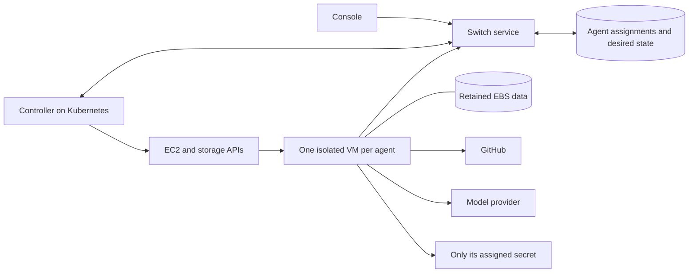

# Hosted execution backend: M0 proposal

Date: 2026-09-18. Status: proposed, not deployed or cloud-validated.
Related: [PRD](hosted-agents-prd.md), [runtime checkpoint](hosted-agents-phase-1.md).

## Decision to review

Use a dedicated Linux EC2 VM per hosted agent for the first pilot, with a retained
encrypted EBS data volume. Run the hosted controller as a service on Kubernetes.
Workers are not Kubernetes nodes and receive no Kubernetes administrative access.
“Dedicated” means one ordinary instance per agent, not AWS Dedicated Host hardware.
This is one initial backend, not a promise to implement multiple backends.

The VM provides the per-agent machine boundary and ordinary Linux tool support.
A stopped VM releases its instance compute allocation while EBS remains billed.
For the first lifecycle experiment, stop/start the same instance; independently
exercise termination/replacement with retained data as a recovery test. Pin image
and tool versions. Use fresh roots for deliberate replacement and upgrades.

This recommendation is contingent on live account, networking, quota, cost and
security checks. Repository configuration is not evidence of installed runtimes,
current capacity or available cloud credentials. Internal inventory lives outside
this public repository.

## Alternatives

| Option | Assessment for the first pilot |
| --- | --- |
| Dedicated EC2 VM + EBS | Recommended candidate: machine boundary, broad Linux compatibility and directly testable stop/start/storage semantics. Higher per-agent compute overhead and slower provisioning than lightweight warm containers. |
| Ordinary pods on shared nodes | Useful packaging but not our selected boundary for unrelated users executing repository scripts. Stopping a pod also does not guarantee its node compute cost disappears. |
| gVisor pods on dedicated nodes | Worth later evaluation for density. Requires runtime installation/maintenance and compatibility testing of provider CLIs and build tools; it is a userspace-kernel sandbox rather than a VM per agent. |
| Kata/Firecracker-based workers | Potential VM isolation with container scheduling, but requires a compatible hypervisor/KVM environment, worker image/runtime operations and recovery engineering. Not an assumed EKS feature. Verify current hardware support rather than assuming every EC2 type can run nested VMs. |
| EKS Fargate | Provides managed per-pod isolation, but does not support EBS volumes or privileged containers. Static EFS would be a different storage design; not a drop-in fit for this pilot. |

## Components and ownership

Switch owns authorization and durable desired state. The controller reconciles
that state into infrastructure and reports observations; a worker heartbeat alone
cannot establish that old compute has stopped. The controller is a service, not
an AI agent. Only the coding agent is presented as an agent to users.

Product code, worker image/launcher contracts and generic packaging belong in
Switch. Account-specific networking, roles, secret-store deployment and operational
configuration belong in the private deployment repository. Do not copy private
resource IDs, hosts, account names or secret material into this document or tests.

## Persistent and ephemeral data

- Persistent encrypted data disk: repository, uncommitted changes, provider home,
  session journal and runtime identity. Keep state and workspace in disjoint
  private directories as required by the current bootstrap. Recover the same
  recorded paths after attachment; never format a disk merely because mounting
  failed. The launcher validates volume identity and filesystem before mounting.
- Disposable root: pinned OS, runtime, provider CLI, Git and supported build tools.
  No promise that manual packages installed on the root survive replacement.
- Mounted runtime secrets: fetched at boot into private tmpfs outside state and
  workspace, with exact paths expected by the saved bootstrap plan. No secret
  values in user-data, command arguments, images or controller logs.
- EBS is AZ-scoped: ordinary restart/replacement stays in the disk's AZ. No
  automatic cross-AZ migration. Snapshots/backups are a separately tested policy,
  not an implied property of keeping a volume.
- Retain the data disk on instance termination explicitly; root deletion and
  data retention must be separate settings. Persistent provider homes may contain
  sensitive information despite tmpfs input credentials.

## Identity and network boundaries

The controller receives narrowly scoped lifecycle privileges for approved images,
worker network resources and managed assignments. IAM role creation/policies are
provisioned through the private infrastructure workflow; the first proof of concept
uses a precreated worker role. Broad PassRole or arbitrary instance-profile selection
is not acceptable. Production role provisioning remains an infrastructure subtask.

The worker instance profile may read only its own assignment's Secrets Manager
secret and use the required KMS decrypt context. It cannot enumerate/read other
agents' secrets, administer EC2, assume the controller role or access Kubernetes.
The code running in an agent is allowed to access credentials assigned to that
agent; do not pretend a secret environment variable is hidden from its code.
Use a distinct restricted role per pilot assignment and test cross-agent denial.
IAM/secret-count quotas must be checked before expanding this pattern.

A trusted launcher obtains the credentials, prepares private mounts and starts the
unprivileged provider service. No host Docker socket, blanket sudo or control-plane
credentials are given to repository scripts. IMDSv2 is required but is not itself
an isolation boundary from code executing in the VM. Design as if the worker's
limited instance identity can be obtained by its workload.

Use a dedicated worker network boundary with no inbound developer SSH and no
routes/access to other workers or control-plane databases/administration. Allow
only the required Switch API, repository, package, provider and secret endpoints
through an explicitly designed egress path. Security groups provide allow rules,
not deny rules; an outbound 0.0.0.0/0 rule is not a private-network restriction.
DNS, IPv6, metadata and private-address destinations need explicit tests. Arbitrary
package downloads and strict destination allowlists have a compatibility tradeoff
that the supported build environment must document.

## Assignment and lifecycle contract

Persist `agent_id`, desired state, desired revision, operation ID, instance ID,
volume ID/AZ, image version, assignment generation and observed state. Only the
service authorizes desired-state mutations. Serialize reconciliation per agent
with a durable claim/compare-and-set; concurrent controllers and retries must
converge on the same operation.

| Operation | Reconciliation and success condition |
| --- | --- |
| Create | Reserve an operation/generation; create one tagged disk and instance with deterministic retry tokens where supported; record IDs; discover resources after uncertain responses before trying new creates. Deliver scoped credentials, mount storage, establish the SDK assignment and report Ready only after readiness checks. |
| Stop agent | Persist Stopped first and reject new starts; request graceful drain/stop and await confirmation, escalating through cloud lifecycle operations when necessary. Mark Stopped only after EC2 reports stopped/terminated. Retain the disk. Lost contact or a timed-out stop is Needs attention, not Stopped. |
| Start agent | Persist Running with a new operation, reconcile the known stopped instance or a controlled replacement, mount the same disk and revalidate credentials. Reconcile SDK session/epoch state without fabricating IDs or replaying uncertain work. |
| Replacement | Establish that the previous instance cannot execute before reassigning the disk or authorizing the next generation. Never force-detach from a possibly live writer. Unknown cloud state blocks replacement. |
| Delete | Disable starts, confirm compute stopped, revoke/remove bindings and delete retained storage according to an explicit policy. Surface partial cleanup; do not equate instance deletion with disk, snapshot or secret deletion. |

Retained runtime roots contain local supervisor, worker and ownership locks with
process IDs. Those IDs are not valid ownership evidence after an OS reboot or VM
replacement: a reused PID can cause refusal or target an unrelated process group.
Before the cloud lifecycle proof, extend the ownership contract with instance ID,
boot ID and assignment generation. Independently establish that previous compute
is fenced, then reconcile only locks belonging to that previous boot/assignment
under exclusive controller ownership. Preserve journals and provider/session
identity. Do not blindly delete locks or invoke old-PID fencing on a new machine;
unknown identity or an unconfirmed old instance blocks execution. This requires
an explicit runtime change, not a shell script that removes lock files.

Local SDK process-group fencing does not establish cross-VM exclusivity. Durable
commands and provider resume must be joined to deployment assignment generations
before automatic recovery is enabled. Repeated or delayed room messages must not
wake an explicitly stopped agent. Closing Console changes no desired state.

## Bounded cloud proof of concept

Proposed envelope: one worker at a time, Linux x86, 2 vCPU / 8 GiB initially,
20-GiB root plus 40-GiB retained gp3 data disk, at most two running hours. Select
and price the exact instance SKU, region, AMI and egress plan before launch.
No new cluster, GPU, shared tenant rollout or production repository is required.
Create a temporary second assignment/secret for access-denial checks, not a second
running VM. A 24-hour retained-disk cleanup deadline bounds the test's storage tail.

The reviewed resource plan must identify the chosen account/region/AZ/subnet,
security rules and egress, test role and secret permissions, image digest, test
Switch endpoint/identity, resource tags, maximum count/duration and cleanup owner.
Use synthetic credentials first; supply real test-provider credentials only through
the scoped secret mechanism. Do not ask users to paste keys into room messages.

| Test | Evidence required |
| --- | --- |
| Boot | Pinned runtime starts, correct identity mounts the expected disk, no production secret/cluster authority exposed. |
| Workspace persistence | Write committed and uncommitted test data plus a session marker, record hashes, stop and start, then verify hashes and disk ID match. |
| Compute release | Observe EC2 stopped/terminated and retained data disk; prove a room mention does not restart it. Process exit alone is insufficient. |
| Replacement | Stop/terminate safely, launch replacement in the same AZ, reattach unchanged data, verify old instance cannot execute. No automatic provider turn replay. |
| Stale process locks | Abruptly stop/reboot and replace a VM with retained locks; deliberately simulate a reused PID/group. Prove unrelated processes are untouched, uncertain old ownership blocks startup, and journals remain intact. |
| Duplicate prevention | Repeat the same create operation, race start/stop and restart controller during an uncertain cloud response; at most one authorized runnable assignment results. |
| Permissions/network | Attempt cross-agent secret/disk access and access to peer/control-plane services; verify denial. Prove expected GitHub/provider traffic still works. |
| Credential transport | Inspect synthetic token absence in argv/user-data/logs; prove assigned token reaches MCP. Never log real keys as test evidence. |
| Live task | With authorized test credentials, run one provider turn and a small GitHub task in a disposable repo; record auth acceptance and result. Setup tokens are a separate test case. |
| Cleanup | Confirm compute gone, test disk deleted after retention check, and test bindings/secrets cleaned up; reconcile billable leftovers including snapshots and egress resources. |

The existing bootstrap is single-session. The cloud lifecycle harness and durable
assignment controller described here do not exist yet; a manual stop/start test
alone would not validate race handling or a full hosted agent with room watching.

## Cost model and current verification status

Cost = active instance hours + all provisioned root/data disk time + egress/NAT or
endpoint costs + secret/KMS/logging requests and storage + optional snapshots.
Data disk cost continues while the agent is stopped; the stopped root also remains
billed if the VM is stopped rather than terminated. Existing EKS service costs
are separate from incremental worker costs. Do not quote a total that silently
excludes networking or assumes shared capacity is free.

Completed: repository inventory, architecture/lifecycle proposal, primary-source
review and a sample regional compute/EBS quote retained with the private inventory.
Astra medium identified the stale PID-lock risk; the amended ownership/test gate
was re-reviewed with no remaining actionable proposal findings. The previously tested runtime foundation is available. Not completed:
live inventory, all-in network/resource cost approval, provisioning, EBS lifecycle proof,
tenant isolation tests or live provider authentication. Default AWS credentials
and a current Kubernetes context are unavailable in this session; no cloud
resources were created. No new runtime implementation is claimed by this document.

## Primary references

- [EC2 stop/start](https://docs.aws.amazon.com/AWSEC2/latest/UserGuide/Stop_Start.html)
- [EC2 instance lifecycle and billing](https://docs.aws.amazon.com/AWSEC2/latest/UserGuide/ec2-instance-lifecycle.html)
- [EBS attachment and AZ rules](https://docs.aws.amazon.com/ebs/latest/userguide/ebs-attaching-volume.html)
- [EBS retention](https://docs.aws.amazon.com/ebs/latest/userguide/EBSFeatures.html)
- [Scoped Secrets Manager policies](https://docs.aws.amazon.com/secretsmanager/latest/userguide/auth-and-access_iam-policies.html)
- [EC2 role credentials via metadata](https://docs.aws.amazon.com/AWSEC2/latest/UserGuide/instance-metadata-security-credentials.html)
- [VPC security-group rules](https://docs.aws.amazon.com/vpc/latest/userguide/security-group-rules.html)

- [EC2 infrastructure security](https://docs.aws.amazon.com/AWSEC2/latest/UserGuide/infrastructure-security.html)
- [gVisor execution platforms](https://gvisor.dev/docs/architecture_guide/platforms/)
- [gVisor compatibility](https://gvisor.dev/docs/user_guide/compatibility/)
- [Kata installation prerequisites](https://github.com/kata-containers/kata-containers/blob/main/docs/installation.md)
- [EC2 nested virtualization support](https://docs.aws.amazon.com/AWSEC2/latest/UserGuide/amazon-ec2-nested-virtualization.html)
- [EKS Fargate constraints](https://docs.aws.amazon.com/eks/latest/userguide/fargate.html)
